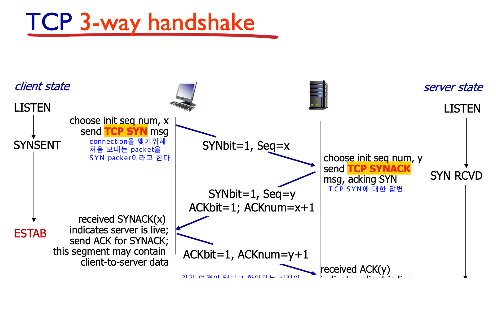
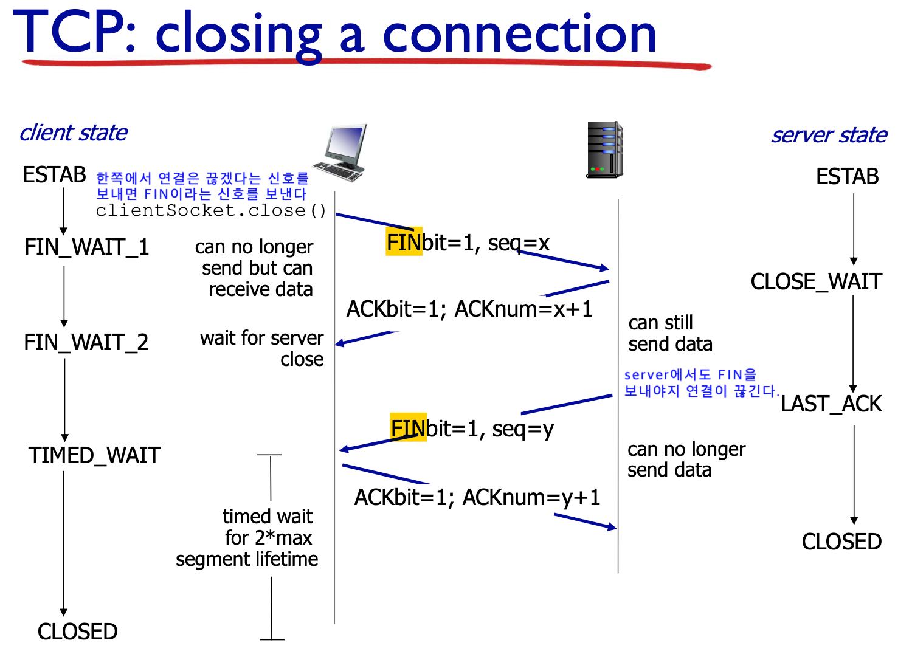

# 3-way handshaking, 4-way handshaking
## 3-way handshaking

TCP 장치들 사이의 연결을 만들기 위해서는 3-way handshaking을 한다.

1. 클라이언트는 서버에 접속을 요청하는 SYN 패킷을 보낸다. 이때 클라이언트는 SYN을 보내고 SYN/ACK 응답을 기다리는 SYN_SENT상태가 된다.
2. 서버는 SYN요청을 받고 클라이언트에게 요청을 수락한다는 ACK 와 SYN flag 가 설정된 패킷을 발송하고 A가 다시 ACK으로 응답하기를 기다린다. 이때 서버는 SYN_RECEIVED 상태가 된다.
3. 클라이언트는 서버에게 ACK을 보내고 이후로부터는 연결이 이루어지고 데이터가 오가게 되는것이다. 이때의 B서버 상태가 ESTABLISHED 이다.

## 4-way handshaking

TCP 통신을 하기위해 연결된 장치들의 세선을 종료하기 위해서는 4-way handshaking을 진행한다.

1. 클라이언트가 연결을 종료하겠다는 FIN플래그를 전송한다.
2. 서버는 확인메시지를 보내고 자신의 통신이 끝날때까지 기다리는데 이 상태가 TIME_WAIT상태다.
3. 서버가 통신이 끝났으면 연결이 종료되었다고 클라이언트에게 FIN플래그를 전송한다.
4. 클라이언트는 확인했다는 메시지를 보낸다.

[상태 설명](https://www.notion.so/aa9880b98088456ebd9e223241b59a87)

# 질문
- Q. 만약 "Server에서 FIN을 전송하기 전에 전송한 패킷이 Routing 지연이나 패킷 유실로 인한 재전송 등으로 인해 FIN패킷보다 늦게 도착하는 상황"이 발생한다면 어떻게 될까?
   - A. Client에서 세션을 종료시킨 후 뒤늦게 도착하는 패킷이 있다면 이 패킷은 Drop되고 데이터는 유실될 것입니다.이러한 현상에 대비하여 Client는 Server로부터 FIN을 수신하더라도 일정시간(디폴트 240초) 동안 세션을 남겨놓고 잉여 패킷을 기다리는 과정을 거치게 되는데 이 과정을 "TIME_WAIT" 라고 한다.
