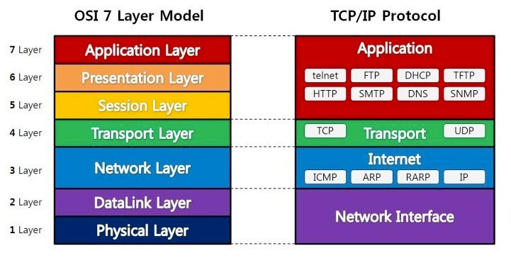

# OSI 7 계층

## 물리 계층 (Physical Layer)

- 전기적, 기계적, 기능적인 특성을 이용해 통신 케이블로 데이터를 전기적인 신호로 변환해서 주고받는 기능을 한다.
- 단순히 데이터를 전달할뿐, 전송하는 데이터가 무엇인지, 어떤 에러가 있는지 등에는 전혀 신경쓰지 않는다.
- 해당 계층에서 사용되는 통신 단위는 비트이다.
- 관련 장비: 통신 케이블, 리피터, 허브 등

## 데이터 링크 계층 (DataLink Layer)

- 투 포인트(Point to Point) 간 신뢰성있는 전송을 보장하기 위한 계층이다.
- 물리 계층을 통해 송수신되는 정보의 오류와 흐름을 관리(흐름 제어)하며 안전한 정보의 전달을 수행할 수 있도록 도와주는 역할을 한다.
- 통신에서의 오류를 찾고(=오류 제어) 재전송하는 기능을 갖고 있다.
- MAC Address를 사용하여 통신을 한다.
- 해당 계층에서 전송되는 단위는 프레임(Frame)이다.
- 관련 장비: 브릿지, 스위치
    - 해당 장비를 통해 MAC Addres를 가지고 물리 계층에서 받은 정보를 전달한다.

## 네트워크 계층 (Network Layer)

- 데이터를 목적지까지 가장 안전하고 빠르게 전달(라우팅)하는 작업을 한다.
- 이동할 경로를 선택하여 IP주소를 지정한 후,  경로에 따라 패킷을 전달해주는 것이 이 계층의 역할이다.
- 라우팅, 흐름 제어, 세그멘테이션(segmentation/desegmentation), 오류 제어, 인터네트워킹(Internetworking) 등을 수행한다.
- 해당 계층에서 전송되는 단위는 패킷(Packet)이다.
- 관련 장비: 라우터, 스위치
    - 요즘은 2계층의 장비 중 스위치라는 장비에 라우팅 기능을 장착한 Layer 3 스위치도 있다.

## 전송 계층 (Transport Layer)

- TCP와 UDP 프로토콜을 통해 통신을 활성화한다. 포트를 열어두고, 프로그램들이 전송을 할 수 있도록 제공해준다.
- 신뢰성 있고 효율적인 데이터를 전송하며 오류검출 및 복구와 흐름제어, 중복검사 등을 수행한다.
- 해당 계층에서 전송되는 단위는 세그먼트(Segment)이다.

## 세션 계층 (Session Layer)

- 양 끝단의 응용 프로세스가 통신을 관리하기 위한 방법을 제공한다.
- 데이터가 통신하기 위한 논리적인 연결인 Session의 설정, 유지, 종료, 전송 중단시 복구 등의 작업을 한다.
    - 통신 연결이 손실되는 경우 연결 복구 시도를 하고 연결 시도중 장시간 연결이 되지 않았다면 세션 계층의 프로토콜이 연결을 닫고 다시 연결을 시도한다.
- TCP/IP 의 세션을 만들고 없애는 책임을 갖고 있다.

## 표현 계층 (Presentation Layer)

- 코드 간의 번역을 담당하여 사용자 시스템에서 데이터의 형식상 차이를 다루는 부담을 응용 계층으로부터 덜어 준다. 즉, 데이터 표현이 상이한 응용 프로세스의 독립성을 제공하고, 암호화를 담당한다.

## 응용 계층 (Application Layer)

- 응용 프로세스와 직접 관계하여 일반적인 응용 서비스를 수행한다.
- 네트워크 소프트웨어 UI 부분, 사용자의 입출력(I/O)부분이다.
- HTTP, FTP, SMTP, POP3, IMAP, Telnet 등과 같은 프로토콜이 있다.

# 질문
- Q. 7계층으로 나누는 이유는 무엇일까??
    - A. 통신이 일어나는 흐름을 한눈에 알아보기 쉽고, 특정한 곳에 이상이 발생하면 해당 계층만 수정할 수 있기 떄문이다.

# 참조
[OSI 7 계층이란?, OSI 7 계층을 나눈 이유](https://shlee0882.tistory.com/110)

[[네트워크] OSI 7Layer / 7계층 개념 및 역할, 구조까지 한번에 알아보기](https://onecoin-life.com/19)
