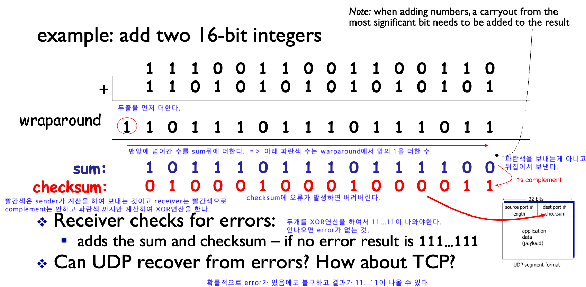

전송 계층은 송신자와 수신자를 연결하는 통신 서비스를 제공하는 계층으로, 데이터의 전달을 담당한다. 이러한 전송계층의 프로토콜로는 TCP와 UDP가 있다.

둘의 차이점을 간단히 설명하자면 먼저 TCP는 연결을 맺은 후에 통신을 하고 UDP는 별다른 연결을 맺지 않고 통신을 한다.

# UDP(User Datagram Protocol)

- Sender와 Receiver사이에 연결을 만들지 않는다.
    - IP를 기반으로 데이터를 전송한다.
    - 서버와 클라이언트는 1:1, 1:N, N:M 등으로 연결될 수 있다.
- 각각의 UDP 세그먼트(Segment)들은 독림적으로 다뤄지게 된다. 세그먼트들이 독립적으로 단순히 보내지고 받는 작업을 진행하다보니 세그먼트들의 순서를 지키는데 드는 오버헤드가 줄어들게 된다.
    - ex) 1,2,3을 보냈는데 3번이 빠르게 가면 3번이 먼저 도착해버린다. 순서에 대한 문제는 application에서 해결해야한다. 반대로 TCP는 보낸 순서대로 도착한다.
- TCP와 다르게 비연결형 프로토콜이다.
- 혼잡제어, 흐름제어 등의 기능들도 처리하지 않기 때문에 TCP보다 속도가 빠르고 네트워크 부하가 적다.
    - 흐름제어(flow control)가 없어서 패킷이 제대로 전송되었는지, 오류가 없는지 확인할 수 없다.
- 신뢰성보다는 연속성, 서비스의 성능이 중요한 서비스에 사용된다.
    - ex) 실시간 스트리밍 서비스

DNS와 DHCP는 TCP가 아닌 UDP를 사용한다.

- 그 이유는 Sender, Receiver사이에 연결을 맺으면 보내고 받는 데이터 크기에 비하여 연결에 드는 비용이 더 크기 때문에 Root DNS 같은 경우 모든 것들과 TCP로 연결을 맺게 된다면 부담이 너무 크다. 그래서 연결 없는 UDP방식을 사용한다.

## UDP Segment Header

위의 Header에서 Checksum은 데이터 전송 과정에서 해당 데이터가 변경된 것이 있는지 체크를 해주는 일을 한다.

- Sender는 세그먼트의 16-bit로 표현한 Content와 Header필드 값을 더한 다음 1의 보수를 만들어 checksum 필드에 추가한다.
- Receiver는 반대로 Content와 Header의 필드값을 16-bit로 변환 후 더한 값을 1의 보수로 변경한 후 checksum의 필드와 같은지 확인한다. 만약 같다면 데이터 전송 과정에서 문제가 발생하지 않은 것이고, 다르다면 해당 세그먼드는 에러가 담긴 세그먼트로 판단한다.

# TCP (Transmission Control Protocol)

- TCP는 UDP와 다르게 Receiver와 Sender사이에 연결을 만들고 해당 연결을 기반으로 데이터를 주고받는다. (가상 회선 방식을 제공)
- 전이중(Full-Duplex), 점대점(Point to Point) 방식이다.
- 연결을 만든 후 통신을 하기에 안정적이고 데이터를 순서대로 보낸다는 특징이 있다.

  [[TCP] Reliable Delivery](https://github.com/Seongwon97/2022-ConquerCS/blob/main/%EB%A0%89%EC%8A%A4/TCP%EC%9D%98%20Reliable%20Delivery.md)

- 3-way handshaking과정을 통해 연결을 설정하고 4-way handshaking을 통해 해제한다.
    - Sender와 Receiver를 확실히 하여 정확한 전송을 보장하기 위해 사용한다.

  [3-way handshaking, 4-way handshaking ](https://github.com/Seongwon97/2022-ConquerCS/blob/main/%EB%A0%89%EC%8A%A4/3%2C4way-handshaking.md)

- TCP도 UDP와 같이 커다란 데이터를 Segment로 나누어 순서대로 데이터를 전송한다. 이때 Receiver는 시퀀스 번호를 통해 해당 세그먼트가 들어갈 순서가 맞는지 확인을 하며 만약 순서에 맞지 않은 세그먼트가 들어왔다면 사이에 Loss가 있었다는 것을 감지하게 된다.
- Receiver는 올바른 세그먼트를 받는다면 해당 데이터를 잘 받았다는 ACK(응답)을 보내어 Sender가 자신이 보낸 데이터가 잘 보내졌다는 것을 확인할 수 있다.
- Sender, Receiver사이에 하나의 연결을 만들고 해당 연결을 통해 통신을 하기에 둘 사이에는 교통 체증이 발생할 수 있다. 그래서 Flow control과 Congestion control을 하게 된다.

  [흐름제어, 혼잡 제어](https://github.com/Seongwon97/2022-ConquerCS/blob/main/%EB%A0%89%EC%8A%A4/%ED%9D%90%EB%A6%84%EC%A0%9C%EC%96%B4%2C%ED%98%BC%EC%9E%A1%EC%A0%9C%EC%96%B4.md)

- UDP보다 속도가 느리다.
- TCP는 연속성보다 신뢰성있는 전송이 중요할 때에 사용하는 프로토콜이다.

# TCP, UDP 비교 표

# 질문
- Q. 데이터 전송을 하며 Receiver가 Segment를 잘 받았다고 응답하는 ACK중에 하나가 누락되면 어떻게 될까??
   - A. ACK는 처음부터 ACK까지 잘 받았다는 것을 의미하여 앞에서 잘 보내지지 않았더라도 뒤에 있는 ACK가 보내진다면 앞의 데이터까지 다 보내졌다고 하여서 괜찮다. ACK는 매번 보내지 않아도 되고 두번에 한번 보내는듯이 지정해도 문제가 되지 않는다.
- Q. sequence number와 acknowledgement를 같이 안쓰고 왜 별도로 만들었을까??
  

  - A. 양방향으로 통신을 할때 데이터는 데이터로 보내면서 받은데이터에 대한 ACK도 같이 보낸다. ACK를 따로 보내기에는 비효율적이라 보낼 데이터가 있으면 보내는 데이터에 껴서 보낸다. 보내야 할 데이터가 없으면 ACK만 따로 보낸다. 또한 ACK은 세그먼트를 받고 바로 보내는 것이 아닌 Receiver가 Sender에게 보낼 데이터가 있는지 기다리는 약간의 기다림을 갖는다.
  

# 참조
[[TCP/UDP] TCP와 UDP의 특징과 차이](https://mangkyu.tistory.com/15)

[[Network] TCP / UDP의 개념과 특징, 차이점](https://coding-factory.tistory.com/614)
