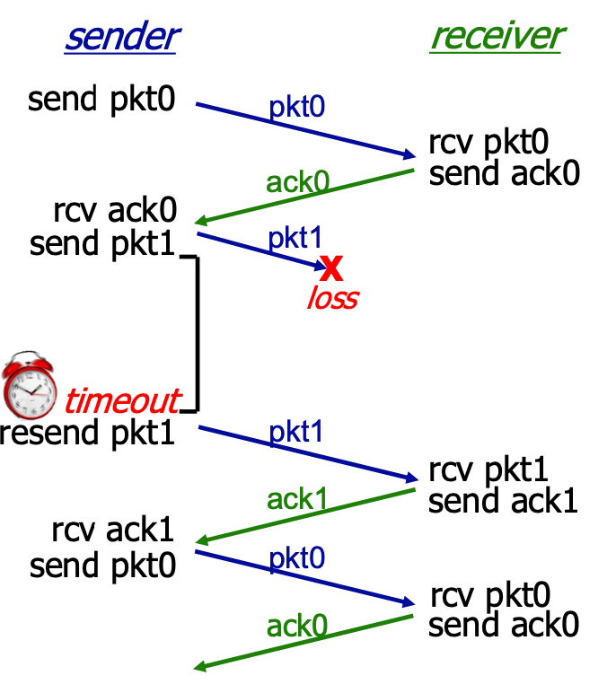
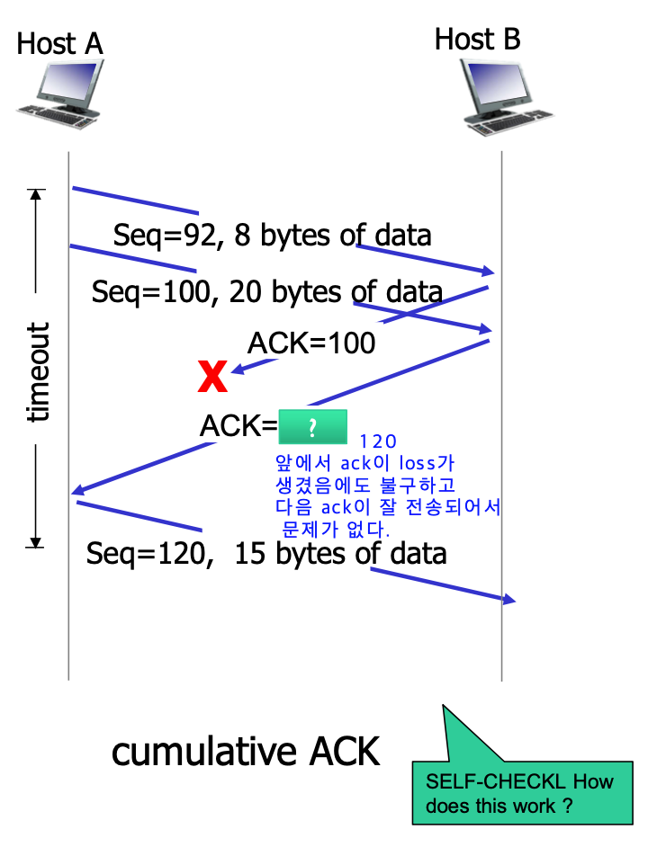
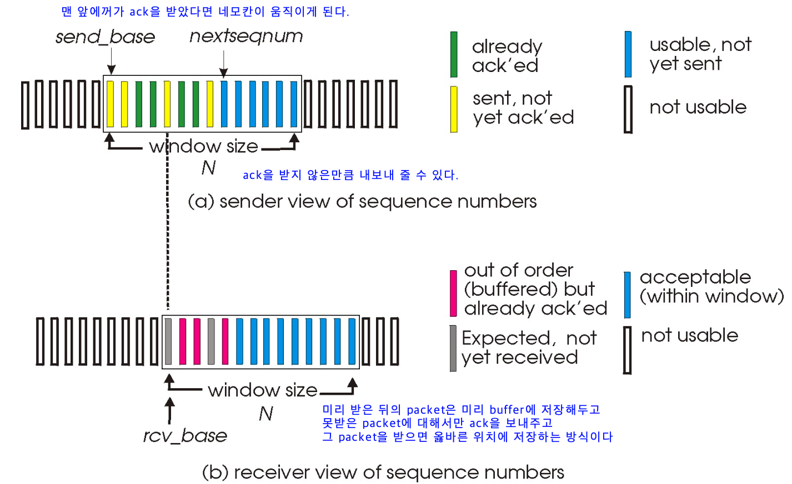

# [TCP] Reliable Delivery

## **ARQ(Automatic Repeat Request)**

- 신뢰성 있는 데이터 전달을 위해 재전송을 기반으로 한 에러 제어 방식을 의미한다.

TCP는 신뢰할만한 전송을 하기 위해 아래의 작업들을 한다.

- Checksum을 통해 수신받은 패킷에 에러가 있는지 확인
- Sequence Number를 통해 누락된 데이터를 확인
- 누락된 데이터가 있다면 해당 데이터를 재전송

ACK

- 누락된 데이터가 있는지 확인하기 위해서 TCP에서는 ACK을 사용한다.
- 수신자는 패킷을 받으면 송신자에게 해당 패킷을 잘 받았다는 ACK을 보내고 송신자는 해당 ACK을 통해 송신자가 패킷을 잘 받았다는 것을 확인한다.
    - 송신자가 Timeout될 때까지 ACK을 받지 못한다면 수신자가 해당 패킷을 잘 받지 못하였다 판단하고 재전송을 한다.

## Stop And Wait

- 송신자가 하나의 패킷을 보내고 해당 전송에 대한 ACK을 받은 후에 다음 Packet을 보내는 전송 방식이다.
- 하지만 해당 방법은 하나의 Packet을 보내고 ACK 또는 Timeout을 기다리게 되어서 성능이 좋지 못하다.
    - 성능 향상법
        1. timeout을 적당하게 조절한다.
        2. pipeline을 사용하여 여러개의 packet을 동시에 보낸다.

## Pipeline protocol

### Go-back-N ARQ기법

- 패킷을 전송할 때 수신측에서 데이터를 잘못 받거나 못 받은 경우에 해당 패킷 번호부터 다시 재전송을 하는 기법이다.
- cumulative ACK을 사용한다.
    - 수신자는 현재 받은 ACK이전 순서의 패킷을 모두 받은 경우에만 ACK을 보낸다.
        - 패킷이 순서대로 안오고 뒤의 패킷이 먼저 온 경우, 해당 패킷의 번호를 무시하고 순차적으로 받아야하는 패킷의 Sequence Number를 담은 ACK을 보낸다.
    - 수신자가 모든 ACK을 보내지 않거나 ACK이 중간에 누락되더라도 송신자는 이후의 ACK을 받으면 이전 패킷들이 올바르게 전송되었다는 것을 인지한다.
    -

### Selective Repeat ARQ 기법

- Go back N과 다르게 잘못 받은 패킷만 재전송을 한다.
- GBN과 비교하였을 때 모든 패킷을 재전송하지 않기 때문에 효율성은 더 높지만, 수신측에서 패밋을 확인하기 위한 추가적인 정렬된 배열이 필요하고 복잡하다.
- individual ACK을 사용한다.
    - GBN과 다르게 수신자는 패킷이 순서대로 오지 않아도 ACK을 보낸다.
    - 송신자는 ACK을 받지 않은 패킷만 재전송한다.

    
