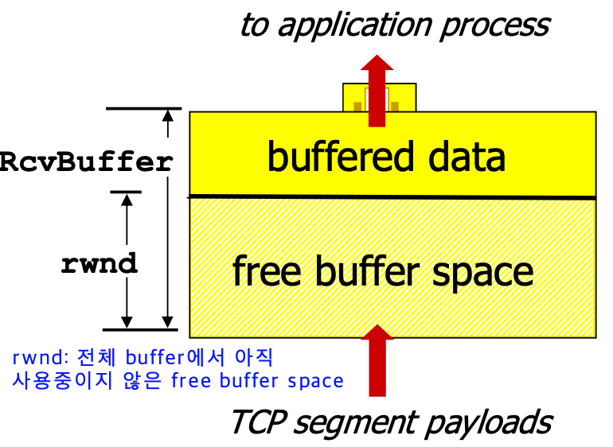
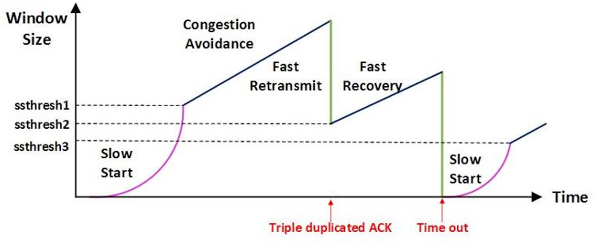
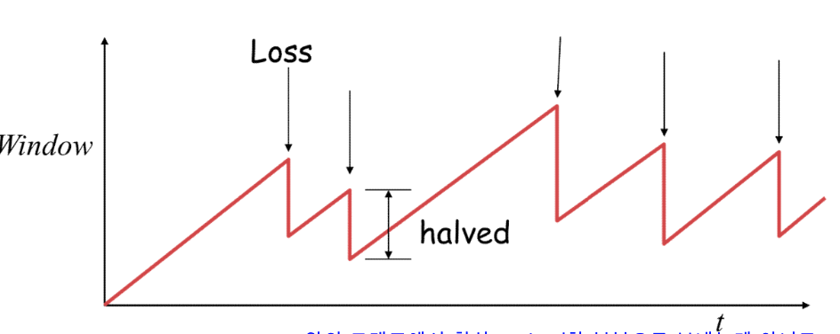
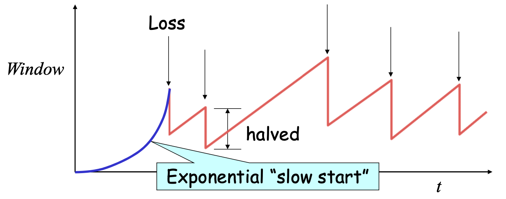
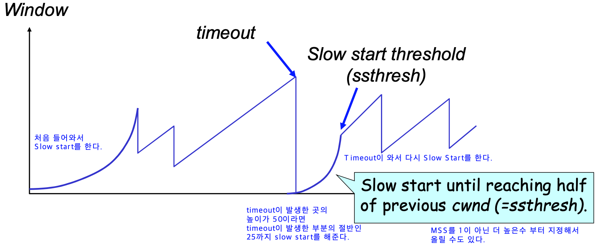

# 흐름제어 (Flow Control)

- 데이터의 수신자가 송신자가 보내주는 데이터의 양을 수신자의 버퍼사이즈가 오퍼블로우가 발생하지 않도록 속도를 조절해주는 방법이다.
- 만약 수신자의 데이터 처리 속도가 송신자의 전송 속도보다 느릴 경우 수신자 쪽의 버퍼를 초과하게 될 것이고, 이후의 데이터들은 손실이 될 것이다. 이는 데이터 전송 성능에 많은 영향을 끼쳐서 수신쪽에서 송신자의 전송 속도를 조절한다.
- 전송 속도를 조절하는 방법은 상대방에게 응답을 할 때 TCP header중 하나인 **rwnd**에 **남은 버퍼 사이즈 정보를 추가**해서 보내주고 송신자는 해당 데이터를 보고 in-flight data의 양(전송 속도)을 조절한다.

> in-flight: 전송을 하고 ACK을 받지 못한 데이터
>

# 혼잡제어 (Congestion Control)

- 혼잡제어는 네트워크 내의 패킷 수가 넘치게 증가하는 혼잡 현상을 방지하는 방법이다. 즉, 네이워크의 혼잡을 피하기 위해 송신측에서 보내는 데이터의 전송 속도를 강제로 줄이는 작업을 말한다.
- 송신자는 시간에 따른 네트워크 혼잡도를 판단해 Sending Rate를 변경한다.
    - 혼잡도는 어떻게 감지할까?
        - E2E의 성능을 조사하며 전 구간에 걸쳐서 Packet의 지연과 누락을 감지한다.

## AIMD (Additive Increase, Multiplicative Decrease)

- 하나의 패킷을 잃게 되면 Window size의 절반으로 줄인다. 반면에 이전 전송 속도로 전송이 성공한다면 Window size를 1씩 증가시킨다.
- 여러 호스트가 한개의 네트워크를 공유하고 있으면 나중에 진입하는 쪽이 처음에는 불리하지만 시간이 흐르면 Optimal한 지점으로 가게된다는 특징이 있다.
- 문제점: 초기에 네트워크의 높은 대역폭을 사용하지 못하여 오랜 시간이 걸리고 네트워크가 혼잡해지는 상황을 미리 감지하지 못한다.

> Window Size는 Pipelining을 할 수 있는 크기로 전송량을 의미한다.
>

## Slow Start

- AIMD 방식은 처음에 전송 속도를 높이는데 많은 시간이 걸리는 단점이 존재한다.
- Slow Start 방식은 AIMD방식처럼 처음에 1개의 패밋을 보내는 것으로 window size를 정하지만, 전송을 성공하여 ACK을 받을때마다 window size를 1개씩 linear하게 올리는 것이 아닌 첫번째 실패가 발생할때까지 2배씩 올리게 된다. 즉, 처음에는 cwnd가 1로 시작하여 천천히 시작하지만 시간이 지날수록 지수 함수 꼴로 증가하게 된다.
    - 처음에는 네트워크 혼잡량을 예측할 수가 없어서 2배씩 cwnd를 증가시키고 첫번째 실패가 발생한다면 네트워크의 수용량을 어느정도 예측할 수 있어서 window size를 절반으로 줄이고 AIMD의 방식으로 진행한다.
- 만약 통신을 하며 Timeout이 발생한다면 cwnd의 크기를 절반으로 줄이는 것이 아닌 0으로 축소시킨 후, timeout이 발생한 지점까지 slow start를 다시 시작한다.
    - 해당 지점까지 문제 없이 도달한다면 다시 linear하게 1씩 증가시킨다. 이것을 **Congestion Avoidance**라고 한다.

  

## Fast Retransmit

- 빠른 재전송은 TCP의 혼잡 조절에 추가된 정책이다.
- 패킷을 받는 쪽에서 먼저 도착해야할 패킷이 도착하지 않고 다음 패킷이 도착한 경우에도 ACK 패킷을 보내게 된다.
- 단, 순서대로 잘 도착한 마지막 패킷의 다음 패킷의 순번을 ACK 패킷에 실어서 보내게 되므로, 중간에 하나가 손실되게 되면 송신 측에서는 순번이 중복된 ACK 패킷을 받게 된다. 이것을 감지하는 순간 문제가 되는 순번의 패킷을 재전송 해줄 수 있다.
- 중복된 순번의 패킷을 3개 받으면 재전송을 하게 된다. 약간 혼잡한 상황이 일어난 것이므로 혼잡을 감지하고 window size를 줄이게 된다.

## Fast Recovery

- 혼잡한 상태가 되면 window size를 1로 줄이지 않고 반으로 줄이고 선형증가시키는 방법이다. 이 정책까지 적용하면 혼잡 상황을 한번 겪고 나서부터는 순수한 AIMD 방식으로 동작하게 된다.
