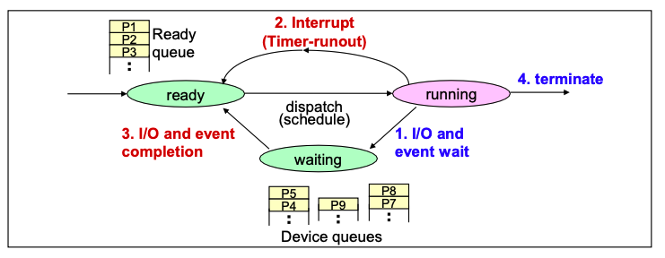
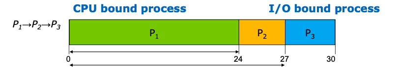
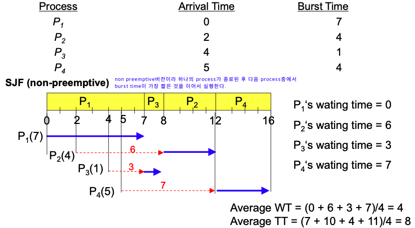
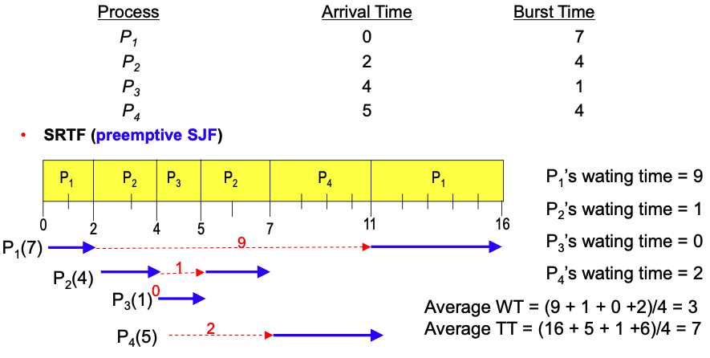
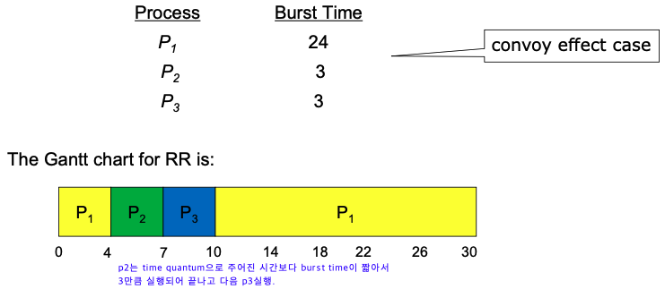
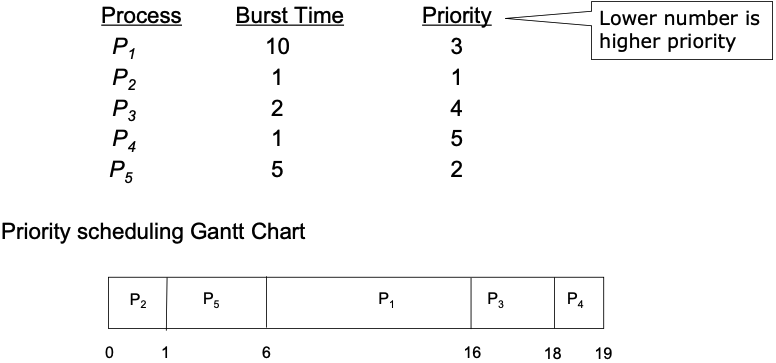
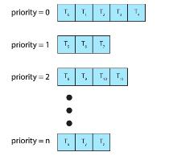
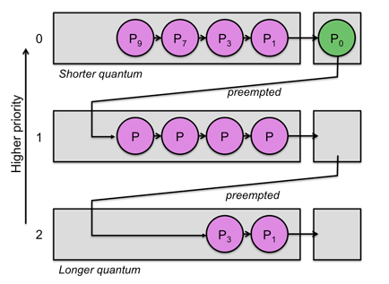

# CPU Scheduling
## 1. CPU Scheduling이란?

- 컴퓨터는 CPU는 한정적인데 반해 CPU를 사용하고 싶어하는 Process(Thread)들은 셀 수도 없이 많이 존재한다. OS는 이러한 Process들이 CPU를 효율적으로 사용할 수 있도록 스케줄링을 하는 작업을 한다.

- Process의 상태를 학습하며 다음과 같은 사진을 봤을 것이다. CPU scheduling은 ready queue에서 누구를 뽑아서 먼저 실행할지 정하는 것이다.

## 2. 장기, 중기, 단기 스케줄러
### 장기스케줄러(Long-term scheduler or job scheduler)

메모리는 한정되어 있는데 많은 프로세스들이 한꺼번에 메모리에 올라올 경우, 대용량 메모리(일반적으로 디스크)에 임시로 저장된다. 이 pool 에 저장되어 있는 프로세스 중 어떤 프로세스에 메모리를 할당하여 ready queue 로 보낼지 결정하는 역할을 한다.

- 메모리와 디스크 사이의 스케줄링을 담당.
- 프로세스에 memory(및 각종 리소스)를 할당(admit)
- degree of Multiprogramming 제어  
  (실행중인 프로세스의 수 제어)
- 프로세스의 상태
  new -> ready(in memory)

### 중기스케줄러(Medium-term scheduler or Swapper)

- 여유 공간 마련을 위해 프로세스를 통째로 메모리에서 디스크로 쫓아냄 (swapping)
- 프로세스에게서 memory 를 deallocate
- degree of Multiprogramming 제어
- 현 시스템에서 메모리에 너무 많은 프로그램이 동시에 올라가는 것을 조절하는 스케줄러.
- 프로세스의 상태  
  ready -> suspended

### 단기스케줄러(Short-term scheduler or CPU scheduler)

- CPU 와 메모리 사이의 스케줄링을 담당.
- Ready Queue 에 존재하는 프로세스 중 어떤 프로세스를 running 시킬지 결정.
- 프로세스에 CPU 를 할당(scheduler dispatch)
- 프로세스의 상태  
  ready -> running -> waiting -> ready

> 출처 - [JaeYeopHan/Interview_Question_for_Beginner](https://github.com/JaeYeopHan/Interview_Question_for_Beginner/tree/master/OS#%EC%8A%A4%EC%BC%80%EC%A4%84%EB%9F%AC)

## 3. Preemtive vs Non-preemtive Scheduling

### 3.1. Non-preemtive(비선점)

- Process가 CPU를 스스로 놔줄 때까지 기다리는 스케줄링 방식이다. Process들은 종료 또는 I/O 작업을 하기 전까지는 CPU를 지속적으로 사용할 수 있다.
- CPU를 놓아줄 때까지 기다려야해서 preemtive에 비하여 context switch가 적게 일어나 Overhead가 적다. 하지만 이것은 작업을 요청해도 자신의 순서가 오기까지 오래 기다려야 하기에 response time이 오래걸린다.
- 바로바로 반응해야하는 프로그램들에는 좋지 못하다.
    - 처리시간 예측이 용이하다.

### 3.2. Preemtive(선점)

- interrupt 발생과 같은 것이 발생해 강제로 CPU를 뺐는 방법이다.
- 현대 대부분의 OS는 preemtive방식이다.
- race condition이 발생한다.

## 4. Scheduling  척도

- **CPU utilization**: CPU를 얼마나 사용하는지, 높을수록 효율적으로 사용하는 거라 좋다.
- **Throughput**:  시간당 수행한 작업의 양
- **Turnaround time**
    - 프로세스가 종료되기까지 걸린 시간
    - waiting시간, 실행 시간을 모두 합친 것으로 process가 생성되어서 종료되기까지 총 시간
- **Waiting time**
    - ready queue에서 기다린 총 시간
    - waiting queue에서 기다리는 전체 시간을 의미
    - turnaround time과 함께 CPU scheduling 알고리즘의 성능을 측정하는 변수로 사용
- **Response time**
    - 프로세스가 생성되고 첫번째 응답이 있기까지 걸린 시간
    - interactive and real-time system 프로그램 측정에 사용된다.

## 5. Scheduling 종류

### 5.1. **First-come, First-Served (FCFS)**

- Queue와 같이 먼저 들어온 것이 먼저 수행되는 스케줄링 방법이다.
- Non-preemtive scheduling방법이다.
- **Convoy Effect**가 발생할 수 있다.

  > Convoy Effect란?
  >
  >
  > I/O bound process 들이 늦게 들어오고 CPU bound process들이 먼저 들어오게 된다면 실행 시간이 적은 I/O bound process들은 많은 시간을 기다려야하는데 이러한 상황을 Convoy Effect라고 한다.
  >
  > 

### 5.2. Shortest-Job-First (SJF) scheduling

- CPU burst가 짧은 것부터 실행을 하여 waiting time을 최소 시키는 스케줄링 방법이다.
- 평균 waiting time이 가장 적다
- SJF에서는 CPU bust length가 어떤지는 확실히 알 수가 없어서 예측을 해야한다. 예측은 과거의 데이터를 갖고 exponential moving average를 하여 CPU burst를 예측한다.
- Nonpreemptive SJF, Preemptive SJF가 존재한다.

> **Shortest-Remaining-Time-First (SRTF)**
>
> - Preemptive SJF이다.
> - preemptive SJF는 새로운 process가 들어왔을때 또는 process가 종료됐을때마다 어떤 process의 burst time이 가장 작은지 판별을 하고 현재 실행되고 있는 process보다 더 짧은 burst time을 가진 process가 있다면 context switch를 한다.
>
>     
>
- SJF 장점
    - waiting time을 최소화한다.
    - 짧게 끝낼 수 있는 process들을 먼저 실행시켜서 process의 수를 최소화한다.
- SJF 단점
    - CPU burst time은 예측으로만 알 수 있는데 예측이 틀릴 수 있기에 실제 적용이 힘들다.
    - **Starvation Problem**이 발생할 수 있다.
        - Starvation이란?

          burst time이 짧은 process들이 계속 들어오면 burst time의 길이가 긴 process는 실행되지 못하고 무한정 기다리게 된다. 이러한 문제를 Starvation이라고 한다.

### 5.3. HRN (Hightest Response-ratio Next)

- SJF의 단점을 보완하여 우선순위를 계산하여 CPU 선점의 불평등을 보완한 방법이다.
- 프로세스가 실제 실행될 시간과 대기 시간에 따라 우선순위를 결정한다.
- 우선순위 = (대기시간 + 실행시간) / (실행시간)

### 5.4. **Round Robin (RR)**

- Timer를 사용하여 time quantum이후에 실행중인 일을 중단하고 다른 process로 context switch 시키는 실행시키는 스케줄링 방법이다.
- 일반적으로 SJF보다 평균 waiting time이 높다. 하지만 공정하고 starvation이 발생하지 않는다.
- 성능은 time quantum을 매우 크게 설정하면 FCFS와 같이 실행되고 매우 작게 설정하면 context switch time이 증가하여 overhead가 매우 높아져 비효율적으로 된다.
- 장점
    - 모두 돌아가며 수행하기에 response time이 적다.
    - FCFS에 비해 I/O bound process에 한해 waiting time이 크게 줄어든다. SJF보다는 일반적으로 waiting time이 길다.
    - SJF의 문제인 starvation이 발생하지 않는다.
- 단점
    - 길이가 비슷한 process들을 수행시키면 turnaround time이 증가하는 문제점이 있다.
    - preemtive 방식이기에 context switching을 하는 overhead가 발생한다.

### 5.5. **Priority Scheduling**

- Priority가 높은 process들부터 먼저 수행하는 스케줄링 방법이다.
- SJF도 priority scheduling중 하나이다. (우선순위를 job의 길이가 작은 거로 정한 것)
- Starvation이 발생할 수 있다. -> 그에 대한 해결책 중 하나가 **Aging**이다.
    - Aging이란?

      Aging은 각각의 process마다 시간이 지나면 지날수록 우선순의를 높여주는 방법이다.

### 5.6. Multileve Queue

- 작업들을 여러 종류의 그룹으로 나누어 여러 개의 큐를 이용하는 기법이다.
    - 커널 작업은 우선순위가 높은 큐에서 실행된다.
- 우선순위가 낮은 큐들이 실행 못하는 걸 방지하고자 각 큐마다 다른 `Time Quantum`을 설정 해주는 방식 사용한다.
    - 우선순위가 높은 큐는 작은 `Time Quantum` 할당하고 우선순위가 낮은 큐는 큰 `Time Quantum` 할당한다.

### 5.7. Multilevel-Feedback-Queue (다단계 피드백 큐)

- Multileve Queue에서 time quantum을 다 채운 프로세스는 CPU burst process라고 판단하여 하위 우선순위 큐로 내리는 스케줄링 방법이다.
- I/O burst process와 같이 짧은 작업들에 우선순위를 주는 방법이다.
- 처리 시간이 짧은 프로세스를 먼저 처리하기에 평균 turnaround time을 줄여준다.

### 5.8.Real-time scheduling

- Process중에서 Deadline이 존재하는 것들도 존재한다. Real-time scheduling은 deadline을 지켜주는 스케줄링 방법이다.
- **Rate Montonic Scheduling, Earliest Deadline First Scheduling (EDF)** 이 존재한다.
