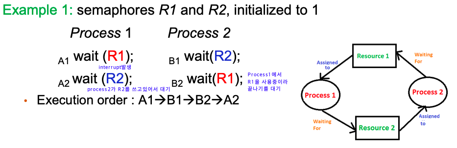

# Deadlock
데드락은 두 개 이상의 프로세스나 스레드가 서로 자원을 얻지 못해서 다음 작업을 하지 못하여 무한히 다음 자원을 기다리는 상태를 말한다. 세마포어를 예시로 들면 아래와 같다.

## 자원의 종류

Physical resource type: I/O device, memory space, CPU cycle과 같은 resource들을 의미한다.

Logical resource type: semaphore, mutex lock, file과 같이 물리적으로 존재하지 않지만 여러 process가 같이 사용하는 자원을 의미한다.

## 데드락이 발생하는 조건

데드락이 발생하려면 아래의 4가지 조건을 모두 만족해야한다.

1. Mutual Exclusion

   자원에 대해서 한개의 Process만이 점유할 수 있다. 동시에 여러개의 프로세스가 점유할 수 없다.

2. Hold and wait

   최소한 하나의 자원을 점유하고 있으면서 다른 프로세스에 할당되어 사용하고 있는 자원을 추가로 점유하기 위해 대기하는 프로세스가 존재해야 한다

3. No Preemption

   다른 프로세스에 할당된 자원은 사용이 끝날 때까지 강제로 뺐을 수 없다.

4. Circular wait

   사이클이 존재해야한다.

## 데드락 예방 (**Prevention**)

데드락 발생 4가지 조건 중 하나의 조건을 없애서 Deadlock 예방할 수 있다. deadlock prevention은 deadlock의 4가지 발생조건 중 최소한 하나의 조건을 거부하여 예방하지만 실현 불가능한 case들이 존재하고 심각한 resource의 낭비를 만들어 utilization이 낮아진다.

1. **No mutual exclusion**
    - 같은 시간에 자원들을 공유할 수 있도록 한다.
    - Problem: mutual exclusion을 없애면 deadlock을 예방하지만 race condition이 발생한다.

      →  공유 할 수 없는 자원(mutex lock, printer)도 존재하기도 하여서 mutual exclusion을 없애는 것은 사실상 어렵다

2. **No hold and wait**
    - 프로세스가 resource를 요청할 때마다 다른 리소스를 보유하지 않도록 보장한다.
    - **Total allocation**: 필요로 하는 자원들을 모두 이용할 수 있을 때까지 기다렸다가 한번에 allocation받아서 hold and wait을 없애는 방법이다.
    - Problem: 작업이 끝난 resource들도 오랫동안 갖고 있어서 resource utilization이 떨어진다
3. **Allow preemption**
    - Preemption을 허용하는 방법이다. (ex. RR scheduling)
    - Problem: CPU같은 경우는 preemption을 하는 것이 괜찮지만 semaphore와 같은 자원들은 불가능하다.
4. **No circular wait**
    - **Total ordering**: 자원 타입별로 전체적인 순서를 정하고 order의 수를 높여가며 자원을 요청하여 circular wait을 없애준다. (사이클이 있어도 circular wait이 없어진다.)
    - Problem: 항상 순서에 따라 자원을 요청해야한다.

## 데드락 **회피(Avoidance)**

- 어떠한 요청이 왔을 때 데드락이 절대 일어나지 않는 safe상태로 유지할 수 있으면 요청을 받아주고 unsafe상태로 가게 된다면 그 요청을 거부하며 항상 safe상태로 유지되게 하는 것이 Deadlock avoidance이다.
- instance수가 1개인지 여러 개인지에 따라 Resource-Allocation Graph Algorithm과 Banker’s Algorithm이 존재한다.

## 데드락 무시(**Ignorance)**

- Ignore the problem and pretend that deadlocks never occur in the system (Ostrich Algorithm)
- 실제 system에서는 deadlock prevention, avoidance를 하면 overhead가 너무 커서 실제로는 사용하지 않는다.
- 실제로는 deadlock ignorance를 하여 개발자들이 deadlock에 빠지지 않도록 코딩을 하게 한다.
- 만약 deadlock에 빠질 경우 deadlock recovery(ex. 재부팅, 프로세스 종료, resource강제로 빼았기)등의 작업을 한다.
    - Deadlock Detection

      자원 할당 그래프를 통해 데드락을 탐지한다.

    - Recovery

      데드락을 일으킨 프로세스를 종료하거나 할당된 자원을 해제시켜 회복하는 방법이다.

      > **프로세스 종료 방법**
      >
      > - 교착 상태의 프로세스를 모두 중지한다
      > - 교착 상태가 제거될 때까지 하나씩 프로세스 중지한다
      >
      > **자원 선점 방법**
      >
      > - 교착 상태의 프로세스가 점유하고 있는 자원을 선점해 다른 프로세스에게 할당한다 (해당 프로세스 일시정지 시킴)
      > - 우선 순위가 낮은 프로세스나 수행 횟수 적은 프로세스 위주로 프로세스 자원 선점한다
