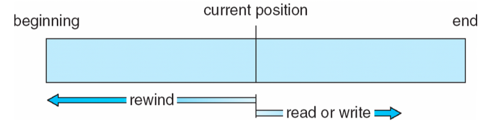
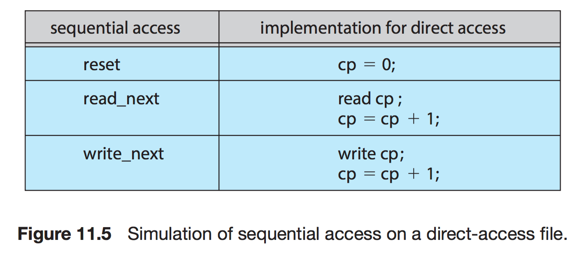
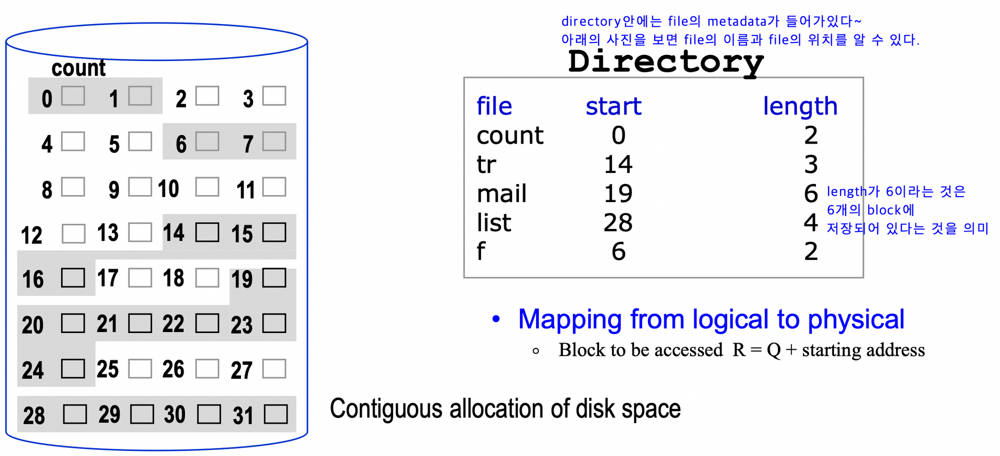
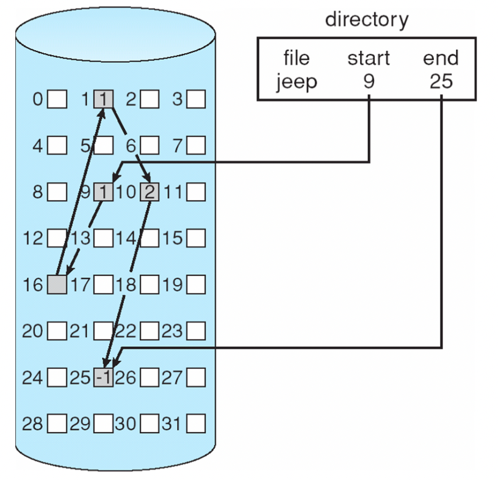
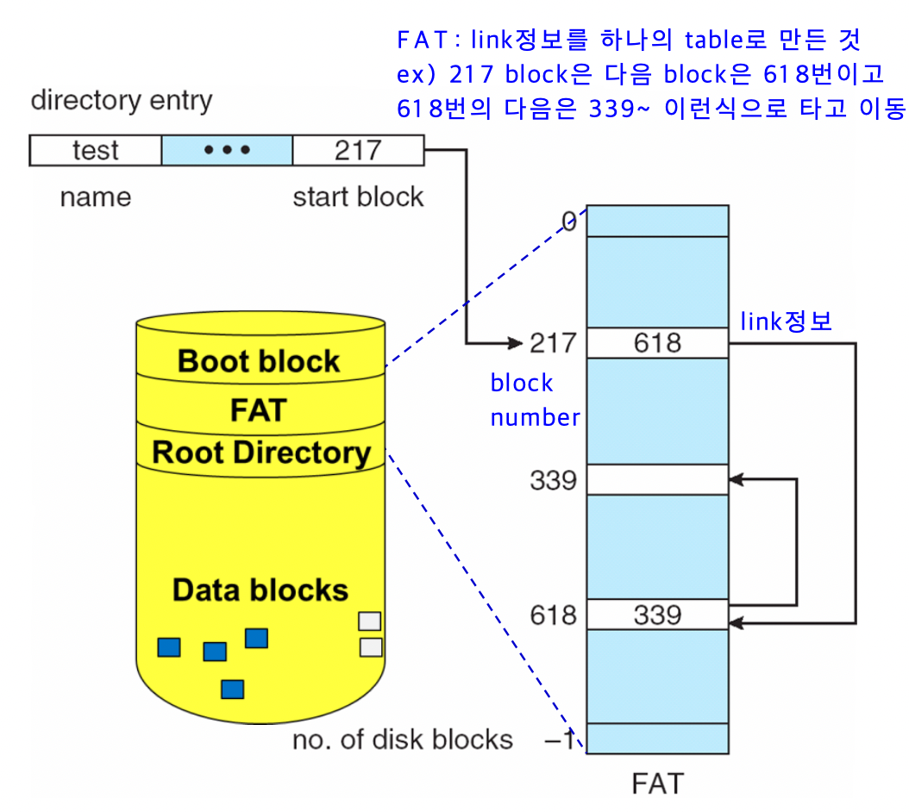
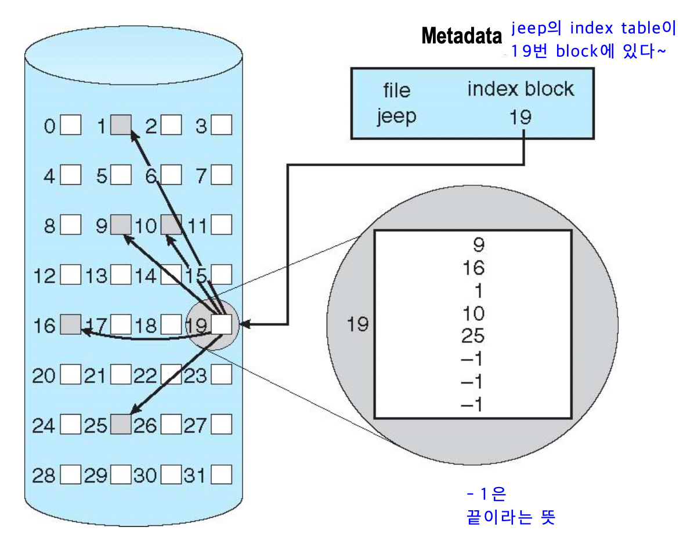
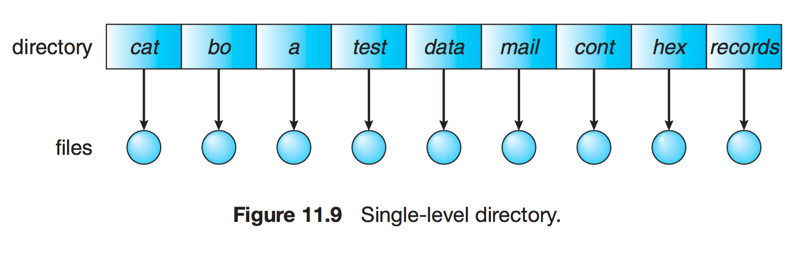
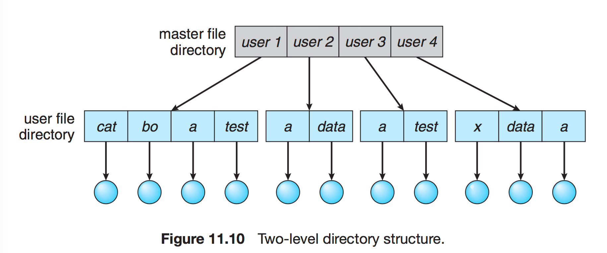
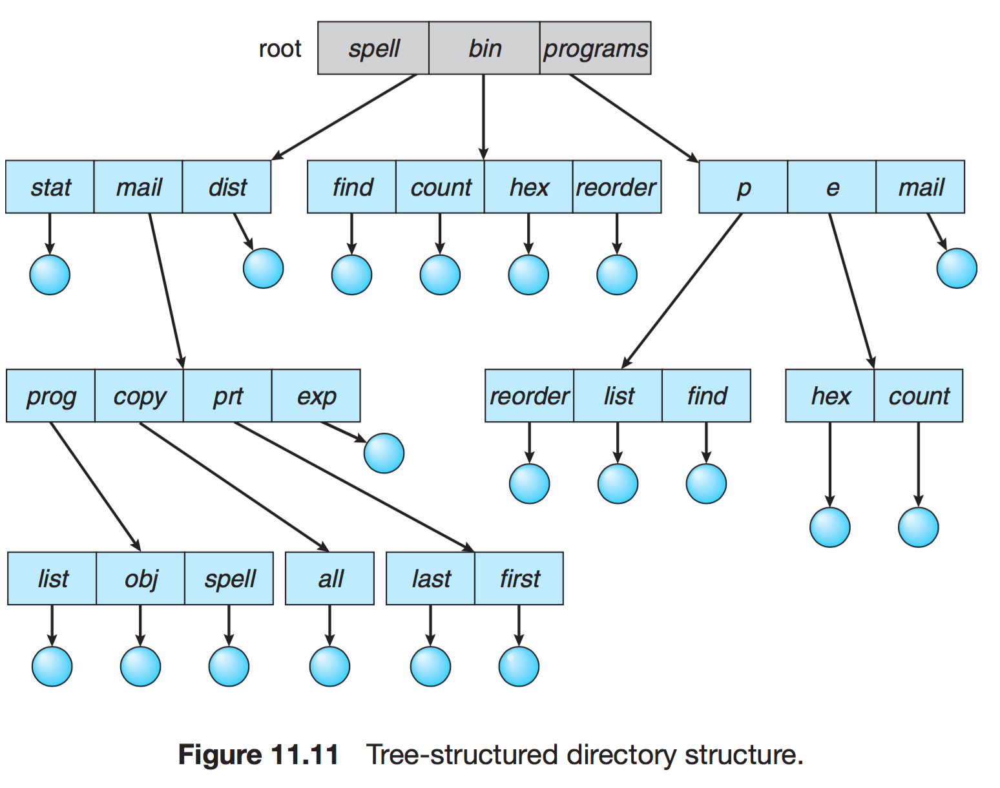
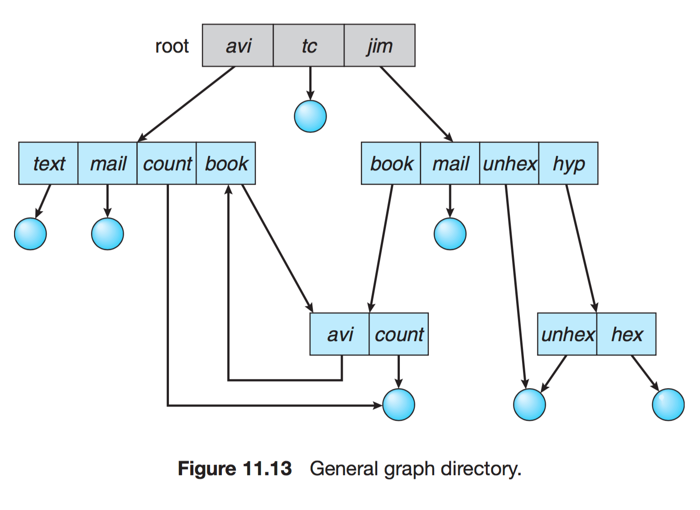

# File System
## File System이란?

- 파일 시스템은 컴퓨터에서 파일이나 자료를 쉽게 발견할 수 있도록 유지 및 관리하는 방법을 의미한다.
- 파일 CRUD 기능을 원활히 수행하기 위한 목적으로 만들어졌으며 파일 관리, 보조 저장소 관리, 파일 무결성 메커니즘, 접근 방법 제공 등의 역할을 한다.
- 커널 영역에서 동작한다.
- 계층적 디렉터리 구조를 가져 파일이나 자료를 쉽게 발견할 수 있다.
- 디스크 파티션 별로 하나씩 둘 수 있다. (ex. C드라이브, D드라이브)

### **구조**

- 메타 영역 : 데이터 영역에 기록된 파일의 이름, 위치, 크기, 시간정보, 삭제유무 등의 파일 정보
- 데이터 영역 : 파일의 데이터

## File Access Methods

### Sequential Access

- 파일을 순차적으로 접근하는 방법이다.
- 일반적으로 file을 읽고 쓰는 것은 Sequential Access를 사용한다.
- 현재 위치를 가르키는 포인터에서 시스템 콜이 발생한 경우 포인터를 앞으로 보내면서 read와 write를 진행한다.
- 뒤로 돌아갈 때는 지정한 offset만큼 되감기를 진행한다.

### Direct Acces (Relatie Access)

- 특별한 순서 없이 특정 위치를 Access하는 방법이다.
- 프로그램이 read/write을 빠르게 해준다.
- 현재 위치를 가리키는 cp 변수만 유지하면 직접 접근 파일을 가지고 순차 파일 기능을 쉽게 구현이 가능하다.
- 파일 블록에 대해 순서에 제약이 없이 임의의 접근을 허용한다.
- Database와 같이 특정 위치로 가는 access를 할 때 사용한다.

## Disk Allocation Method

파일을 지속적으로 보관하기 위해서는 disk에 저장을 하여야 한다. 각각의 파일에 disk 공간을 할당하는 방법으로는 Contiguous allocation, Linked allocation, Indexed allocation이 존재한다.

### **Contiguous allocation**

- file들이 disk안에서 연속된 block을 차지한다.
- Starting location과 length만 필요하여서 간단하다.

- 장점
    - I/O 작업이 빠르다.
    - 연속적으로 접근하여 direct access가 쉽다.
- 단점
    - External fragmentation이 발생한다. (compaction은 많은 낭비를 하게 되어서 사실상 어렵다.)
    - File size확장을 다루기 어렵다.

### **Linked allocation  (non-contiguous)**

- 각각의 file을 Disk block의 linked list로 만드는 방법이다.
- metadata는 start/end block의 pointer를 저장한다.

- 장점
    - file block을 사용할 수 있어서 external fragmenation이 발생하지 않는다.
    - 파일 확장을 할 시에 비어있는 block을 사용하면 되어서 확장이 쉽다.
- 단점
    - direct access를 하기에 비효율적이다.
      ex) 5번째 block에 접근하려면 sequential access는 a파일의 5번쨰 블록을 한번 접근하면 되지만 linked allocation은 block을 계속 타고 가면서 여러번 access해야한다.
    - 파일 시작점이나 중간 block(sector)에서 에러가 발생하면 뒤에 있는 모든 파일을 접근할 수 없다. (시작점에 발생하면 전체 파일 이용 불가)
    - pointer를 사용하여 next block pointer를 저장할 추가적인 공간이 필요하다. (overhead)

### **File-Allocation Table (FAT)**

- Linked allocation을 변형(향상)시켜 FAT이라는 할당 방법도 생겼다.
- Link의 정보들을 모아서 하나의 table에 저장한다.
- FAT는 file system당 하나씩 존재한다.
- FAT은 크기가 작아서 main memory에 올릴 수 있다  -> direct(random) access time이 향상된다.

### **Indexed Allocation** -inode

- FAT는 전체 index를 다 모아서 저장했는데(memory에 저장) index allocation은 한개의 file의 index에 대한 것을 한 개의 index block에 저장한다.
- 각각의 file은 index block을 갖게 된다.
- File의 metadata에는 index block이 들어간다.
- 장점
    - file block을 사용할 수 있어서 external fragmenation이 발생하지 않는다.
    - Direct Access를 지원한다.
- 단점
    - 추가적인 index block이 필요하여서 파일이 아무리 작아도 2개의 block이 필요하다. (내용 저장 block, index block)
    - 파일이 너무 큰 경우 하나의 index block에 모든 index를 저장하지 못할 수도 있다. 이러한 경우 index block 들의 정보를 갖는 새로운 block을 만들어 관리를 한다.

## **디렉터리와 디스크 구조**

### **1단계 디렉터리**

- 가장 간단한 구조로 파일들은 서로 유일한 이름을 가진다.
- 서로 다른 사용자라도 같은 이름 사용 불가하다

### **2단계 디렉터리**

사용자에게 개별적인 디렉터리 만들어준다.

> UFD : 자신만의 사용자 파일 디렉터리
>
>
> MFD : 사용자의 이름과 계정번호로 색인되어 있는 디렉터리
>

### **트리 구조 디렉터리**

- 2단계 구조 확장된 다단계 트리 구조이다.
- 한 비트를 활용하여, 일반 파일(0)인지 디렉터리 파일(1) 구분한다.

### **그래프 구조 디렉터리**

- 순환이 발생하지 않도록 하위 디렉터리가 아닌 파일에 대한 링크만 허용하거나, 가비지 컬렉션을 이용해 전체 파일 시스템을 순회하고 접근 가능한 모든 것을 표시한다.
- 링크가 있으면 우회하여 순환을 피할 수 있다.

