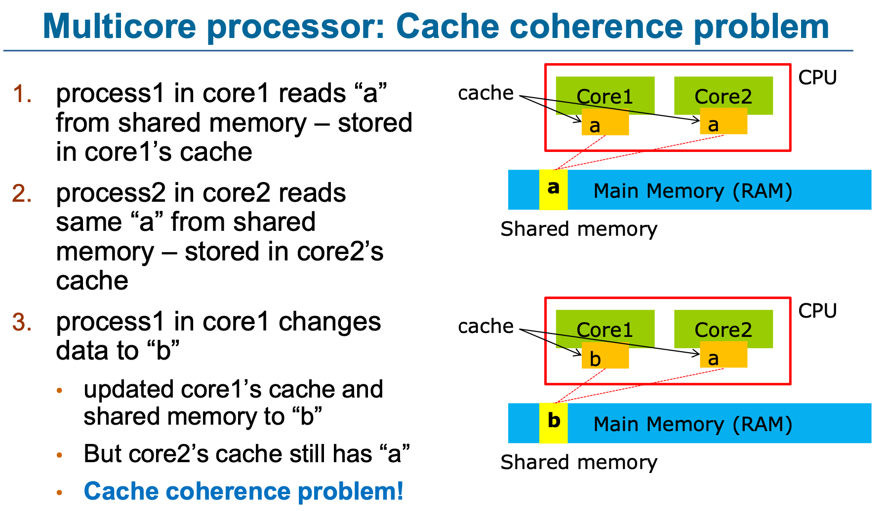

# IPC (InterProcess Communication)
각각의 프로세스는 다른 프로세스에 영향을 주지 않고 독립적으로 실행된다.

프로세스간에 독립적인 구조를 갖고 있지만 서로 통신을 해야하는 상황이 존재할 것이다. 이를 가능하게 해주는 것이 바로 IPC이다.

IPC는 커널이 제공하는 IPC 설비를 통해 통신을 진행한다.

## IPC 종류

### 익명 PIPE

파이프는 두 개의 데이터를 연결하는데 하나의 프로세스는 데이터를 쓰기만하고, 다른 프로세스는 데이터를 읽기만하는 단방향 통신이다. (**반이중 통신**이라고도 불린다.) 그래서 양방향 통신을 하고 싶으면 2개의 파이프를 만들어야 한다.

간단하게 사용할 수 있는 장점이 있고 단순한 데이터의 흐름을 가질 땐 해당 파이프를 사용하는 것이 효율적이나 **전이중통신(양방향 통신)**을 위해 2개의 파이프를 만들어야 할 때는 구현이 복잡해진다는 단점이 있다.

### Named PIPE(FIFO)

익명 파이프는 부모-자식 프로세스간 통신처럼 통신할 프로세스를 명확히 알 수 있는 경우에 사용한다. 반면에 Named 파이프는 전혀 모르는 상태의 프로세스들 사이의 통신에 사용한다.

부모 프로세스와 무관한 다른 프로세스도 통신이 가능하다. 하지만 익명 파이프처럼 익기/쓰기가 동시에 불가능하여 전이중 통신을 만들기 위해서는 2개의 파이프를 만들어야 한다.

### Message Queue

입출력 방식은 Named 파이프와 동일하나 파이프처럼 데이터의 흐름을 통한 통신을 하는 것이 아니라 메모리의 공간을 사용하여 통신을 한다. 사용할 데이터에 번호를 붙이며 여러 프로세스가 동시에 데이터를 쉽게 다룬다.

### Shared Memory

파이프, 메시지 큐가 통신을 이용한 설비라면, **공유 메모리는 데이터 자체를 공유하도록 지원하는 설비**이다.

Shared memory를 사용하면 특수한 공간이 생기는데 이 공간을 process들이 각자 자신의 공간이라고 생각하며 사용한다. 프로세스가 공유 메모리 할당을 커널에 요청하면 커널은 해당 프로세스에 메모리 공간을 할당해주고 이후에 모든 프로세스는 해당 메모리에 접근할 수 있다.

해당 방법은 중개자 없이 곧바로 메모리에 접근할 수 있어서 IPC 중에서 가장 빠르게 작동한다. 하지만 2개 이상의 Process가 동시에 접근하려는 문제(Proces synchronization)와 Multi Processor에서의 Cache Coherence Problem이 발생할 수 있다.

- **Cache Coherence Problem**

  Milti-core process의 문제를 cache coherence problem이라고 한다.
  data를 사용할때는 최근에 사용한 memory에 저장된 data를 cache로 올려서 사용을 하게 된다. 예를 들어 core1, 2에서 shared memory로 사용되는 a라는 값이 있는데 core1, 2에서는 cache에 저장된 a라는 값을 각각 한번 불러온 다음에 cache miss가 발생하지 않는 이상 계속 각자의 cache에 저장된 값을 사용한다. 이때 core1에서 사용하던 shared memory의 값을 b로 바꿔서 memory의 값도 b로 변경되었는데 core2에서는 앞서 불러온 a의 값을 사용하기에 cache coherence문제가 발생한다.

  

### Memory Map

공유 메모리처럼 메모리를 공유하는 방법이다. 메모리 맵은 열린 파일을 메모리에 매핑시켜 공유하는 방식이다.

주로 파일로 대용량 데이터를 공유해야 할 때 사용한다.

### Socket

네트워크 통신을 통해 데이터를 공유한다.

클라이언트와 서버가 소켓을 통해서 통싢는 구조로 원격에서 프로세스간 데이터를 공유할 때 사용한다.

> 이러한 IPC 통신에서 프로세스 간 데이터를 동기화하고 보호하기 위해 세마포어와 뮤텍스를 사용한다.
>
