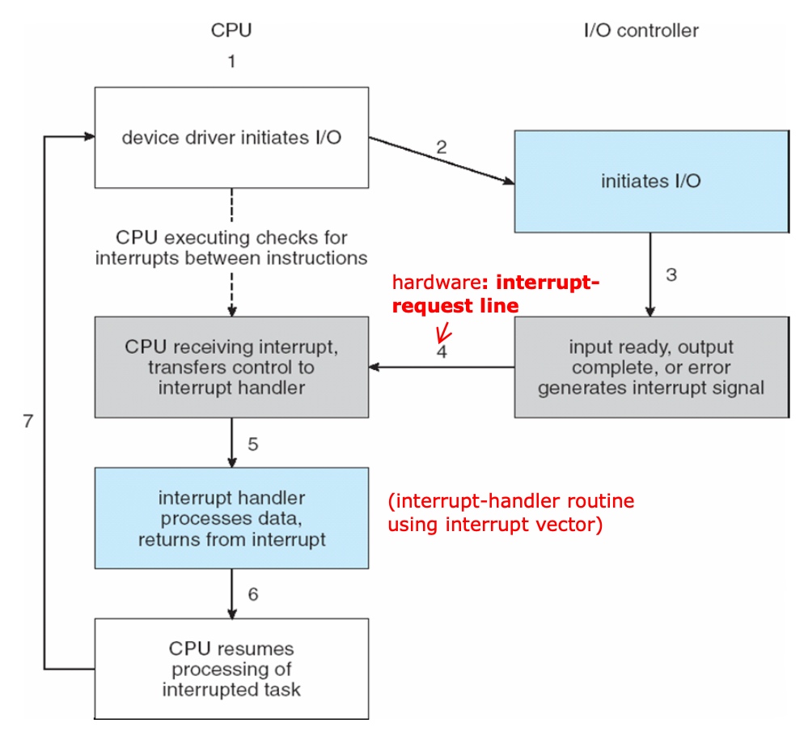

# Interrupt
## 1. 인터럽트란?

CPU가 프로그램을 실행하고 있는중 예기치 않은 상황이나 지금보다 먼저 수행해야하는 일이  발생한 경우 현재 실행 중인 작업을 즉시 중단하고, 발생된 상황에 대한 우선 처리가 필요함을 CPU에게 알리는 것을 의미한다.

- 하드웨어적으로 시그널을 확인하는 방식이다.
- 인터럽트 발생시에만 처리를 하여 시스템 부하가 적다.

이러한 인터럽트는 크게 하드웨어 인터럽트와 소프트웨어 인터럽트로 나뉘게 된다.

## 2. 하드웨어 인터럽트

각각의 Hardware I/O device에서 발생한 인터럽트를 하드웨어 인터럽트라고 한다.

### 2.1. 하드웨어 인터럽트의 종류

- 입출력 인터럽트 (I/O interrupt) - 입출력 작업의 종료나 입출력 오류에 의해 CPU의 기능이 요청됨
- 정전,전원 이상 인터럽트(Power fail interrupt) - 전원 공급의 이상
- 기계 착오 인터럽트(Machine check interrupt) - CPU의 기능적인 오류
- 외부 신호 인터럽트(External interrupt) - I/O 장치가 아닌 오퍼레이터나 타이머에 의해 의도적으로 프로그램이 중단된 경우

## 3. 소프트웨어 인터럽트 (= trap)

- CPU 내부에서 자신이 실행한 명령이나 CPU의 명령 실행에 관련된 모듈이 발생하는 경우 발생한다.
- 프로그램의 오류에 의해 생기거나 System call을 호출할 때 발생한다.

### 3.1. 소프트웨어 인터럽트의 종류

- System call: 애플리케이션이 kernel의 함수를 실행하기 위해 system call을 발생시킨다.
- Exception
    - divide by zero, overflow/underflow, etc..

## 4. 인터럽트 백터와 서비스 루틴

### Interrupt Vector

발생하는 여러 인터럽트에 대해 각각의 인터럽트를 어떻게 처리해야하는지에 대한 루틴의 주소를 보관하고 있는 공간이다. 대부부의 CPU들은 인터럽트 백터 테이블을 갖고 있다.

- Intel x86에서는 이를 IDT(Interrupt Descriptor Table)이라고 한다.

### Interrupt Service Routine

각각의 인터럽트를 처리하는 기계어 코드 루틴이다. 인터럽트가 발생하면 인터럽트 백터에서 실행할 인터럽트 서브루틴의 주소를 찾고 해당 서브루틴을 통해 인터럽트를 처리하게 된다. 이는 Interrupt Handler라고도 한다.

> Ex) 키보드, 디스크 등 interrupt가 발생했을때 각각의 interrupt를 어떻게 처리를 해야하는지? 처리하는 함수는 어디에 있는지? 등을 찾아서 처리해야한다. 그러한 내용은 interrupt vector를 통해 찾는다. interrupt vector는 서비스(device driver)의 주소를 갖고 있으며 이를 통해 해당하는 주소로 가서 interrupt service routine(device driver)를 실행시키고 그 서비스 처리가 끝나면 원래 실행중이던 instruction을 다시 이어서 시행한다.
>

## 5. 인터럽트 실행 과정

- Device controller는 요청한 작업이 끝나면 interrupt를 발생시켜 interrupt request line에 쌓아 둔다.
- CPU는 각각의 instruction이 끝날 때마다 interrupt line이 setting됐는지 확인을 하고 setting됐으면 CPU는 instruction의 수행을 멈추고 interrupt handler를 통해 interrupt를 처리한다.
- Interrupt가 발생하면 CPU는 interrupt vector로 실행을 전송한다. Interrupt vector는 interrupt service routine의 address를 알고 있어 해당 address를 알려주고 CPU는 해당 service routine을 실행시킨다. 실행이 끝나면 기존의 수행 중이던 process를 이어서 수행한다.

## 폴링 (Polling)

- 인터럽트와 같게 이벤트를 처리하는 방법 중 하나이다.
- 폴링 방식은 특정 주기마다 스레드를 돌며 시그널이 들어왔는지 확인하는 방식이다.
- 인터럽트와 다르게 소프트웨어적으로 시그널을 확인하는 방식이다.
- 주기적으로 계속 확인을 해야하기에 시스템의 리소스를 많이 잡아먹는다는 단점이 있다.
- 장점으로는 구현이 쉽고 우선순위의 변경이 용이하다는 점이 있다.

> 인터럽트는 폴링 방식과 다르게 하드웨어로 지원을 받아야하는 제약이 있다. 하지만 폴링 방식보다 신속하게 대응하는 것이 가능하여 실시간 대응이 필요할 때 필수적인 기능이다. 즉, 인터럽트는 발생시기를 예측하기 힘든 경우 컨트롤러가 가장 빠르게 대응할 수 있는 방식이다.
>

[인터럽트(Interrupt)의 개념과 종류](https://raisonde.tistory.com/entry/%EC%9D%B8%ED%84%B0%EB%9F%BD%ED%8A%B8Interrupt%EC%9D%98-%EA%B0%9C%EB%85%90%EA%B3%BC-%EC%A2%85%EB%A5%98)

[[OS] Interrupt 인터럽트란?](https://doh-an.tistory.com/31)

[폴링과 인터럽트 비교](https://kkhipp.tistory.com/155)
