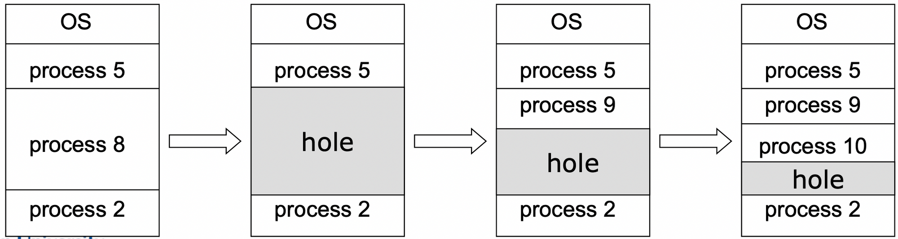
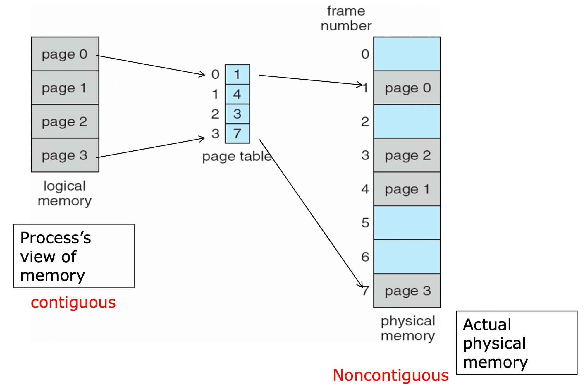

# Contiguous Memory Allocation vs NonContiguous Memory Allocation (feat. Paging, Segmentation)
다중 프로그래밍 시스템에는 여러 프로세스를 수용하기 위해 주기억장치를 동적 분할하는 메모리 관리 작업이 필요하다. OS와 프로세스들은 Main memory에 올라가게 되는데 이때 메모리를 할당(관리)하는 방법들은 크게 연속할당과 불연속 할당이 존재한다.

# Contiguous Memory Allocation

- 프로세스가 사용하는 메모리공간을 연속된 메모리로 할당해주는 것.
- 이 방법은 다양한 크기의 파티션을 하기에 효율적이다. 하지만 메모리 중간에 Hole이 발생할 수 있다.

- OS는 메모리에서 할당된 부분과 비어있는 부분(Hole)의 정보를 관리해야 한다.
- 고정 분할 기법과 동적 분할 기법이 존재한다.
    - 고정 분할 기법 : 주기억장치가 고정된 파티션으로 분할 (**내부 단편화 발생**)
    - 동적 분할 기법 : 파티션들이 동적 생성되며 자신의 크기와 같은 파티션에 적재 (**외부 단편화 발생**)
- 장점
    - 단순한 연산을 통해 할 수 있어서 빠르고 편하다.
    - 연산을 하는데 하드웨어로 limit register와 relocation register만 필요하다.
- 단점
    - 연속적으로 할당을 하다보니까 프로세스가 더 많은 공간을 할당 받기 위해서는 process의 위치를 옮기는 등 옮기기가 어렵다.
    - 자신만의 virtual address를 physical address로 할당받아서 사용하기에 메모리를 공유하기 어렵다. (프로세스는 base~limit 사이의 주소만 접근 가능하여 shared memory로 접근할 방법이 없다.)
    - **external fragmentation**이 발생한다.

  > external fragmentation이란?
  >
  >
  > Hole들이 조각나 있어서 빈 공간이 있음에도 불구하고 새로운 Process가 들어갈 수 있는 공간이 없게 되는 현상을 말한다.
  >
  > 해결책으로는 Compaction과 Nomcontiguous allocation이 존재한다.
  >
  > > Compaction이란?
  > >
  > >- process의 memory공간을 옮겨서 하나의 큰 공간을 만들어주는 방법이다.
  > >    → compile/load time binding에서는 recompile, reload를 하여야 해서 비효율적이다.
  > >    → Execution time binding을 할때만 compaction이 적합하다.

# Noncontiguous allocation

- 연속적이지 않도라도 physical memory의 남은 공간에 데이터를 할당하는 기법이다.
- 현대의 대부분의 OS에서 사용하는 방법이다.
- 페이징, 세그먼테이션 방법 등이 존재한다.

## Paging

- Noncontiguous allocation방법으로 external fragmentation이 발생하지 않는다.
- Physical memory는 고정된 사이즈의 physical frame으로 logical memory는 고정된 사이즈의 virtual page로 나뉘게 된다. (frame size와 page size는 동일)
- 프로세스별로 page table을 갖으며 page table을 통해 logical address를 physical address로 변환한다. (Page table이 MMU 역할을 한다.)

  

- physical memory의 비어있는 frame은 OS가 관리를 해준다.
    - Free frame은 free-frame list에 올라가 있으며 새로운 process가 오면 free frame list만 보고 순서대로 배정해준다. (list내의 순서는 중요하지 않다.)
    - 할당된 frame number들은 page table에 들어간다.

### Paging이 필요한 이유

1. Privide transparency

   Programmer들은 logical address를 보고 있고 physical address를 볼 수 없어서 page들이 contiguous하게 보인다.

2. No External fragmentation
    - Noncontiguous memory allocation을 사용하여 external fragmentation이 없으나 정해진 사이즈의 page내의 빈 공간이 발생하여 internal fragmentation이 발생할 수 있다.
    - Page size를 줄이면 internal fragmentation이 줄어드나 page수가 증가하여 page table의 크기가 증가하고 그에 따라 page탐색 시간도 증가, disk transfer이 증가하는 문제가 발생한다. (일반적으로는 4kB로 사용)
    - Page size와 internal fragmentation, page table size, disk I/O efficiency는 tradeoff한 관계이다.
3. Provice protection to memory
    - 개발자들이 페이지 외부의 공간을 접근할 수 없어서 메모리의 보호가 된다.
4. provice shared memory
    - shared page를 통해 code와 같은 데이터의 공유가 가능하다.

## Segmentation

- 페이징은 프로세스를 **물리적으로** 일정한 크기로 나눠서 메모리에 할당하지만 세그멘테이션은 프로세스를 **논리적으로** 나눠서 메모리에 배치하게 된다.
- 프로세스를 main, program, procedure, function, method, object, stack, local variable, global variable 등과 같은  여러 논리 단위인 세그먼트(segment)집합으로 나누어 표현한다.
- 세그먼테이션도 페이징과 비슷하게 세그먼트 테이블을 갖고 있다.
    - 페이징과 다른 점이라면 세그먼트의 크기가 일정하지 않아서 테이블이 limit정보를 추가로 갖고 있다.

### Paging vs Segmentation

- 보호와 공유 측면에서는 페이징보다 세그먼테이션이 더 효율적이다.
    - 페이징은 영역이 섞일 가능성이 존재하지만 세그멘테이션은 정확히 영역을 나눠서 더 효율적으로 공유할 수 있다.
- 세그먼테이션은 read, write, execute 권한을 논리적으로 나누서 테이블에 해당 정보를 추가하는데 내용을 논리적으로 나누기에 비트를 설정하기 간단하고 안전하다. 반면에 페이징은 code+data+stack 영역이 존재할 때 이를 일정한 크기로 나누기 때문에 영역이 섞여 비트를 설정하기 까다로워질 수 있다.
- 세그먼테이션은 세그먼트의 크기가 일정하지 않고 다영하여 Exteral Fragmentation(외부 단편화)이 발생할 수 있다. 이러한 이유때문에 대부분 페이징 기법을 더 많이 사용하고 있다.
