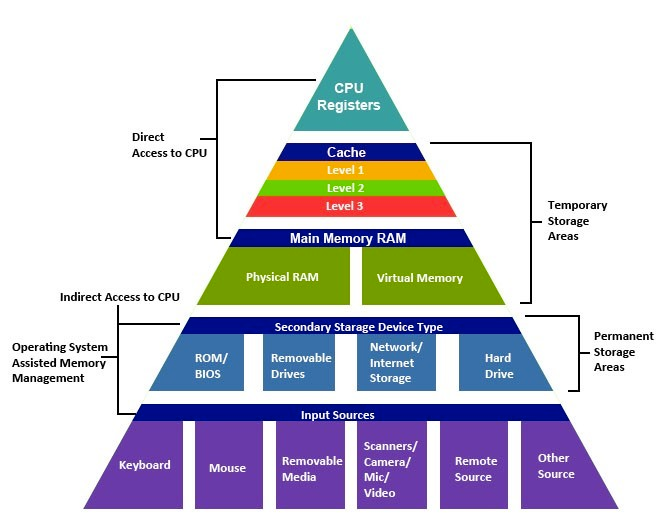
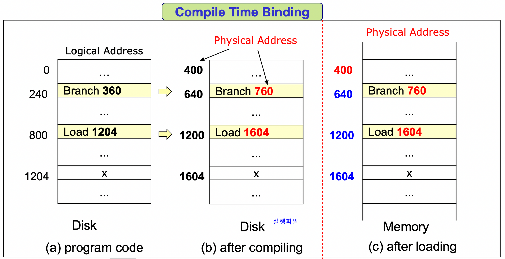
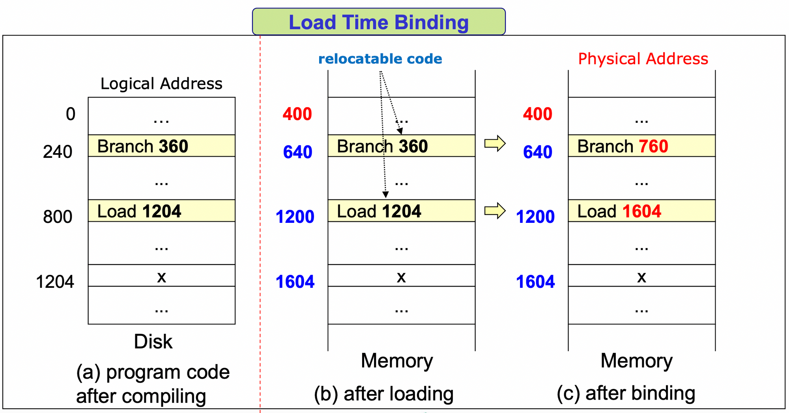
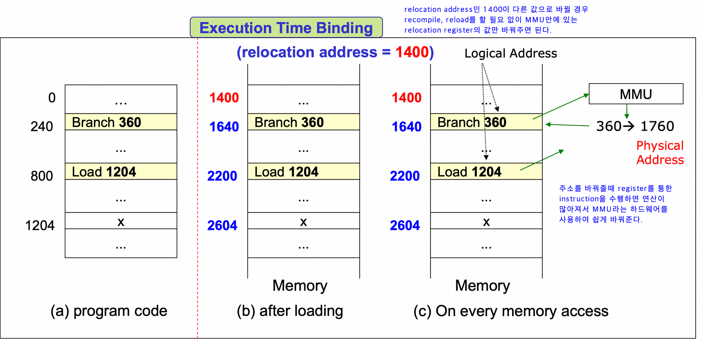
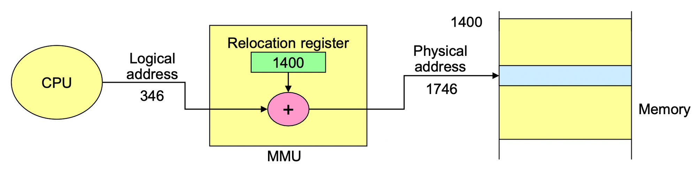
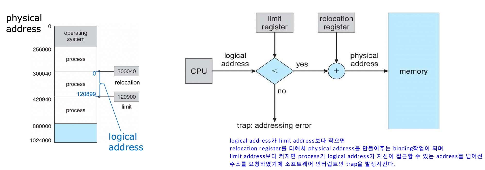

# Memory
## Memory Hierarchy

## Main Memory

프로그램이 실행되기 위해서는 Disk에 있는 프로그램의 데이터를 메인 메모리로 이동시켜야 한다. 그 이유는 메인 메모리만이 CPU가 직접 접근할 수 있는 기억 장치이기 때문이다.

DRAM(Dynamic Random Access Memory)

- Main memory
- Disk보다 access하는게 10만배정도 빠름

SRAM

- Cache memory
- OS가 아닌 hardware가 cache를 관리한다.
- OS가 보기에 cache는 하나의 memory이다.

## Address binding

메모리의 공간이 한정적이기 때문에, 사용자에게 더 많은 메모리를 제공하기 위해 '가상 주소'라는 개념이 등장하였다. (가상 주소는 프로그램 상에서 사용자가 보는 주소 공간이라고 보면 됨) 각각의 process들은 실제 physical memory address를 이용하는 대신 앞서 말한 가상주소인 logical address를 이용한다.

이러한 logical address는 실제로 프로그램 CPU에서 수행하려면 Main memory의  physical address를 할당 받아야하는데 이와 같이 논리적인 주소를 물리 주소로 매핑하는 것을 Address binding이라고 한다.

- Address binding는 실행되는 시점에 따라 compile time binding, Load time binding, Run time binding으로 나뉘게 된다.

### **Compile time binding**

- Compiler에서 컴파일을 할 때 binding을 한다.
- Absolute code생성
- Physical address가 바뀌면 recompile을 해야 한다.

### **Load time binding**

- Address binding을 load time때까지 미루다가 Loader가 load할 때 binding을 진행
- Relocatable code가 생성된다.
- address주소가 바뀌게 된다면 reload를 해야한다. (recompile보다는 소모가 적다.)

→ compile/load time binding은 주소값을 바꿔줘야 하는 상황이 발생하면 recompile, reload를 통해 모든 주소를 바꿔야 한다는 문제점이 있다.

### **Run time binding (Execution Time)**

- 컴파일하고 load한 뒤에도 physical address를 사용하다가 실제 실행이 되는 execution time에서 binding을 해준다.
- Address binding을 하는데 Hardware support가 필요하다.(MMU)
- 대부분의 OS가 이 방법을 사용한다.
- Address를 바꾸게 된다면 recompile, reload를 할 필요가 없이 relocation register의 값만 바꿔주면 된다.

## **MMU (Memory Management Unit)**

- 메모리 보호나 캐시 관리 등 CPU가 메모리에 접근하는 것을 총 관리해주는 하드웨어이다.
- Runtime binding을 할 때 논리적 주소를 물리적 주소로 매핑시켜주는 하드웨어 장치이다.
- Relocation register를 통해 물리적 주소로 매핑을 해준다.

- process마다 각각 다른 값의 relocation(=base) register, limit register를  갖고 있으며 이를 통해 logical address space를 정의한다.(값은 PCB에 저장)

**MMU의 메모리 보호**

- limit register를 통해 logical address가 binding될 때 다른 physical address로 가는 것을 막는다.
- memory protection -> limit밖으로 넘어가려하면 소프트웨어 인터럽트인 trap발생

## Cache memory

주기억장치에 저장된 내용의 일부를 임시로 저장해두는 기억장치로 CPU와 주기억장치의 속도 차이로 성능 저하를 방지해준다.

> 캐시는 플리플롭 소자로 구성되어 SRAM으로 되어있어서 DRAM보다 빠른 장점을 지니고 있다.
>

CPU에서 메인 메모리에 접근하기 이전에 먼저 캐시 기억장치를 확인하게 된다. 데이터가 존재하면 Cache Hit이 발생하여 바로 해당 명령어를 사용하고 데이터가 없다면 Cache miss가 발생하여 Main memory로 접근하게 된다.

이와 같이 Main Memory로 접근하기 이전에 Cache를 접근하기에 잘만 활용하면 메모리 접근 비용을 아낄 수 있다.

Cache hit을 극대화 시키기 위헤서는 지역성의 원리를 이용한다. 지역성의 전제조건으로 프로그램은 모든 코드나 데이터를 균등하게 Access 하지 않는다는 특성을 기본으로 한다. 
즉, Locality란 기억 장치 내의 정보를 균일하게 Access 하는 것이 아닌 어느 한 순간에 특정 부분을 집중적으로 참조하는 특성인 것이다.

> 지역성
>
> - 기억 장치 내의 정보를 균일하게 액세스 하는 것이 아니라 한 순간에 특정부분을 집중적으로 참조하는 특성을 의미한다.
> - **시간 지역성** : 최근에 참조된 주소의 내용은 곧 다음에도 참조되는 특성
> - **공간 지역성** : 실제 프로그램이 참조된 주소와 인접한 주소의 내용이 다시 참조되는 특성
