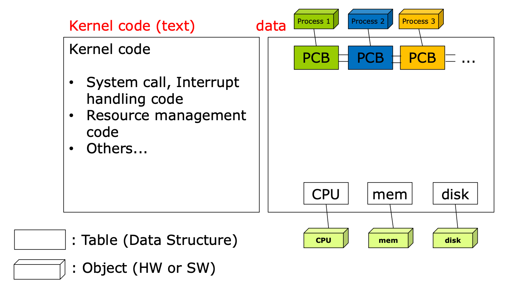

# PCB (Process Control Block)
## PCB란?

- 각각의 Process들은 OS의 관리를 받게 되는데 이때 OS는 process의 현재 정보들을 알기 위해 PCB를 사용한다.
- OS는 프로세스들의 아래의 정보를 저장하고 있다.
    - Process **state**
    - Process number: process id (**pid**)
    - **Program counter** (PC) - next instruction address
    - **CPU register** – contents of registers (in CPU)
    - etc (Owner, CPU Usage, Memory Usage, Process Priority)

## PCB가 왜 필요할까?

- CPU core를 하나의 process가 사용하지 않고 schedule에 따라 PC, register의 값들이 교체되게 된다. 이때 실행중인 process가 바뀔 때마다 값들을 변경할 수 없기에 PCB에 값들을 저장하고 Process가 변경될 때마다 PCB의 값들을 불러와서 연산을 이어서 한다. 즉, 앞으로 다시 수행할 대기중인 프로세스에 관한 저장 값을 저장해두기 위해 만들어졌다.

## 어떻게 관리될까?

- kernel의 data영역은 CPU, memory, disk등의 데이터들을 각각 갖고 있다. 그리고 각각의 process의 정보들을 갖고 있는 PCB들이 존재한다. 즉, PCB는 kernel의 data 영역에서 관리된다.

  

- 이때 PCB들은 Linked List 방식으로 관리가 된다. PCB List Head에 PCB들이 생성될 때마다 붙게 된다. 주소값으로 연결이 이루어져 있는 연결리스트이기 때문에 삽입 삭제가 용이하다.
- 프로세스가 생성되면 PCB가 생성되고 프로세스가 종료되면 PCB도 제거된다.
