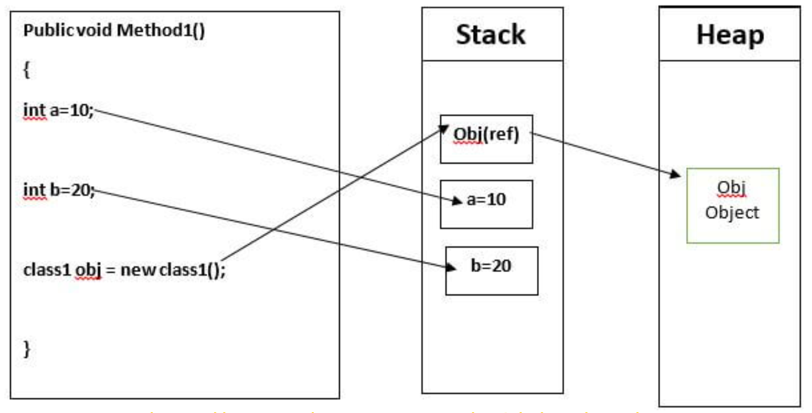
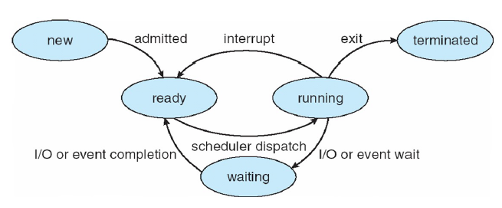
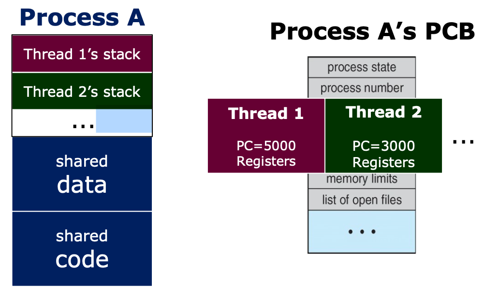
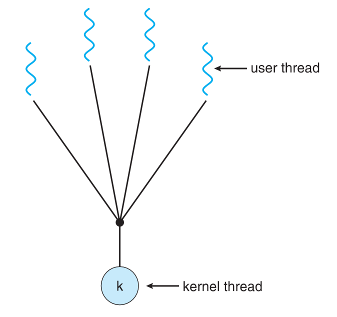
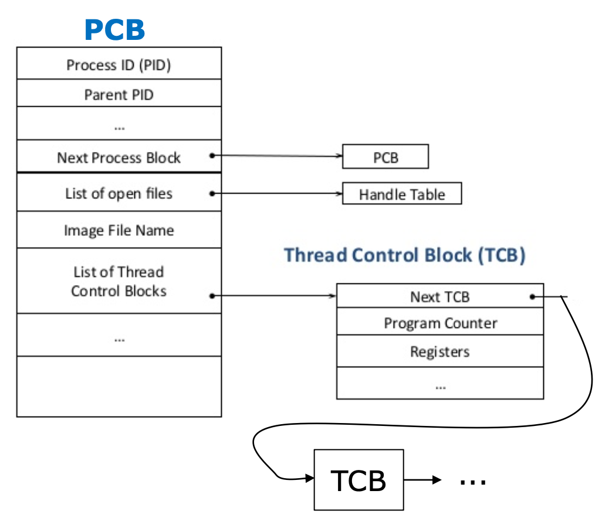

# 프로세스 (Process)
## 1. Process란?

- 프로세스는 코드로 작성된 프로그램이 메모리에 적재되어 사용할 수 있는 상태가 된 것이다. 즉, 메모리 상에서 실행중인 프로그램을 프로세스라고 한다.
- 여러개의 Thread를 보관하고 있는 컨테이너이다.
- 프로세스는 최소한 한개 이상의 Thread를 보관한다. (생성될 때 기본적으로 하나의 스레드를 같이 생성한다.)

## 2. 프로세스의 주소 공간

- **Text (Code)**: 코드 자체를 구성하는 메모리 영역
- **Data**:  전역변수, 정적 변수, 배열과 같은 static data (global variable)
    - 초기화된 데이터는 data 영역에 저장하며 초기화되지 않은 데이터는 bss 영역에 저장한다.
- **Stack**: 지역변수, 매개변수, 리턴 값과 같은 데이터를 저장하는 임시 메모리 영역이다. (local variable, function parameter, return address)
- **Heap**: run time 시점에 동적 할당되는 데이터들이 저장된다. (malloc, java object)

  > C에서 Pointer 변수 같은 경우 stack에는 데이터의 주소값들이 저장이 되고 heap에는 실제 값이 저장된다.
  >

  > Java의 경우 객체 생성에서 비슷한 예시가 있다.
  >
  >
  > 
  >
  > int a,b는 local variable이어서 stack에 저장이 되고 class1 obj도 local variable이어서 stack에 저장이 되는데 object의 실제 내용은 heap에 저장이 되고 stack에서는 주소값을 갖고 있다. object를 생성이 되면 처음에는 stack에 주소값만 생성이 되고 실제로 할당이 되면 그때서야 heap이 생성되고 실제 데이터가 저장이 된다.

프로세스는 위와 같은 자신만의 공간과 자원을 할당받아 사용을 한다. 그에 반하여 스레드는 스택만 따로 할당받고 나머지 영역은 프로세스 안에서 다른 스레드와 공간과 자원을 공유하며 사용한다.

### 2.1. 프로세스 주소 공간을 나눈 이유는 무엇일까?

최대한 데이터를 공유하며 메모리 사용량을 줄이기 떄문이다.

Code와 같은 프로그램 자체의 정보는 같은 변함이 없는 같은 내용이기에 따로 관리를 하며 공유를 한다. 반면에 Stack, Data는 스택의 구조의 특성과 전역 변수의 활용성을 위해서 나누게 되었다.

## 3. 프로세스의 상태

- **Running**: CPU를 잡고 instruction을 수행중인 상태
- **Ready**: CPU를 사용하려고 기다리는 상태 (할당이 되면 바로 시행하려고 proces 가 메모리에 올라가 있다.)
- **Blocked(wait, sleep)**: CPU를 주어도 당장 instruction을 수행할 수 없는 상태, process 자신이 요청한 event (I/O, 공유하는 데이터 등)가 즉시 만족되지 않아 이를 기다리는 상태이다. 요청한 event가 수행을 마치면 interrupt를 발생시키고 blocked상태의 process를 ready queue에 옮겨준다.
- **New**: process가 생성중인 상태
- **Terminated**: 수행이 끝난 상태

> running state에서 CPU를 뺐기거나 넘기는 경우
>
> 1. Interrupt가 발생했을 때 (timer도 포함)
> 2. I/O request를 하기 위해 system call을 하여 waiting상태로 넘어가는 경우
> 3. Process의 수행이 끝나서 terminated로 되는 경우

## 3. PCB란?

각각의 Process들은 OS의 관리를 받게 되는데 이때 OS는 process의 현재 정보들을 알기 위해 PCB를 사용한다.

[PCB(Process Control Block) ](PCB란.md)

## 4. Process Context

Process Context는 프로세스의 상태를 나타낸다. 현재 이 프로세스가 메모리를 얼마나 사용하고 있는지? 함수를 어디까지 실행하고 있는지? 과거에 나쁜 짓을 하지 않았는지? 등의 정보를 갖고 있다.

- CPU execution context
    - process counter
    - registers
- Process memory space
    - code, data, stack
- Process management inOS
    - Process Control Block (PCB)
    - Kernel stack

## 5. 멀티 프로세스

컴퓨터에 있는 하나 이상의 CPU에서 하나 이상의 작업을 동시에 병렬처리하는 것을 의미한다.

**장점**

- 독립된 구조로 안정성이 높다.
- 프로세스 중에 하나에 문제가 생겨도 다른 프로세스에 영향을 주지 않아 정지되는 문제가 발생하지 않는다.

**단점**

- 독립된 메모리 영역이기 때문에 작업이 많을 수록 Context Switching Overhead가 발생하여 성능 저하가 발생할 수 있다.
- 각각의 프로세스가 PCB, OS resource를 가져서 효율적이지 못하다.
- 프로세스끼리 서로 데이터를 공유하려면 IPC를 필요로 한다.

---
# Thread
## 1. Thread란?

CPU가 동작하는 가장 작은 단위의 unit은 thread이다.
사용자들이 2개의 같은 program을 이용하는 경우는 program들은 동일한 code를 실행하고 data들을 공유하고 싶을 것이다. 그래서 code와 data를 같이 공유하며 사용하자라고 만든 것이 thread이다

- 동일한 프로그램을 여러 개 띄우더라도 process가 하나만 만들어진다. (code, data, stack이 하나만 만들어진다는 뜻.)
- thread마다 PC, register, stack를 따로 관리 (TCB)
- thread들은 code, data, OS resources를 공유한다. (공유하는 부분을 task라고 부른다.)
- IPC없이 바로 shared memory에 접근 가능하다
- Process들끼리 바꾸는 context switching보다 Thread를 변경하는 것이 overhead가 적다.
- 새로운 스레드를 만들 때는 PC, Register, Stack에 대한 공간만 만들면 됨으로 프로세스를 만드는 것보다 memory와 time 측면에서 이점이 있다.

## 2. Thread의 종류

스레드는 Kernel Thread와 User Thread로 나뉜다.

### 2.1. Kernel thread

- thread_create system call을 통해 생성되며 Kernel의 support를 받아 kernel이 thread의 존재를 알게 된다.
- 각각의 thread는 TCB를 갖는다. (TCB의 정보들은 PCB안에 있다.)
- **장점**: Parallelism과 Concurrency를 지원한다.

  (Concurrency: 하나의 스레드가 block 상태에 있어도 다른 스레드가 실행 가능하다.)

- **단점**: thread들은 kernel을 통해서 operation을 해야하기에 User thread보다 무겁다.

### 2.2. User thread

- Implement thread in user library.
- 생성을 위해 system call이 필요 없다.
- 하나의 kernel thread안에 여러 개의 user thread가 mapping되어서 만들어진다.
- **장점**: kernel이 존재를 몰라서 user space안에서 thread library에 의해 관리된다, system call이 필요 없어서 빠르다.
- **단점**: 하나의 user thread가 system call을 만들면 전체 thread가 blocked 상태가 된다 또한 Parallelism을 지원하지 않는다.

## 3. TCB (Thread Control Block)

- process를 관리하기 위해 필요한 PCB와 같이 thread를 관리하기 위해서는 TCB가 있다.
- TCB의 정보는 PCB안에 있다.
- 각각의 Kernel Thread에만 생성된다.
- Contains PC, register의 정보를 갖고 있다.
- ready queue는 CPU를 기다리고 있는 TCB의 리스트로 context switch를 할때마다 TCB들에 있는 각각의 PC, register 정보를 바꿔주게 된다.

## 4. 멀티 스레드

하나의 프로세스에 여러 스레드로 자원을 공유하며 작업을 나누어 수행하는 것이다.

**장점**

- 독립적으로 프로세스를 생성하는 것에 비해 PC, Register, Stack에 대한 공간만 만들면 됨으로 프로세스를 만드는 것보다 memory와 time 측면에서 이점이 있다.
- 시스템의 처리율이 향상된다.
- 스레드간 데이터를 주고받는 것이 간단해지고 시스템 자원 소모가 줄었다.
- 스레드 사이의 작업량이 적어 Context Switching이 빠르다. (캐시 메모리를 비울 필요가 없다)
  - Nom-blocking system call을 하여 효율적이다.
    - Single thread는 I/O작업을 하면 process전체가 waiting으로 가게 되는 blocking system인데 multi-thread process같은 경우는 하나의 thread가 I/O작업을 하여 해당 thread가 waiting으로 가더라도 다른 thread가 CPU를 할당받아 사용할 수 있는 Non-blocking system이다.
- 간단한 통신 방법으로 프로그램의 응답시간과 통신 비용이 단축됐다. (IPC없이 Shared 메모리에 접근 가능)

**단점**

- 자원을 공유하기에 bottle neck, deadlock과 같은 동기화 문제가 발생할 수 있다.
- 주의깊은 설계가 필요하고 디버깅이 어렵다.
- 하나의 스레드에 문제가 생기면 전체 프로세스가 영향을 받는다.
- 단일 프로세스 시스템의 경우 효과를 기대하기가 어렵다.

## 5. 멀티 프로세스 vs 멀티 스레드

- 멀티 스레드는 멀티 프로세스보다 작은 메모리 공간을 차지하고Context Switching이 빠른 장점이 있지만, 동기화 문제와 하나의 스레드 장애로 전체 스레드가 종료될 위험을 갖고 있다.
- 멀티 프로세스는 하나의 프로세스가 죽더라도 다른 프로세스에 영향을 주지 않아 안정성이 높지만, 멀티 스레드보다 많은 메모리 공간과 CPU 시간을 차지하는 단점이 있다.
- 두 방법은 동시에 여러 작업을 수행하는 점에서 동일하지만, 각각의 장단이 있음으로 적용하는 시스템에 따라 적합한 동작 방식을 선택하고 적용해야 한다.

[[OS]멀티 프로세스와 멀티 스레드의 차이는 무엇일까?](https://livenow14.tistory.com/67)
