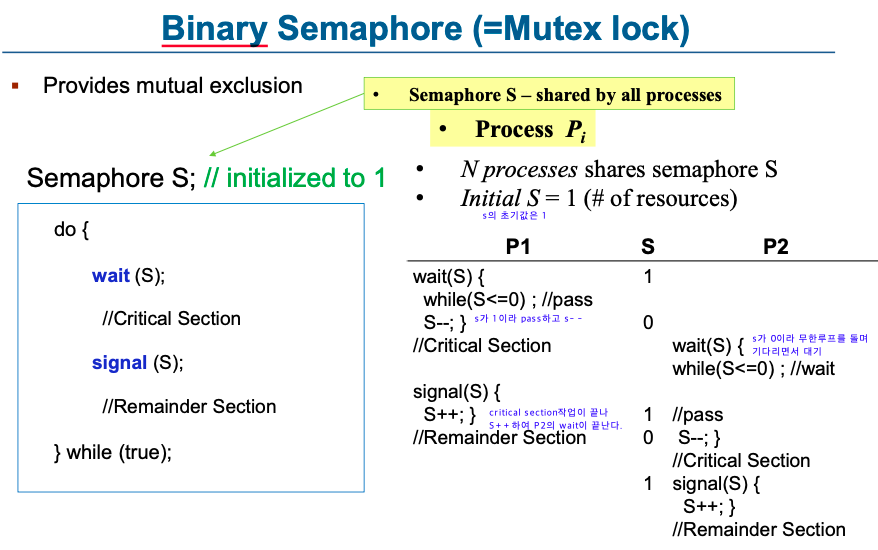
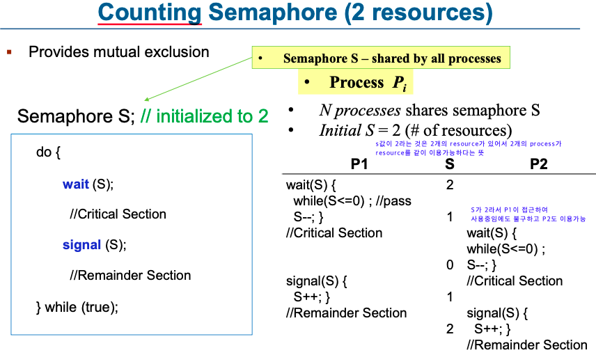
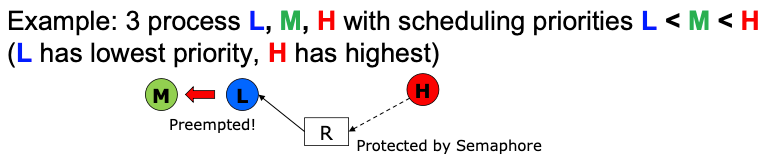

# Synchronize
multicore cpu에서 2개 이상 프로세스가 parallel하게 실행되는 경우 또는 두개 이상의 프로세스가 하나의 single core에서 concurrently하게 실행되는 등 공유 자원에 동시접근하는 문제가 발생할 수 있다.

이때 공유자원을 관리해주지 않으면 데이터의 일관성이 깨질 수 있다. 이러한 문제를 Race Condition이라고 한다.

## Race Condition

2개 이상의 Process가 공유자원에 접근할 때 발생하는 문제이다. 이는 어떤 순서로 실행이 되느냐에 따라 예측과 다른 결과가 나올 수 있다. 이를 막기 위해서 synchronized를 해야한다.

### Race Condition이 발생하는 경우

1. **커널 작업을 수행하는 중에 인터럽트 발생하는 경우**
    - 문제점 : 커널모드에서 데이터를 로드하여 작업을 수행하다가 인터럽트가 발생하여 같은 데이터를 조작하는 경우
    - 해결법 : 커널모드에서 작업을 수행하는 동안, 인터럽트를 disable 시켜 CPU 제어권을 가져가지 못하도록 한다.
2. **프로세스가 'System Call'을 하여 커널 모드로 진입하여 작업을 수행하는 도중 context switching이 발생할 때**
    - 문제점 : 프로세스1이 커널모드에서 데이터를 조작하는 도중, 시간이 초과되어 CPU 제어권이 프로세스2로 넘어가 같은 데이터를 조작하는 경우 ( 프로세스2가 작업에 반영되지 않음 )
    - 해결법 : 프로세스가 커널모드에서 작업을 하는 경우 시간이 초과되어도 CPU 제어권이 다른 프로세스에게 넘어가지 않도록 함
3. **멀티 프로세서 환경에서 공유 메모리 내의 커널 데이터에 접근할 때**
    - 문제점 : 멀티 프로세서 환경에서 2개의 CPU가 동시에 커널 내부의 공유 데이터에 접근하여 조작하는 경우
    - 해결법 : 커널 내부에 있는 각 공유 데이터에 접근할 때마다, 그 데이터에 대한 lock/unlock을 하는 방법

## **Critical section**

- 각각의 process들은 shared data를 접근하는 부분에 critical section이라고 불리는 code segment를 갖고 있다.
- 동시간대에 하나의 process만 critical section을 실행할 수 있다.
- 각각의 process들은 critical section에 들어갈 때 entry section에서 permission에 대해 물어보고 사용 가능하면 들어간다. 실행을 마치면 exit section을 통해 사용을 마쳤다는 것을 알리고 remainder section을 이어서 실행시킨다.
- Critical section에는 필요 조건이 있다.
    - **Mutual Exclusion(상호 배제)**: 하나의 프로세스가 들어오면 다른 프로세스는 못들어온다.
    - **Progress(진행)**: Critical Section을 실행하는 프로세스가 없을 때는 원하는 프로세스는 누구나 들어갈 수 있다.
    - **Bounded waiting(한정된 대기)**: 각각의 process들은 몇번의 시도안에 Critical Section에 들어갈 수 있어야 한다.

## Semaphore & Mutex Lock

많은 시스템들은 synchronization을 하기 위해 atomic hardware instruction의 도움을 받는다. Atomic instruction은 interrupt를 발생하지 않는다.

mutex lock과 semaphore는 atomic instruction을 사용하기 위한 tool이다. 둘은 atomic instruction의 지원을 받아서 Critical Section을 구현한다.

### Mutex Locks

- 임계 구역을 가진 스레드들의 실행시간이 서로 겹치지 않고 각각 단독으로 실행되게 하는 기술로 공유된 자원의 데이터 혹은 임계영역(Critical Section) 등에 하나의 Process 혹은 Thread가 접근하는 것을 막아줌 (동기화 대상이 하나)
- Mutual Exclusion(상호 배제)의 약자이다.
- 해당 접근을 조율하기 위해 lock과 unlock을 사용한다. 누군가가 lock을 acquire하게된다면 다른 process들은 critical section을 들어가지 못한다.
    - lock : 현재 임계 구역에 들어갈 권한을 얻어온다 ( 만약 다른 프로세스/스레드가 임계 구역 수행 중이면 종료할 때까지 대기 )
    - unlock : 현재 임계 구역을 모두 사용했음을 알린다. ( 대기 중인 다른 프로세스/스레드가 임계 구역에 진입할 수 있음 )

### Semaphore

- 공유된 자원의 데이터 혹은 임계영역(Critical Section) 등에 여러 Process 혹은 Thread가 접근하는 것을 막아줌 (동기화 대상이 하나 이상이다.)
- Semaphore는 S라는 integer variable을 갖고 critical section을 관리한다.
- Wait(S)와 signal(S)는 atomic instruction이다
- Semaphore는 mutex lock보다 활용도가 높다.
- semaphore의 크기에 따라 Binary semaphore, Counting semaphore가 존재

**Binary semaphore**

- Semaphore값이 0,1만 갖는 것으로 Mutex lock과 동일하다.
- 누가 사용하면 semaphore는 0으로 되고 안쓰면 1이 된다.

**Counting semaphore**

- Semaphore의 값이 0,1말고도 다른 값들도 가질 수 있어서 여러 개의 thread가 resource를 동시에 이용할 수 있게 해준다. (=여러 개의 resource를 이용할 수 있다.)

### Semaphore에서 발생할 수 있는 문제점

- Deadlock
- Priority Inversion

  이는 Priority Scheduling에서 발생할 수 있는 문제로 우선순위가 높은 프로세스가 필요로 하는 자원을 우선순위가 낮은 프로세스가 lock을 걸고 있을 때 발생하는 문제이다.

  

  낮은 우선순위를 가진 L이 resource R을 이용중인데 R을 이용하고 싶고 높은 우선순위를 가진 H가 ready queue에 추가되어서 먼저 수행을 하려고 하는데 L이 interrupt발생을 못시키게 하는 semaphore에 접근중이라 H는 L의 수행이 끝날때까지 기다린다. (여기까지는 Priority inversion이 아니다.)
  이때 R에 접근을 하고싶어하지 않는 M이 ready queue에 추가되면 R에 관련없는 M은 preemption을 발생시켜 L을 종료시키고 M을 수행한다. M이 preemption을 발생시켜 H가 M까지 기다리게 하는 일을
  priority inversion이라고 한다.

### Semaphore와 Mutex의 차이

- Mutex는 동기화 대상이 오직 1개일 때 사용하며, Semaphore는 동기화 대상이 1개 이상일 때 사용한다.
- Mutex는 자원을 소유할 수 있고, 책임을 가지는 반면 Semaphore는 자원 소유가 불가합니다.Mutex는 상태가 0, 1 뿐이므로 Lock을 가질 수 있고, 소유하고 있는 스레드만이 이 Mutex를 해제할 수 있다. 반면 Semaphore는 Semaphore를 소유하지 않는 스레드가 Semaphore를 해제할 수 있다.
- Semaphore는 시스템 범위에 걸쳐 있고, 파일 시스템 상의 파일로 존재합니다. 반면, Mutex는 프로세스의 범위를 가지며 프로세스 종료될 때 자동으로 Clean up 된다.

[[운영체제] Mutex 뮤텍스와 Semaphore 세마포어의 차이](https://heeonii.tistory.com/14)
