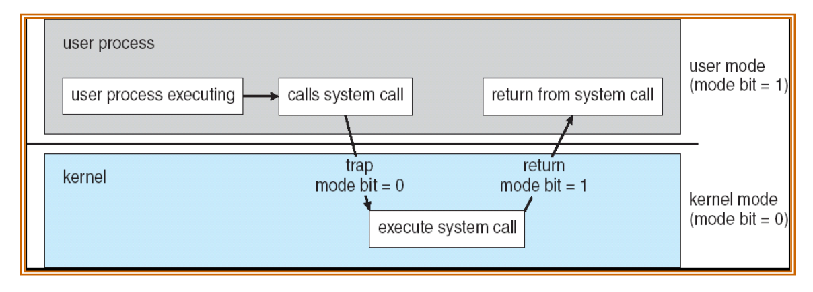
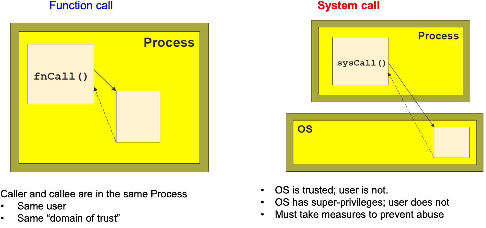

# System Call
System Call을 알기 위해서는 먼저 Dual Mode Operation에 대해 알아야 한다.

## Dual Mode Operation

- 사용자 장치의 잘못된 수행으로 다른 프로그램 및 운영체제에 피해가 가지 않도록 하기 위한 Mode bit이라는 보호장치가 존재한다.
- Mode bit은 하드웨어적으로 두가지 모드의 operation을 지원한다.
    - 1이면 user mode (사용자 프로그램 수행)
    - 0이면 kernel mode (OS코드 수행)
- Privileged instruction은 파일을 다루거나 I/O에게 request를 하는 등 OS만 실행할 수 있는 instruction으로 kernel mode에서만 수행가능하다.
- 만약 user mode에서 실행하려고 하면 프로그램을 종료하고 software interrupt가 발생한다. User Program이 hardware에 접근하려면 system call을 통해 실행하여야 한다.

## System Call이란?

User program이 접근하지 못하는 OS만의 Privileged instruction을 실행하기 위해 OS에게 특정 일들을 수행해달라고 요청하는 것으로 Software interrupt이다. 이는 User program과 OS사이의 interface를 제공한다

## Function Call과의 차이점

fuction call은 같은 process 내에서 process 내에 있는 function 을 불러서 수행하는 것이다. 반면에 System call은 OS의 도움을 받아 OS의 function을 불러서 수행하는 것이다.
