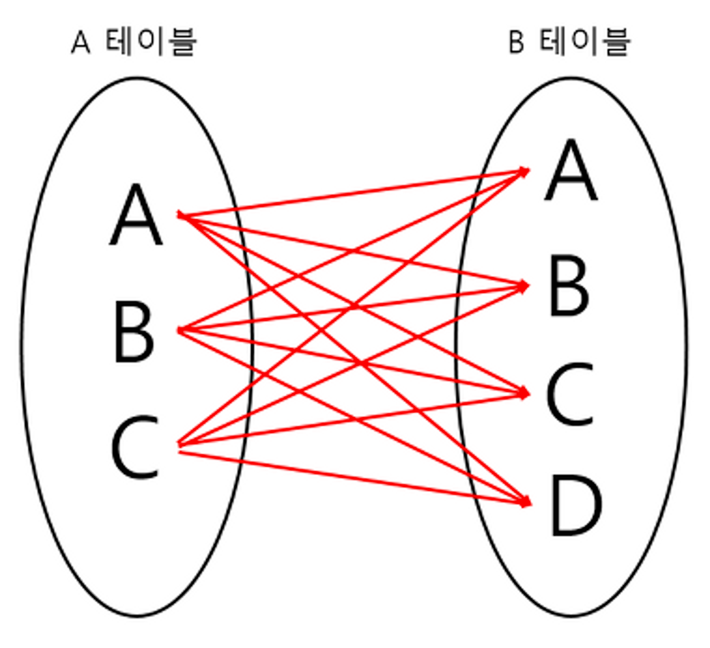
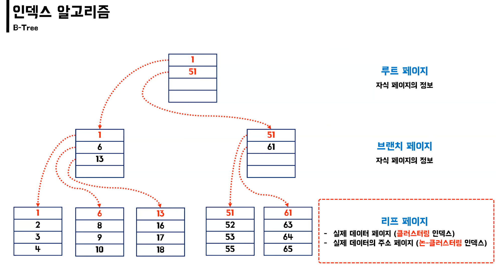
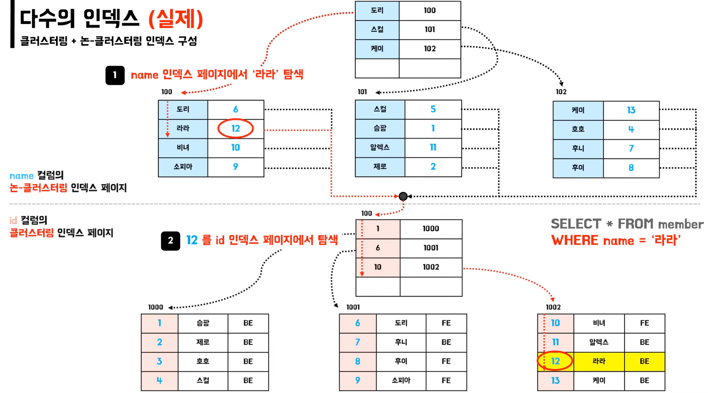
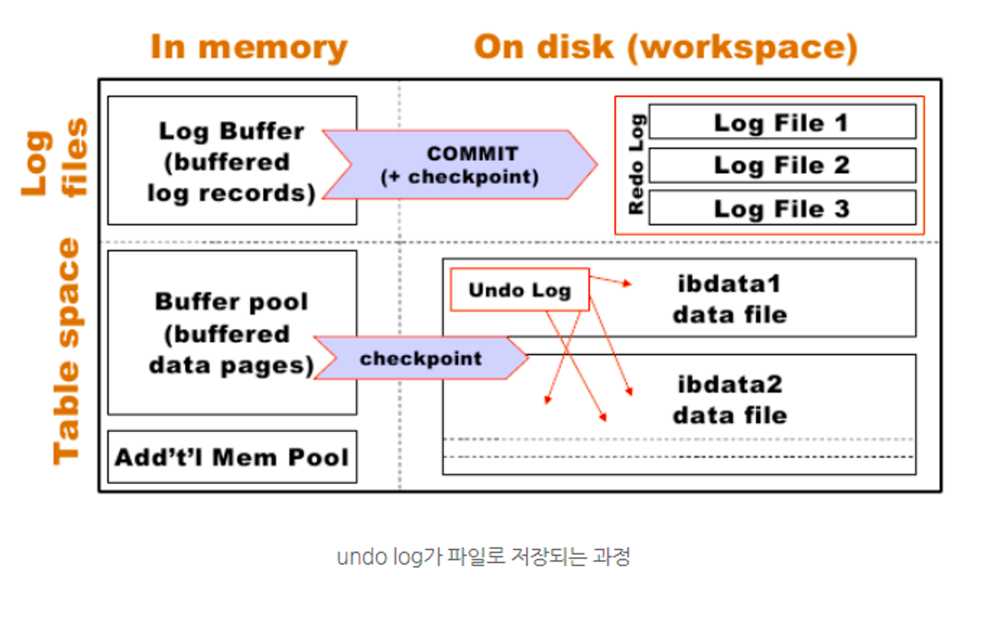
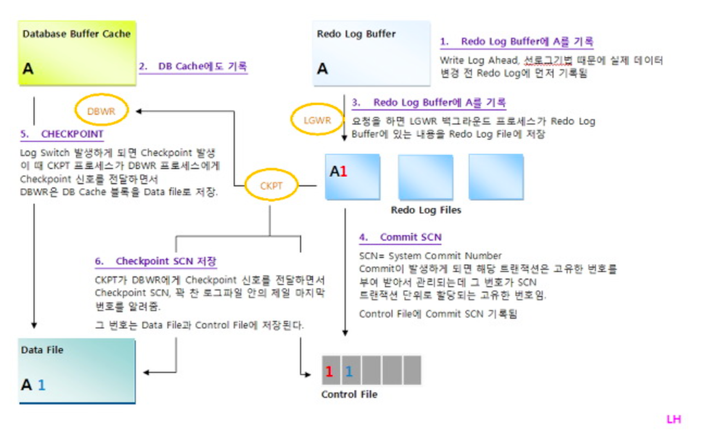

# Database
<details>
<summary>SQL이란 무엇일까요?</summary>

<hr>

SQL(Structured Query Language)란 관계형 데이터베이스 관리 시스템의 데이터를 관리하기 위해 설계된 특수 목적의 프로그래밍 언어이며 관계형 데이터베이스 관리 시스템에서 자료의 검색, 관리, 데이터베이스 스키마 생성과 수정, 데이터베이스 객체 접근 조정 관리를 위해 고안되었다.

<hr>
</details>


<details>
<summary>트랜잭션이란?</summary>

<hr>

- 트렌잭션이란 데이터베이스의 상태를 변화시키기 위해 수행하는 작업의 단위 또는 한꺼번에 모두 수행되어야 할 일련의 연산들을 뜻한다.
- 트랜잭션은 데이터의 정합성을 보장하기 위해 고안되었으며 데이터베이스 시스템에서 병행제어 및 회복 작업을 할 시 처리되는 작업의 논리적인 단위가 된다.

### 📚 Reference
- [트랜잭션이란?](https://seongwon.dev/Database/20221001-트랜잭션이란/)

<hr>
</details>


<details>
<summary>트랜잭션의 특징인 ACID에 대해 설명해주세요 </summary>

<hr>

- Atimicity(원자성)
  - 트랜잭션의 연산은 DB에 모두 반영되거나 아예 반영되지 않아야 한다,
- Consistency(일관성)
  - 트랜잭션이 성공적으로 작업을 수행한 후에도 데이터베이스는 일관성있는 상태를 유지해야한다.
  - e.g. 돈을 송금하기 전/후의 돈의 총 합은 같아야 한다.
- Isolation(독립성)
  - 둘 이상의 트랜잭션이 실행되고 있을 경우 어떤 트랜잭션이라도 다른 트랜잭션의 연산에 끼어들 수 없다.
- Durability(지속성, 영속성)
  - 성공적으로 수행을 마친 트랜잭션의 결과는 시스템이 고장나도 영구적으로 반영되어야 한다.

### 📚 Reference
- [트랜잭션이란?](https://seongwon.dev/Database/20221001-트랜잭션이란/#트랜젝션의-특징-acid)

<hr>
</details>


<details>
<summary>다수의 트랜잭션이 하나의 자원을 접근할 때 발생할 수 있는 문제들은 무엇이 있을까요?</summary>

<hr>

- Dirty Read
  - Uncommitted 결과를 다른 트랜젝션에서 확인하는 현상을 말한다.
- Non-Repeatable Read
  - 하나의 트랜잭션에서 같은 데이터를 두 번 조회하였을 때 같은 결과를 가져와야 한다는 REPEATABLE READ정합성에 어긋나게 다른 데이터를 읽어오는 문제이다.
- Phantom Read
  - 한 트랜잭션 안에서 일정 범위의 레코드를 두 번 이상 읽었을 때, 첫번째 쿼리에서 없던 데이터가 두번째 쿼리에서 나타나는 현상이다.

### 📚 Reference
- [트랜잭션이란?](https://seongwon.dev/Database/20221001-트랜잭션이란/#다수의-트랜젝션이-하나의-자원을-경쟁할-때의-문제들)
- [트랜잭션의 격리수준(Isolation level)이란?](https://seongwon.dev/Database/20221022-트랜잭션-격리수준이란/)

<hr>
</details>


<details>
<summary>트랜잭션의 격리 레벨에 대해 설명해주세요</summary>

<hr>

트랜잭션 격리수준이란 여러 트랜잭션이 동시에 처리될 때 특정 트랜잭션이 다른 트랜잭션에서 변경하거나 조회하는 데이터를 볼 수 있게 허용할지 말지를 결정하는 것입니다. 격리 수준을 어떻게 설정하느에 따라 데이터 부정합 문제와 성능에 영향을 줄 수 있다.

격리 수준은 `READ UNCOMMITTED`(Level0), `READ COMMITTED`(Level1), `REPEATABLE READ`(Level2), `SERIALIZABLE`(Level3)이 존재한다.

### READ UNCOMMITTED

- 트랜잭션의 변경 내용을 commit 여부의 상관없이 다른 트랜잭션이 조회할 수 있다.
- 격리가 되지 않은 상태라 **Dirty Read, Non-Repeatable Read, Phantom Read가 모두 발생할 수 있다.**

### READ COMMITTED

- 트랜잭션에서 데이터를 변경하였더라도 Commit이 완료된 데이터만 다른 트랜잭션에서 조회할 수 있다.
- MySQL에서는 언두로그를 이용해 데이터의 변경이 발생하면 변경 이전 데이터를 언두(Undo)로그에 복사하고 조회 요청이 오면 언두로그의 데이터를 반환하는 구조로 동작하여 다른 트랜잭션들에게는 변경 이전의 데이터를 보여주는 구조로 동작하여 Dirty Read를 해결하였다.
- **Non-Repeatable Read, Phantom Read가 발생할 수 있다.**

### REPEATABLE READ

- 하나의 트랜잭션에서 같은 데이터를 두 번 조회하였을 때 같은 결과를 가져오는 REAPETABLE READ를 보장한다.
- MySQL InnoDB에서는 MVCC 방식으로 언두 영역에 백업해둔 데이터를 이용해 하나의 트랜잭션에서 발생하는 같은 조회 쿼리에 대해서는 동일한 결과를 보장하고 있다. → 각각의 트랜잭션은 언두로그에서 자신이 부여받은 트랜잭션 ID보다 더 작은 ID의 데이터만 볼 수 있다.
- **Phantom Read가 발생할 수 있다.** (MySQL InnoDB는 넥스트 키 락 덕분에 REPEATABLE READ에서도 발생하지 않는다.)

### Serialize

- 한 트랜잭션에서 읽기, 쓰기 등의 모든 데이터들은 다른 트랜잭션이 접근할 수 없게 한다.
- 모든 동작이 직렬화하게 작동하여 완벽한 읽기 일관성 모드를 제공한다.
- 데이터에 접근하는 것 만으로도 다른 트랜잭션은 해당 데이터에 접근할 수 없기에 REPEATABLE READ에서 발생하는 Phantom Read는 발생하지 않는다.

### 📚 Reference
- [트랜잭션의 격리수준(Isolation level)이란?](https://seongwon.dev/Database/20221022-트랜잭션-격리수준이란/)

<hr>
</details>


<details>
<summary>DDL, DML, DCL 은 무엇일까요?</summary>

<hr>

**DDL(Data Definition Language)**

- 데이터베이스 스키마를 정의하거나 조작하기 위한 언어
- 대상은 SCHEMA, DOMAIN, TABLE, VIEW, INDEX 등이 있다.
- 명령어를 입력하는 순간 작업이 즉시 완료(Auto Commit)된다.
- CREATE, ALTER, DROP. RENAME, COMMENT, TRUNCATE

**DML(Data Manipulation Language)**

- 데이터베이스 내부 레코드를 관리하기 위한 언어로 데이터 추가, 변경, 삭제 등의 작업을 수행한다.
- AUTO COMMIT이 되지 않아, 작업 완료시 트랜잭션 내에서 COMMIT 명령어를 통해 반영을 해야하며 ROLLBACK이 가능하다.
- SELECT, INSERT, UPDATE, DELETE 등

**DCL(Data Control Language)**

- 데이터베이스에 접근하거나 객체에 권한을 주는 등의 역할을 하는 언어이다.
- GRANT, REVOKE, COMMIT, ROLLBACK

<hr>
</details>


<details>
<summary>Key에 대해 설명해주세요</summary>

<hr>

**후보키 (candidate key)**

- 릴레이션을 구성하는 속성들 중 튜플을 유일하게 실별할 수 있는 속성들의 부분집합을 의미한다.
- 모든 릴레이션은 반드시 하나 이상의 후보키를 가져야 한다.
- 릴레이션에 있는 모든 튜플에 대해 **유일성**과 **최소성**을 만족시켜야 한다.
  - 유일성: Key로 하나의 Tuple을 유일하게 식별할 수 있다.
  - 최소성: 꼭 필요한 속성으로만 구성된다.

**기본키 (Primary Key)**

- 한 릴레이션에서 특정 튜플을 유일하게 구별할 수 있는 속성으로 후보키중에서 선택된 Main key이다.
- 무결성 특징을 갖는다.

  > 무결성이란 데이터의 정확성과 일관성을 유지하고, 데이터의 결손과 부정합이 없음을 보증하는 것을 의미한다.
  >
  - Null값을 가질 수 없다.
  - 중복된 값이 저장될 수 없다.

> 기본키는 수정이 가능할까?
>
> - 기본키를 수정하기 위해서는 삭제를 한 후 추가를 하는 식으로 동작한다.

**대체키 (Alternate Key)**

- 후보키가 둘 이상일 때 기본키를 제외한 나머지 후보키를 의미한다.
- 보조키라고 부른다

**슈퍼키 (Super key)**

- 한개의 릴레이션 내에 있는 속성들의 집합으로 구성된 키이다.
  - ex) <학생> 릴레이션에 '학번', '주민번호', '학번'+'주민번호', '학번'+'주민번호'+'성명' 등으로 슈퍼키를 구성할 수 있습니다.
- 릴레이션을 구성하는 모든 튜플에 대해 **유일성은 만족하지만 최소성은 만족시키지 못한다.**
  - 집합에 속한 모든 속성을 엮지 않아도 유일성이 있는 슈퍼키를 만들 수 있는 상황이 존재하여 최소성을 만족하지 못한다 한다.

**외래키 (Foreign Key)**

- 참조되는 릴레이션의 기본키와 대응되어 릴레이션 간에 참조 관계를 표현하는데 중요한 도구로 사용된다.
- **참조 무결성의 조건으로 외래키로 참조 테이블의 기본키에 없는 값은 입력할 수 없다.**

<hr>
</details>


<details>
<summary>외래키 값은 NULL이 들어올 수 있나요?</summary>

<hr>

Yes. 외래키는 Null이 허용된다.

하지만 참조 무결성을 위해 null을 하지 않는 것이 좋다.

<hr>
</details>


<details>
<summary>View란 무엇일까요?</summary>

<hr>

데이터베이스에서 뷰는 사용자에게 접근이 허용된 자료만을 보여주기 위해 한개 이상의 테이블을 조인하여 만든 **가상 테이블**이다. 뷰는 저장 장치에 물리적으로 존재하지 않지만 사용자에게는 실제로 존재하는 것처럼 간주된다.

사용은 사용자에게 특정 정보만을 제공하고 싶은 경우나 데이터 보정 작업, 처리과정 시험 등 임시적인 작업을 위한 용도로 활용된다.

> View에 DML 문을 사용하면 기본 테이블의 데이터도 변경된다.
>

**장점**

- 논리적인 데이터의 독립성을 제공한다. (물리적인 공간이 필요 없다)
- 복잡한 쿼리를 단순화하고 데이터 조회가 용이하다.
- 접근 제어를 통한 보안이 제공된다.

**단점**

- 뷰에 인덱스를 구성할 수 없다.
- 뷰의 정의를 변경할 수 없다.
- 뷰로 구성된 내용에 대한 삽입, 삭제, 갱신, 연산에 제약이 따른다.

**뷰에 데이터의 CUD 연산의 제약이 걸리는 경우**

- 뷰 정의에 포함되지 않은 컬럼 중에서 기본 테이블의 컬럼이 Not Null 제약조건이 지정되어있는 경우 Insert 불가
- `Data * 2` 와 같이 산술 표현식으로 정의된 가상 컬럼이 뷰에 정의되면 Insert, Update 불가
- Distinct를 포함하는 경우에 DML 명령 사용 불가
- 그룹 함수나 Group By 절을 포함한 경우 DML 명령 사용 불가

### 📚 Reference
- [SQL 단순 VIEW 수정 & 삭제](https://pathas.tistory.com/73)
- [[DB기초] 뷰(View)란 무엇인가? + 간단한 예제](https://coding-factory.tistory.com/224)

<hr>
</details>


<details>
<summary>조인(Join)은 무엇이며 어떤 종류들이 있을까요?</summary>

<hr>

조인이란 두 개 이상의 테이블이나 데이터베이스를 연결하여 데이터를 검색하는 방법이다. 테이블을 연결하려면 1개 이상의 속성을 공유하고 있어야하여 이를 통해 데이터 검색을 한다.

### Join의 종류

- **INNER JOIN**
  - 기준 테이블과 조인 테이블의 중복된 교집합( A ∩ B )을 추출하게 된다.

    ```sql
    SELECT
    A.NAME, B.AGE
    FROM EX_TABLE A
    INNER JOIN JOIN_TABLE B ON A.NO_EMP = B.NO_EMP
    ```

- **LEFT OUTER JOIN**
  - 기준(왼쪽) 테이블과 조인 테이블의 교집합과 차집합의 연산 결과를 합친 것과 같다.

    ```sql
    SELECT
    A.NAME, B.AGE
    FROM EX_TABLE A
    LEFT OUTER JOIN JOIN_TABLE B ON A.NO_EMP = B.NO_EMP
    ```

- **RIGHT OUTER JOIN**
  - LEFT OUTER JOIN과 같으나 기준 테이블이 왼쪽에서 오른쪽으로 바뀐 것이다.

    ```sql
    SELECT
    A.NAME, B.AGE
    FROM EX_TABLE A
    RIGHT OUTER JOIN JOIN_TABLE B ON A.NO_EMP = B.NO_EMP
    ```

- **FULL OUTER JOIN**
  - 두 테이블의 합집합을 조회하게 된다.

    ```sql
    SELECT
    A.NAME, B.AGE
    FROM EX_TABLE A
    FULL OUTER JOIN JOIN_TABLE B ON A.NO_EMP = B.NO_EMP
    ```

- **CROSS JOIN**

  

  - 모든 경우의 수를 표현해주는 방식이다.

    ```sql
    SELECT
    A.NAME, B.AGE
    FROM EX_TABLE A
    CROSS JOIN JOIN_TABLE B
    ```

- **SELF JOIN**
  - 자기 자신과 조인하는 것으로 자신이 갖고 있는 컬럼을 다양하게 변형시켜 사용할 때 자주 사용한다.

    ```sql
    SELECT
    A.NAME, B.AGE
    FROM EX_TABLE A, EX_TABLE B
    ```


> 그림으로 이해하고 싶다면?
>
>
> [DB JOIN 정리(INNER/LEFT/RIGHT/OUTER)](https://pearlluck.tistory.com/46)
>

<hr>
</details>


<details>
<summary>데이터베이스 이상(Anomaly)현상이란?</summary>

<hr>

좋은 관계형데이터베이스를 설계하는 목적 중 하나가 정보의 이상 현상(Anomaly)이 생기지 않도록 고려해 설계하는 것이다. 이상 현상은 테이블을 설계할 때 잘못 설계하여 데이터를 삽입, 삭제, 수정할 때 논리적으로 생기는 오류를 말한다.

**삽입 이상 (Insertion Anomaly)**

- 자료를 삽입할 때 의도하지 않은 자료까지 삽입해야만 자료를 테이블에 추가할 수 있는 현상이다.

**갱신 이상 (Update Anomaly)**

- 중복된 데이터(튜플) 중 일부만 수정되어 데이터의 모순이 일어나는 현상이다.

**삭제 이상 (Deletion Anomaly)**

- 어떤 정보를 삭제하면, 의도하지 않은 다른 정보까지 삭제되어버리는 현상이다.

### 📚 Reference
- [관계형 데이터베이스(RDBMS)의 이상(anomaly) 현상](https://m.blog.naver.com/gluestuck/221711573210)

<hr>
</details>


<details>
<summary>정규화란 무엇일까요?</summary>

<hr>

- 정규화란 이상현상(Anomaly)이 있는 릴레이션을 분해하여 이상현상을 없애는 과정이다.
- 데이터의 중복성을 최소화하고 일관성 등을 보장하여 데이터베이스의 품질을 보장하고 성능의 향상을 위해 수행한다.
- 정규화 수준이 높을 수록 유연한 데이터 구축이 가능하고 데이터의 정확성이 높아지는 반면 물리적 접근이 복잡하고 너무 많은 조인으로 인해 조회 성능이 저하된다.

### 정규화의 장점

- 데이터 구조의 안정성 및 **무결성을 유지**한다.
- **데이터 중복을 배제**하여 **이상(Anomaly)의 발생 방지** 및 **자료 저장 공간의 최소화**가 가능하다
- 정규화된 데이터베이스 구조에서는 새로운 데이터 형의 추가로 인한 확장시, 그 구조를 변경하지 않아도 되거나 일부만 변경해도 된다.
- 테이블의 구성을 논리적이고 직관적으로 할 수 있다.
- 개체와 속성의 누락 여부 확인이 가능하다

### 정규화 단점

- 릴레이션의 분해로 Join연산이 많아진다.
- 쿼리를 통한 데이터 처리 속도가 빨라질 수도 있고 느려질 수도 있다.

  → 많은 조인으로 인해 성능저하가 발생한다면 반정규화를 적용할 수 있다.


### 정규화 과정

> 정규화에는 여러가지 단계가 있지만, 대체적으로 1~3단계 정규화까지의 과정을 거친다.
>

**1NF**

- 릴레이션에 속한 **모든 도메인이 원자 값(Atomic Value, 하나의 값)**으로만 되어 있는 정규형이다. 즉, 릴레이션의 모든 속성 값이 원자 값으로만 되어 있는 정규형이다.
- 아래의 조건을 만족해야한다.
  - 각 컬럼은 하나의 속성(원자 값)만을 가져야 한다.
  - 하나의 컬럼은 같은 종류나 타입을 가져야 한다.
  - 각 컬럼은 유일한(unique)한 값을 가져야 한다.

**2NF**

- 제1정규화를 진행한 테이블에 대해 **기본키가 아닌 모든 속성이 기본키에 대하여 완전 함수적 종속을 만족**하도록 테이블을 분해하는 것이다. → **부분적 종속(Partial Dependency)**이 없어야 한다

  > 완전 함수적 종속이란?
  기본키의 부분집합이 결정자가 되어서는 안된다는 것을 의미한다.

- 즉, 테이블에서 기본키가 복합키(키1, 키2)로 묶여있을 때, 두 키 중 하나의 키만으로 다른 컬럼을 결정지을 수 있으면 안된다는 뜻이다. → 키1 만으로 다른 컬럼의 값을 알 수 있으면 안 된다.

**3NF**

- 제2정규화를 진행한 테이블에 대해 기본키가 아닌 **모든 속성이 기본키에 대해 이행적 종석을 만족하지 않도록** 테이블을 분해하는 것이다.

  > 이행적 함수 종속은 A→B, B→C이면 A→C가 성립되는 것을 의미한다.
  >
  >
  > e.g. 아래의 링크의 예시에서는 Id, 등급, 할인율 컬럼이 있을 때, ID를 통해 등급을 확인할 수 있고, 등급을 통해 등급별 할인율을 매칭할 수 있다면, ID를 통해서도 할인율을 알 수 있는 종속성이 생기게 되는데 이것이 바로 이행적 종속이다.


**BCNF (Boyce-Codd Normal Form)**

- 제3정규화를 진행한 테이블에 대해 **결정자가 모두 후보키**가 되도록 테이블을 분해하는 것이다.
- 3NF에서 후보키가 여러 개 존재하고 서로 중첩되는 경우에 적용하는 강한 3 정규형이라고도 한다.

**4NF**

**다치 종속이 없는** 정규형이다.

> 다치종속은 아래의 조건을 만족한다.
>
> - A→B일때, 하나의 A에 여러 개의 B값이 존재한다. (1:N의 관계로 대응)
> - 최소 3개의 컬럼이 존재한다.
> - R(A, B, C)가 있을 때 A와 B 사이에 다치 종속성이 있을 때 B와 C가 독립적이다.

**5NF**

모든 **조인 종속이 없는**되는 정규형이다.

### 📚 Reference
- [https://code-lab1.tistory.com/48](https://code-lab1.tistory.com/48)
- [[DB] 제 4정규형과 제 5정규형, 4NF와 5NF](https://code-lab1.tistory.com/270)

<hr>
</details>


<details>
<summary>RDBMS와 NoSQL의 차이점은 무엇일까요?</summary>

<hr>

### RDBMS

- RDBMS는 R의 의미인 관계(Relation)의 의미대로 관계형 데이터 모델을 기초로 두고 모든 데이터를 테이블 형태로 표현하는 데이터베이스이다.
- RDBMS에는 핵심적인 2가지 특징이 있다.
  - 데이터는 정해진 데이터 스키마에 따라 테이블에 저장된다.
  - 데이터는 관계를 통해 여러 테이블에 분산된다.
- 테이블은 명확하게 정의된 구조가 있어서 스키마 구조에 맞는 데이터만 추가 할 수 있다.
- 관계형 데이터베이스에서 관계는 외래키를 통해 관계를 표현한다.

**장점**

- 스키마가 명확하게 정의되어있고 데이터의 무결성을 보장한다.
- 테이블간의 관계를 통해 데이터를 중복없이 한번만 저장 가능하다.

**단점**

- 데이터 스키마를 사전에 계획하고 알려야하여 수정하기 힘들다. (유연하지 못하다)
- 관계를 맺고 있어서 조인문이 많이 있는 복잡한 쿼리가 만들어질 수 있다.
- 대체로 **수직적 확장(Scale-up)**만 가능하다.

> 데이터간 관계를 맺고 있는 애플리케이션인 경우, 사용자와 데이터에게 변경될 여지가 없고 명확한 스키마가 더 중요한 경우 RDBMS의 사용을 고려하면 좋다.
>

### NoSQL

- NoSQL(Not Only SQL)
- RDBMS와 다르게 스키마도 없고 관계도 없는 DB이다.
- RDMBS와 다르게 정해진 스키마를 따르지 않고 다른 구조의 데이터를 같은 컬렉션에 추가 가능하다.
- Join이라는 개념이 존재하지 않는다.
  - Join을 하고 싶다면 컬렉션을 통해 데이터를 복제 후, 각 컬렉션 일부에 속하는 데이터를 정확하게 산출하도록 한다.
  - 데이터의 중복이 있어 서로 영향을 줄 위험이 존재한다. 그래서 데이터 변경(수정)이 거의 없는 경우 NoSQL을 사용하면 효울적이다.
- 다양한 저장 형태가 존재한다.
  - Key-Value Database
  - Document Database
  - Wide Column Database
  - Graph Database

> Document Database에 대해 더 알아보기
>
> - NoSQL에서는 레코드를 document라고 부른다.
> - Document는 Json과 비슷한 형태를 갖고 있으며 관계형 데이터베이스처럼 여러 테이블에 나눠담지 않고 관련 데이터를 동일한 **컬렉션**에 넣는다.
> - 대표적으로 MongoDB가 존재한다.

**장점**

- 스키마가 없어서 유연하다. 덕분에 언제든지 저장된 데이터를 조정하고 새로운 필드를 추가할 수 있다.
- 데이터는 애플리케이션이 필요로하는 형식으로 저장된다.
- 데이터를 읽어오는 속도가 빠르다.
- 수직적 확장(Scale-up)뿐만 아니라 수평적 확장(Scale-out)을 쉽게 할 수 있다는 장점이 있다.

**단점**

- 유연성으로 인해 데이터 구조 결정을 미루게 될 수 있다.
- 데이터가 여러 컬렉션에 중복되어 있기 때문에 수정시 모든 컬렉션에서 수행하여야 한다.
- 스키마가 존재하지 않아 명확한 데이터 구조를 보장하지 않으며 데이터 구조 결정이 어려울 수 있다.

> 정확한 데이터 구조를 알 수 없거나 변경/확장이 될 수 있는 경우, 읽기는 자주하지만 데이터 변경은 자주 없는 경우, DB를 수평적 확장해야하는 경우에는 NoSQL을 사용을 고려하면 좋다.
>

### 📚 Reference
- [[Database] RDBMS와 NoSQL의 차이점](https://khj93.tistory.com/entry/Database-RDBMS와-NOSQL-차이점)

<hr>
</details>

<details>
<summary>Full table scan이란?</summary>

<hr>

- 데이터를 탐색하기 위해 모든 테이블의 데이터를 순차적으로 탐색하는 방법이다.
- 데이터베이스는 아래의 상황에서 Full table scan으로 탐색하게 된다.
  - 적용 가능한 인덱스가 없는 경우
  - 인덱스 처리 범위가 넓은 경우
  - 크기가 작은 테이블에 엑세스하는 경우
- Full table scan의 경우 모든 데이터를 순차적으로 탐색하기때문에 데이터가 많을 경우 조죄할 때, 많은 비용이 든다. 이를 보완하기 위해 Index를 설정하여 조회 성능을 향상시킬 수 있다.

<hr>
</details>


<details>
<summary>카디널리티(Cardinality)란?</summary>

<hr>

- 모든 인덱스 키 값 중 유니크한 값의 수를 의미한다.
- 인덱스에서 Selectivity(선택성)과 Cartinality(기수성)은 같은 의미로 사용된다.

  > Selectivity(선택성)이란?
  >
  > - 데이터 집합에서 특정 값을 얼마나 잘 골라낼 수 있는지에 대한 지표이다.
  > - Selectivity = Cardinality / Total Number Of Records
- 인덱스는 기수성이 높을 수록 검색 대상이 줄어들기 때문에 더 빠르게 처리된다.

  > 기수성이 좋지 않다해도 정렬이나 Grouping같은 작업을 위해 인덱스를 만드는 것이 훨씬 더 나은 경우도 많다. → 인덱스가 항상 검색에만 사용되는 것이 아니므로 여러 용도를 고려해 설계할 필요가 있다.


<hr>
</details>

<details>
<summary>인덱스란 무엇일까요?</summary>

<hr>

- 인덱스란 책의 목차와 같은 개념으로, 추가적인 쓰기 작업과 저장 공간을 활용하여 데이터베이스 테이블의 검색 속도를 향상시키기 위한 자료구조이다.
- Index는 항상 정렬된 상태로 보관을 하기에 저장(Insert, Update, Delete) 요청이 오면 Index의 정렬이 다시 한번 진행되기에 성능적으로 손해를 볼 수 있다. 하지만 조회(Select)의 경우 성능 향상을 느낄 수 있다.
  - 인덱스를 추가할 때는 데이터의 저장 속도를 얼마나 희생할 수 있는지, 읽기 속도를 얼마나 향상시켜야 하는지에 따라 결정해야 한다.
- 인덱스는 프라이머리 키(Primary key)와 보조 키(세컨더리 인덱스, Secondary key)로 구분할 수 있다.
  - 프라이머리 키
    - 레코드를 대표하는 컬럼의 값으로 만들어진 인덱스를 의미한다.
    - 테이블에의 식별자를 가르키며 Null값과 중복을 허용하지 않는다.
  - 세컨더리 인덱스
    - 프라이머리 키를 제외한 나머지 인덱스를 의미한다.
    - 유니크 인덱스는 프라이머리 키와 성격이 비슷하고 대체해서 사용할 수 있기에 대체 키라고 부른다.
      - 별도로 분리하기도 하고 세컨더리 인덱스로 분리하기도 한다.

### 기본적으로 설정되는 인덱스

- PK(Primary Key) → 클러스터링 인덱스로 생성
- Unique Column → 논 클러스터링 인덱스로 생성

### 인덱스의 장단점

**장점**

- 테이블을 조회하는 속도와 그에 따른 성능을 향상시킬 수 있다.
- 전반적인 시스템의 부하를 줄일 수 있다.

**단점**

- Index 생성시 인덱스를 저장할 추가적인 저장 공간이 필요하다.
  - 인덱스를 관리하기 위해 DB의 약 10%에 해당하는 저장공간이 필요하다.
- 인덱스를 관리하기 위해 추가 작업이 필요하다
  - 인덱스 된 Field에서 Data를 업데이트하거나, Record를 추가 또는 삭제시 성능이 떨어진다.
  - 데이터 변경 작업이 자주 일어나는 경우, Index를 재작성해야 하므로, 성능에 영향을 미침.
- 인덱스를 잘못 선택할 경우 오히려 성능이 저하되는 역효과가 발생할 수 있다.
- 한 페이지를 동시에 수정할 수 있는 병행성이 줄어든다.

### 인덱스를 지정하면 좋은 경우

- 데이터의 중복도가 낮은(카디널리티가 높은) Column
- 규모가 작지 않은 테이블
- INSERT, UPDATE, DELETE가 자주 발생하지 않는 Column
- JOIN이나 WHERE 또는 ORDER BY에 자주 사용되는 Column
- 외래키가 사용되는 Column

> 좋지 않은 경우는 반대로 카디널리티가 낮고 DML연산이 많은 Column이다.
>

### 인덱스가 지정된 Column의 DML 쿼리 발생시 동작

DBMS는 Index를 항상 최신의 상태로 유지해야지 원하는 값을 빠르게 탐색할 수 있다. 그래서 인덱스가 적용된 Column에 Insert, Update, Delete 쿼리가 수행된다면 각각 아래와 같은 연산을 해줘야한다.

> Index관련 추가적인 작업을 하기에 그만큼 오버헤드가 발생한다
>
- Insert: 새로운 데이터에 대한 인덱스를 추가한다.
  - 페이지에 여유가 있을 경우 바로 데이터 삽입한다.
  - 기존 페이지에 여유가 없을 경우, 새로운 페이지를 확보한 후 문제가 있는 페이지의 데이터를 공평하게 나누어 저장한다. (페이지 분할)
- Update: 기존의 인덱스를 사용하지 않음 처리하고, 갱신된 데이터에 대해 인덱스를 추가한다.
  - 테이블에서 업데이트가 발생하면 인덱스는 업데이트 할 수 없다. 그래서 인덱스에스는 Delete를 발생시킨 후, 새로운 작업의 Insert작업을 진행하여 2배의 작업이 소요된다.
- Delete: 삭제하는 데이터의 인덱스를 사용하지 않는다는 작업을 진행한다.
  - Table에서 data가 delete 되는 경우 : Data가 지워지고, 다른 Data가 그 공간을 사용 가능하다
  - Index에서 Data가 delete 되는 경우 : Data가 지워지지 않고, 사용 안 됨 표시만 해둔다.
  - 그래서 Table의 Data 수와 Index의 Data 수가 다를 수 있다.

<hr>
</details>


<details>
<summary>B-Tree란?</summary>

<hr>

- B-Tree는 가장 일반적으로 먼저 도입된 알고리즘이다.
- B-Tree에서 B는 Binary가 아닌 Balanced를 의미한다.
- 컬럼의 원래 값을 변경하지 않고 앞 부분만 잘라서 관리를 하는데 인덱스 구조체 내에서 항상 정렬된 상태로 관리된다.
- 전문 검색과 같은 특수한 요건이 아닌 경우, 인덱스는 거의 B-Tree를 사용할 정도로 일반적인 용도에 적합하다.



### 구조와 특징

- B-Tree는 루트 노드 아래에 하위 노드(브랜치, 리프 노드)들이 붙어있는 형태이다.
- 데이터베이스에서는 클러스터링 인덱스인지 논-클러스터링 인덱스인지에 따라 리프 노드에 실제 데이터 또는 주소를 저장하고 있다.

<hr>
</details>

<details>
<summary>클러스터링 인덱스와 논-클러스터링 인덱스란 무엇일까요?</summary>

<hr>

> B-Tree의 질문을 먼저 보는 것을 추천드립니다.
>

### 클러스터링 인덱스

클러스터링 인덱스는 리프 노드에 같은 무리의 인덱스 데이터를 물리적으로도 묶어서 저장한다.

#### 특징

- 실제 데이터 자체가 정렬되어 저장된다.
- 테이블당 1개만 존재 가능하다.
- 리프 페이지가 데이터페이지이다.
- 아래의 제약조건 시 자동 생성
  - Primary Key (우선 순위)
  - Unique + Not Null

### 논 클러스터링 인덱스

논-클러스터링 인덱스는 리프노드에 실제 물리적 데이터의 주소를 담아 저장한다.

```sql
## Unique 제약조건을 통한 논-클러스터링 인덱스 설정
ALETER TABLE member
ADD CONSTRAINT unq_name UNIQUE(name);

## Unique Index 설정을 통한 인덱스 설정 (중복 허용 X)
CREATE UNIQUE INDEX unq_inx_name
ON member(name);

## Default Index 설정을 통한 인덱스 설정 (중복 허용)
CREATE INDEX idx_name
ON member(name);
```

#### 특징

- 실제 데이터 페이지는 그대로 존재한다.
- 별도의 인덱스 페이지 생성하여 데이터를 저장한다. → 추가 공간 필요
- 테이블당 여러 개의 논-클러스터링 인덱스를 설정할 수 있다.
- 리프 페이지에 **클러스터링 인덱스가 적용된 컬럼의 실제 값**를 담고 있다. (MySQL InnoDB기준)
  - MyISAM은 리프 페이지에 실제 데이터 주소 값을 담고 있다.
- Unique 제약조건 적용시 자동 생성된다.
- 직접 Index 생성시 논-클러스터링 인덱스로 생성된다.

### 둘이 함께 적용된다면 어떻게 동작할까? (InnoDB 기준)



MySQL InnoDB의 경우 기본적으로 클러스터링 테이블을 생성하여 값을 저장한다. 그렇기에 InnoDB를 사용할 경우 인덱스 B-Tree의 리프 노드가 가르키는 데이터가 실제 데이터의 주소값이 아닌 데이터를 저장하는 클러스터 인덱스의 키(프라이머리 키)가 된다. 즉, 실제 데이터를 읽기 위해서는 Index의 B-Tree를 탐색 후, 클러스터 내의 B-Tree를 다시 한번 탐색해야 한다. 이와 같이 실제 데이터의 주소가 아닌 클러스터링 인덱스로 지정된 PK값을 저장하는 이유는 데이터가 추가되며 페이지 분할이 발생할 경우, 실제 위치한 주소가 변경되는 데이터들이 발생하게 되는데, 그럴 때마다 논 클러스터링 인덱스 페이지의 값을 변경해야하는 상황이 생기게 되어 PK값을 저장하고 있다.

### 📚 Reference
- [[10분 테코톡] 라라, 제로의 데이터베이스 인덱스](https://www.youtube.com/watch?v=edpYzFgHbqs)

<hr>
</details>


### MySQL
<details>
<summary>MySQL InnoDB의 Undo 영역과 Redo 영역에 대해 설명해 주세요.</summary>

<hr>

### UNDO LOG

- Undo Log 란 실행 취소 로그 레코드의 집합으로 Transaction 실행후 Rollback 시 Undo Log 를 참조해 이전 데이터로 복구할수 있도록 로깅 해놓은 영역이다. 쉽게 말하면 Update, Delete 연산으로 데이터를 변경하였을 때, 변경되기 전의 데이터를 보관하는 곳이다.
- 트랜잭션의 롤백 대비용과 트랜잭션 격리용으로 이용한다.
- 언두영역은 필요로 하는 트랜잭션이 없을 때 삭제된다.
- 동작은 데이터의 변경 쿼리(Update, Delete)쿼리가 발생하면 Undo Log에 변경 전의 데이터를 기록하고 InnoDB Buffer Pool의 데이터를 업데이트한다. 이후, 다른 트랜잭션이 해당 데이터에 접근한다면 설정된 격리 수준에 따라 Undo Log에 있는 데이터를 접근한다.
- Undo log도 Redo log와 마찬가지로 Log Buffer에 기록한다.
  - PK값과 변경되기 전의 데이터 값을 저장한다. (변경한 컬럼만 저장)
- Undo log는 Checkpoint시 디스크에 기록된다.



### REDO LOG

- DB 장애 발생시 복구에 사용되는 Log로 MySQL 장애시 Buffer Pool에 저장되어 있던 데이터의 유실을 방지(데이터 복구)하기 위해 사용된다.
- Redo Log를 알기 위해서는 InnoDB의 Buffer Pool 동작 원리를 조금 알아야 한다.
  - MySQL은 Commit이 발생하면 Disk I/O작업을 줄이기 위해 디스크 영역으로 저장하는 것이 아닌 메모리 영역인 (Buffer Pool & Log Buffer)에 데이터가 들어간다. 이때 Buffer Pool은 메모리 공간이기에 MySQL 장애시 Buffer Pool의 내용은 사라지게 된다.
  - Commit이 발생하였을 때, 바로 Disk에저장하지 않아 에러가 발생하였을 때, 이전의 작업 내용을 복구하기 위해 Redo Log를 사용한다.

    > InnoDB Buffer Pool은 InnoDB엔진이 Table Caching및 Index Data Caching을 위해 사용하는 메모리 공간이다.


- Redo Log는 Redo log buffer와 Redo log file을 통해 동작한다.
  - 데이터의 변경이 발생하면 MySQL은 먼저 메모리에 위치한 Redo log buffer에 변경된 데이터를 기록한다. → Redo log buffer도 메모리 공간이라 MySQL장애가 발생하면 데이터가 사라진다. 그래서 디스크에 위치한 Redo log file에 데이터를 백업해두는 작업을 진행한다.
  - Redo log buffer는 checkpoint 이벤트가 발생하면 Redo log buffer에 있던 데이터를 Redo log file로 저장하게 된다.
  - 에러가 발생하면 Redo log buffer에 있는 데이터를 통해 복구를 진행한다.

    > Checkpoint이전에 장애가 발생하면 복구 불가
  

  > Redo log buffer가 Redo log file로 데이터를 저장하는 LGWR 프로세스(checkpoint)가 동작할 때는 아래와 같다.
  >
  > - 데이터베이스 커밋(commit)이 수행되었을 때
  > - 리두 로그 버퍼가 1/3이상 찼을 때
  > - DBWR이 변경된 데이터 블록을 저장하기 전
  > - 3초마다
  > - `LOG_CHECKPOINT_TIMEOUT`파라미터 설정 시간에 의해 TIME-OUT이 발생할 때



### 📚 Reference
- [Mysql Redo / Undo Log](https://velog.io/@pk3669/Mysql-Redo-Undo-Log)

<hr>
</details>

<details>
<summary>MySQL의 Insert Buffer란?</summary>

<hr>

레코드가 Insert, Update되었을 때, 데이터의 변경 뿐만 아니라 인덱스를 업데이트 하는 작업도 필요하다.

InnoDB는 변경해야 할 인덱스 페이지가 Buffer Pool에 있으면 바로 업데이트를 수행하지만, 그렇지 않을 경우 Disk로부터 페이지를 읽어온 후 업데이트를 해야해서 이를 즉시 수행하지 않고 임시저장공간인 인서트 버퍼(Insert Buffer)에 저장해두고 결과는 바로 사용자에게 바로 반환하는 형태로 성능을 향상시켰다.

> 즉, Index에 대한 업데이트 작업은 Insert Buffer에 지연시키고 사용자에게는 작업이 완료되었다고 먼저 통보를 한다.

<hr>
</details>

<details>
<summary>MySQL InnoDB의 MVCC에 대해 설명해주세요</summary>

<hr>

- MVCC(Multi Version Concurrency Control)는 하나의 레코드에 대해 여러 버전이 유지되고, 필요에 따라 보여지는 데이터가 다른 구조를 의미한다.
- 트랜잭션 격리수준에서 READ_UNCOMMITTED를 제외한 상위 레벨의 격리수준의 경우 커밋되지 않은 데이터는 다른 트랜잭션에서 볼 수 없기에 InnoDB Buffer pool이나 Disk에 있는 내용 대신 Undo Log에 기록해준 변경되기 이전의 데이터를 반환해주는데 이러한 과정을 MVCC라고 한다.

<hr>
</details>

<details>
<summary>MySQL 락에 대해 설명해주세요</summary>

<hr>

### Row-Level Lock 

> InnoDB에서 Row-level의 Lock은 **Shared Lock(공유락)** 과 **Exclusive Lock(베타락)** 으로 2가지 유형이 존재한다.
>

#### Shared Lock(공유 락, S Lock)

- 특정 Row를 읽을(Read) 때 사용되는 Lock이다.
- 여러 트랜잭션이 동시에 한 Row에 Shared Lock을 걸 수 있다. → 하나의 Row를 여러 트랜잭션이 동시에 읽을 수 있다.
- Shared Lock이 설정된 Row에는 Exclusive Lock을 사용할 수 없다.
- InnoDB에서 일반적인 `SELECT` 쿼리는 Lock을 사용하지 않는다. 하지만 `SELECT .. FOR SHARE` 등의 일부 쿼리는 각 Row에 Shared Lock을 건다.

#### Exclusive Lock(배타 락, X Lock)

- 특정 Row를 변경(write)할 때 사용된다.
- 특정 Row에 Exclusive Lock이 걸려있을 경우, 다른 트랜잭션은 읽기 작업을 위해 Shared Lock을 걸거나, 쓰기 작업을 위해 Exclusive Lock을 걸 수 없다. → 쓰기 작업을 하고 있는 Row에는 모든 접근이 불가하다.
- `SELECT … FOR UPDATE`, `UPDATE`, `DELETE` 등의 수정 쿼리들이 실행될 때 Row에 걸린다.

### Index record & Gap Lock

> **Record Lock**, **Gap Lock**, **Next Key Lock** 은 Row가 아닌 DB의 index record와 record사이의 간격에 걸리는 Lock이다.
>

#### 레코드(Record) 락

- 레코드 락이란 레코드 자체만을 잠그는 것을 의미한다. InnoDB 스토리지 엔진은 레코드 자체가 아니라 인덱스의 레코드를 잠그는 방식으로 동작한다.
- record lock안에서도 Shared Lock과 Exclusive Lock이 존재한다.
  - 읽기 작업이 발생할 경우 Shared Lock, 쓰기 작업이 있을 경우 Exclusive Lock이 걸린다.

#### 갭(GAP) 락

- 갭 락은 레코드 자체가 아니라 레코드와 바로 인접한 레코드 사이의 간격을 잠그는 것을 의미한다. 갭 락의 역할은 레코드와 레코드 사이의 간격에 새로운 레코드가 생성되는 것을 제어한다.

#### 넥스트 키 락(Next key lock)

- 레코드 락과 갭 락을 합쳐놓은 것을 의미한다.


### 📚 Reference
- [Lock의 종류 (Shared Lock, Exclusive Lock, Record Lock, Gap Lock, Next-key Lock)](https://jaeseongdev.github.io/development/2021/06/16/Lock의-종류-(Shared-Lock,-Exclusive-Lock,-Record-Lock,-Gap-Lock,-Next-key-Lock)/)

<hr>
</details>

<details>
<summary>MySQL에서 기본키를 설정하지 않고 테이블을 만들면 어떻게 될까요?</summary>

<hr>

- 기본값인 innoDB엔진은 데이터를 저장하고 indexing하기 위해 PK를 요구한다. 그래서 PK를 지정하지 않을 경우 auto_increment 속성의 사용자에게 노출되지 않는 hidden PK가 생성된다.
- 하지만 해당 속성의 경우 데이터 관리를 하는데 어려움이 있어 명시적으로 설정하는 것이 좋다.
  - 기본키와 Unique제약조건이 없는 테이블을 만들경우, 데이터를 사용할 때 자동으로 만들어지는 PK를 사용하지 않게 되고 secondary index도 없는 테이블이 만들어진다. 그 결과 조회, 삭제와 같은 연산을 수행할 때 사용할 적절한 Index가 없어 성능 저하가 발생한다.
  - 기본키가 없을 경우 테이블간의 관계 모델링을 하는 것이 일반적으로 불가능하다.

### 📚 Reference
- [Table 작성 시 PK를 무조건 사용해야 하는 이유 - 기술 블로그](https://hodongman.github.io/2019/01/14/Database-PK를-사용해야-하는-이유.html)

<hr>
</details>

### DBCP, HikariCP
<details>
<summary>DB Connection Pool은 무엇이며 왜 필요할까요?</summary>

<hr>

애플리케이션이 DB와의 통신을 하기 위해 매번 새로운 커넥션을 맺는 것은 네트워크 관점에서도 데이터베이스 관점에서도 매우 비효율적이다. 이를 해결하기 위해 데이터베이스 커넥션 풀이 만들어졌다.

DB 커넥션 풀은 DB 커넥션을 여러개 생성하여 풀(Pool)에 저장하였다가 클라이언트의 요청이 올 때 커넥션 객체를 빌려주고 작업이 완료되면 다시 커넥션을 반납하여 풀에 저장하는 프로그래밍 기법이다.

**장점**

- DB Connection 객체를 미리 만들어 풀에 등록한 후, 재사용하기 때문에 커넥션의 생성, 삭제와 같은 비용이 큰 작업 없이 빠르게 DB에 접속할 수 있다.
- DB Connection 수를 제한할 수 있어서 과도한 접속으로 인한 서버의 자원 고갈 방지가 가능하다.
- DB 접속 모듈을 공통화하여 DB 서버의 환경이 바뀔 경우 쉬운 유지보수가 가능하다.

### 📚 Reference
- [DB Connection Pool (DBCP) (feat.HikariCP)](https://seongwon.dev/Database/20221002-DB_Connection_Pool/)

<hr>
</details>

<details>
<summary>HikariCP란 무엇일까요?</summary>

<hr>

- HikariCP란 **Spring에서 default로 사용하고 있는 JDBC Connection Pool이다.**
- HikariCP란 Brett Wooldridge가 2012년에 개발한 JDBC Connection Pool이다. 이는 zero-overhead라고 홍보를 하고 있을 정도로 매우 가볍고, 빠르고 안정적이다.

<hr>
</details>

<details>
<summary>HikariCP의 동작 원리에 대해 설명해주세요</summary>

<hr>

> DBCP는 Thread가 Connection을 요청하면 Connection Pool에서 각자의 Connection 반환 방식에 따라서 현재 사용중이지 않은 Connection을 반환한다.
>

HikariCP의 경우 이전에 사용하였던 Connection이 있으면 해당 Connection을 반환하는 것을 우선적으로 진행하고 있다.

만약 Connection을 요청하였을 때, 사용 가능한 Connection이 없을 경우 HandOffQueue에 해당 요청을 넣으며 다른 Thread에서 사용을 마치고 Connection이 반납되기를 기다린다. 만약 Timeout 시간동안 반납된 Connection이 없다면 예외가 던져지게 된다. Timeout이 발생하기 전에 다른 Thread로부터 Connection이 반납되면 Connection을 Queue에 넣어 Conneciton을 기다리는 Thread가 Connection을 획득하여 작업을 진행하도록 한다.

> 그림과 함께 이해를 하고 싶다면 아래의 링크를 참조해주세요
>
>
> [DB Connection Pool (DBCP) (feat.HikariCP)](https://seongwon.dev/Database/20221002-DB_Connection_Pool/#dbcp의-동작-원리-hikaricp)

<hr>
</details>
