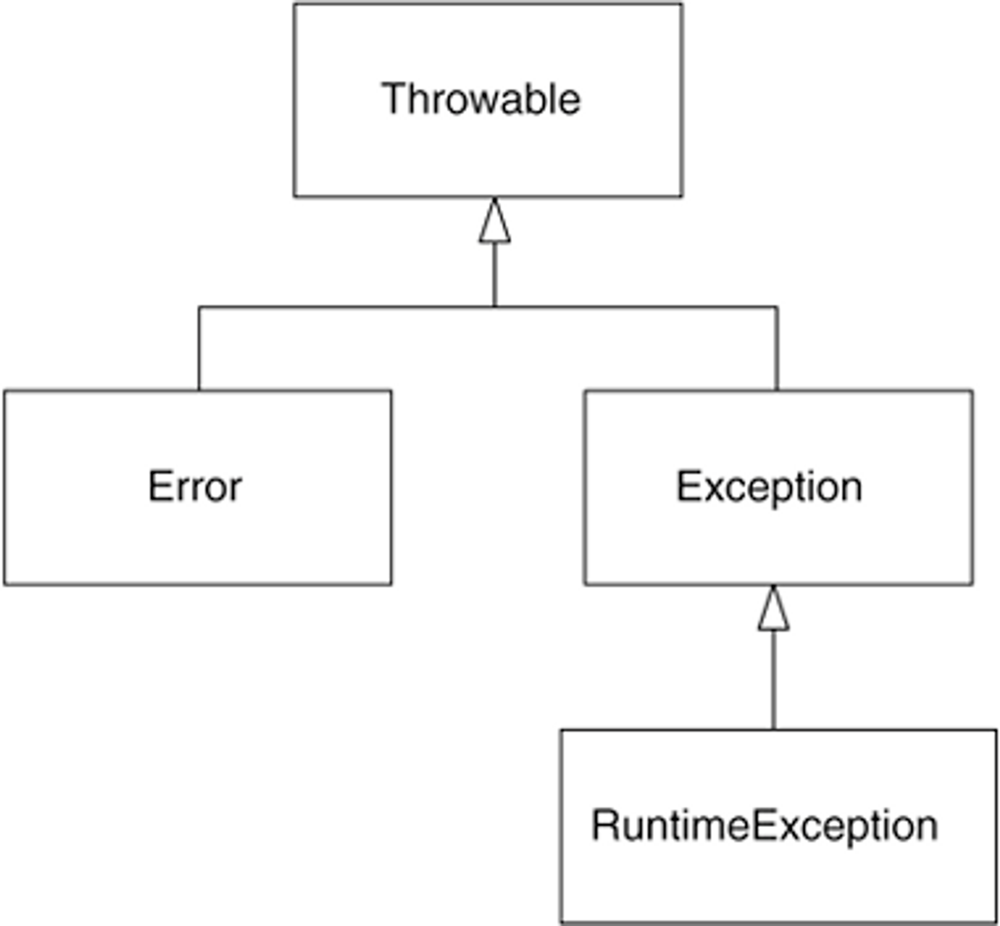

# Java
<details>
<summary>다른 언어와 비교하였을 때 Java의 장점에 대해 설명해주세요.</summary>

<br>

- 플랫폼에 구애받지 않고 JVM이 설치된 모든 장치에서 동작한다.
    - 운영체제의 영향이 없이 동작하며 멀티 스레드를 지원하지 않는 OS에서도 자바 언어를 사용하면 멀티스레드를 구현할 수 있다.
- 객체지향 언어이다.
- 수많은 개발자와 레퍼런스가 있어 문제가 발생하였을 때, 트러블슈팅을 하기 쉽다.
- 디버깅하는 실행 속도를 개선하기 위해 JIT 컴파일러가 사용된다.
- GC(가비지 컬렉션)이 존재하여 객체의 소멸을 스스로 해준다.

단점

- 실행 속도가 다른 언어보다 느리다.
- 다른 언어와 비교했을 때 소스코드의 길이가 길다.
- GC가 언제 어떻게 작동될지 아무도 모르기 때문에 중간에 끊김 현상이 발생할 수 있어 실시간 응용 시스템으로 부적합하다

[Java의 장단점](https://okeybox.tistory.com/131)

</details>


<details>
<summary>자바의 버전별 특징에 대해 설명해주세요</summary>

<br>

자바8: 람다, 인터페이스의 default method, stream api, **Null 처리 Optional** 등이 추가됨

자바9: 인터페이스 내에서 private 메서드 사용이 가능

자바10: 타입 추론 변수 var 추가, 병렬 처리 GC, 개별 스레드로 분리된 Stop the world등이 추가됐다.

- 기존에는 Stop-The-World 가 발생하면 GC 를 실행하는 쓰레드를 제외한 나머지 쓰레드는 모두 작업을 멈춘다. GC 작업을 완료한 이후에야 중단했던 작업을 다시 시작한다. 근데 이게 개별 쓰레드로 분리되어서 Stop-The-World 시간이 개선된것 같다.

자바 11: String 메서드 추가(`strip()`, `isBlank()`, `lines()`, `repeat()`), 람다 파라미터로 var사용

자바 12~14: 스위치 표현식 개선 (표현식에서 값 반환 가능)

[java 버전별 차이 & 특징](https://velog.io/@ljo_0920/java-%EB%B2%84%EC%A0%84%EB%B3%84-%EC%B0%A8%EC%9D%B4-%ED%8A%B9%EC%A7%95)

</details>


<details>
<summary>객체지향 설계 5원칙(SOLID)란?</summary>

<br>

SRP(Single Responsibility Principle, 단일 책임 원칙)

- 작성된 클래스는 하나의 기능만 가지며 클래스가 제공하는 모든 서비스는 그 하나의 책임을 수행하는데 집중되어야 한다.

OCP(Open Close Principle, 개방폐쇄의 원칙)

- 소프트웨어의 구성요소는 확장에 열려있고 변경에는 닫혀있다. 변경을 위한 비용은 가능하면 줄이고 확장을 위한 비용은 극대화해야한다.
- 요구사항의 변경이나 추가 사항이 발생하여도 기존 구성요소는 수정이 일어나지 말아야 하며, 기존 구성요소를 쉽게 확장해서 재사용할 수 있어야 한다.

LSP(The Liskov Substitution Principle, 리스코프 치환의 원칙)

- 서브 타입은 언제나 기반 타입과 호환될 수 있어야 한다.
- 상속은 궁극적으로 다형성을 통한 확장성을 목표로 한다. LSP도 서브클래스가 확장에 대한 인터페이스를 준수해야함을 의미한다.

ISP(Interface Segregation Principle, 인터페이스 분리의 원칙)

- 한 클래스는 자신이 사용하지 않는 인터페이스는 구현하지 말아야 한다. → 다른 크랠스에 종속될 때는 가능한 최소한의 인터페이스만을 사용해야 한다.

DIP(Dependency Inversion Principle, 의존성 역전의 원칙)

- 하위 레벨 모듈의 변경이 상위 레벨 모듈의 변경을 요구하는 위치 관계를 끊는 의미의 역전이다.
- **저수준 모듈이 고수준 모듈에 의존하게 되는 것을 의미한다.**
- 추상화에 의존하고 구체화에 의존하면 안 된다. 즉, 하위 모듈이 상위 모듈에서 정의한 추상 타입(인터페이스)에 의존하여야 한다.

</details>


<details>
<summary>GC(Garbage Collection)</summary>

<br>

`stop-the-world`란, GC을 실행하기 위해 JVM이 애플리케이션 실행을 멈추는 것이다.

- stop-the-world가 발생하면 GC를 실행하는 쓰레드를 제외한 나머지 쓰레드는 모두 작업을 멈춘다.

GC는 두 가지 가설 아래에서 만들어졌다.

- 대부분의 객체는 금방 접근 불가능 상태(unreachable)가 된다.
- 오래된 객체에서 젊은 객체로의 참조는 아주 적게 존재한다.

이러한 가설에 의해 GC는 Young, Old영역으로 나눠서 동작하게 된다.

- Young 영역(Yong Generation 영역): 새롭게 생성한 객체의 대부분이 여기에 위치한다. 대부분의 객체가 금방 접근 불가능 상태가 되기 때문에 매우 많은 객체가 Young 영역에 생성되었다가 사라진다. 이 영역에서 객체가 사라질때 Minor GC가 발생한다고 말한다.
- Old 영역(Old Generation 영역): 접근 불가능 상태로 되지 않아 Young 영역에서 살아남은 객체가 여기로 복사된다. 대부분 Young 영역보다 크게 할당하며, 크기가 큰 만큼 Young 영역보다 GC는 적게 발생한다. 이 영역에서 객체가 사라질 때 Major GC(혹은 Full GC)가 발생한다고 말한다.

Young영역은 Eden영역과 2개의 Survivor영역으로 나뉜다. 동작은 아래와 같다.

- 새로 생성한 대부분의 객체는 Eden 영역에 위치한다.
- Eden 영역에서 GC가 한 번 발생한 후 살아남은 객체는 Survivor 영역 중 하나로 이동된다.
- Eden 영역에서 GC가 발생하면 이미 살아남은 객체가 존재하는 Survivor 영역으로 객체가 계속 쌓인다.
- 하나의 Survivor 영역이 가득 차게 되면 그 중에서 살아남은 객체를 다른 Survivor 영역으로 이동한다. 그리고 가득 찬 Survivor 영역은 아무 데이터도 없는 상태로 된다.
- 이 과정을 반복하다가 계속해서 살아남아 있는 객체는 Old 영역으로 이동하게 된다.

> Survivor 영역 중 하나는 반드시 비어 있는 상태로 남아 있어야 한다.
>

Old 영역은 기본적으로 데이터가 가득 차면 GC를 실행한다. GC 방식에 따라서 처리 절차가 달라지므로, 어떤 GC 방식이 있는지 살펴보면 이해가 쉬울 것이다. GC 방식은 JDK 7을 기준으로 5가지 방식이 있다.

- Serial GC
  - CPU코어가 하나만 있을 때 사용하기 위해 만든 방식이라 성능이 많이 떨어져서 절대 사용하면 안된다
  - Old 영역의 GC는 `mark-sweep-compact`이라는 알고리즘을 사용
    1. Old 영역에 살아 있는 객체를 식별(Mark)
    2. 힙(heap)의 앞 부분부터 확인하여 살아 있는 것만 남긴다(Sweep)
    3. 각 객체들이 연속되게 쌓이도록 힙의 가장 앞 부분부터 채워서 객체가 존재하는 부분과 객체가 없는 부분으로 나눈다(Compaction)
- Parallel GC
  - Serial과 동작 알고리즘은 같으나 GC를 처리하는 쓰레드가 여러개라 더 빠르다.
- Parallel Old GC(Parallel Compacting GC)
  - `Mark-Summary-Compaction`단계를 거친다.
    - Summary 단계는 앞서 GC를 수행한 영역에 대해서 별도로 살아 있는 객체를 식별한다
- Concurrent Mark & Sweep GC(이하 CMS)
  - 동작은 과정
    1. Initial Mark 단계에서는 클래스 로더에서 가장 가까운 객체 중 살아 있는 객체만 찾는 것으로 끝내서 stop the world가 매우 짧다.
    2. Concurrent Mark 단계에서는 방금 살아있다고 확인한 객체에서 참조하고 있는 객체들을 따라가면서 확인한다. 이 단계의 특징은 다른 스레드가 실행 중인 상태에서 동시에 진행된다는 것이다.
    3. Concurrent Sweep 단계에서는 쓰레기를 정리하는 작업을 실행한다. 이 작업도 다른 스레드가 실행되고 있는 상황에서 진행한다.
  - CMS GC는 stop the world가 짧다는 장점이 있으나 아래의 단점이 존재한다.
    - 다른 GC 방식보다 메모리와 CPU를 더 많이 사용한다.
    - Compaction 단계가 기본적으로 제공되지 않는다.
- G1(Garbage First) GC
  - G1 GC는 Young 영역과 Old 영역에 대해서는 잊는 것이 좋다.
  - G1 GC는 바둑판의 각 영역에 객체를 할당하고 GC를 실행한다. 그러다가, 해당 영역이 꽉 차면 다른 영역에서 객체를 할당하고 GC를 실행한다.
    - 앞서 동작한 Young의 세가지 영역에서 데이터가 Old 영역으로 이동하는 단계가 사라진 GC 방식이다.
  - G1 GC의 가장 큰 장점은 성능이다. 지금까지 설명한 어떤 GC 방식보다도 빠르다.

[NAVER D2](https://d2.naver.com/helloworld/1329)

</details>


<details>
<summary>Package란 무엇이며 왜 사용할까?</summary>

<br>

패키지는 관련된 클래스 코드들을 모어서 관리하기 위해 사용한다.
패키지 분리를 통해 필요한 클래스 파일들을 쉽게 찾을 수 있으며, 각각의 프로젝트나 소프트웨어간의 코드 충돌을 방지할 수 있다. 또한 배포할 때 관련된 코드들을 묶어서 배포하고 재사용할 수 있다.

> 모든 패키지의 이름은 소문자로 관리하는 것이 관례이며 패키지 명은 일반적으로 도메인명을 사용하는 것이 관례이다.

</details>

<details>
<summary>String, Integer와 같은 클래스는 import 없이 어떻게 사용이 가능할까?</summary>

<br>

자바는 빌드를 하며 빌트인 패키지를 자동으로 import한다. String, Integer, System과 같은 클래스가 속해있는 java.lang은 해당 클래스에 해당하여 자동으로 import한다.

</details>


<details>
<summary>클래스와 인스턴스는 무엇이 다를까?</summary>

<br>

- 클래스는 인스턴스를 생성하기위한 template으로 클래스 자체만으로는 상태가 없다.
- 인스턴스는 클래스를 통해 실체화된 객체이다. 클래스와 다르게 실체화가 되었기에 상태를 갖고 있다.

</details>


<details>
<summary>인스턴스 필드/메서드와 클래스 필드/메서드는 무엇이 다를까?</summary>

<br>

- 인스턴스
  - 필드 - **인스턴스의 상태를 갖는 변수**를 인스턴스 필드라 한다.
  - 메서드 -  인스턴스가 생성된 이후에 호출이 가능하며 인스턴스의 상태(필드)를 변경하는 메서드를 의미한다.
- 클래스
  - 필드 - 여러 **인스턴스에서 공유하는 정보를 클래스 필드**라 한다. 즉, static 키워드가 붙은 공유되는 필드를 클래스 필드라 한다.
  - 메서드 - 클래스 메서드는 인스턴스 상태와 관련 없이, **인스턴스가 생성되지 않아도 호출이 가능한 클래스**를 뜻한다. 즉, static이 붙은 메서드를 클래스 필드라 한다.

</details>


<details>
<summary>JVM load와 unload에 대해 설명해주세요</summary>

<br>

JVM Load는 클래스가 필요한 시점에 동적으로 클래스의 바이트코드를 읽어 메모리에 할당하는 과정을 뜻한다.

JVM Unload는 클래스가 더 이상 사용되지 않아 메모리에서 클래스를 해제하는 과정을 의미한다.

</details>


<details>
<summary>new String()을 통한 문자열 선언</summary>

<br>

```java
String string1 = "abc";
String string2 = new String("abc");
```

위의 코드는 String class를 만드는 두가지 방법을 나타낸다. 두가지 방법은 보기에는 같은 결과가 나온다고 생각할 수 있지만 내부적으로는 다른 결과를 낸다. string1과 string2는 스트링 풀(String pool)에 있는 같은 객체를 바라보게 된다. 반면에 `new String()`을 통해 생성한 string3의 경우는 힙 메모리에 새로운 인스턴스를 만들어 관리를 하게 된다. 예시 코드를 작성하여 수행해보면 다음과 같은 결과가 나온다.

```java
public class StringTest {

	public static void main(String[] args) {
		String string1 = new String("abc");
		String string2 = new String("abc");

		System.out.println(string1 == string2); // false

		String string3 = "abc";
		String string4 = "abc";

		System.out.println(string3 == string4); // true
	}
}
```

위의 코드의 경우 `new String` 을 사용하여 새로운 인스턴스를 생성한 string1, string2의 경우는 서로 다른 주소값을 가르켜 false라는 결과를 반환한다. 반면에 스트링 풀의 주소만을 가르키며 생성한 string3, string4의 경우는 값이 같다는 결과가 나오게 된다.

</details>


<details>
<summary>String이 같은지 비교할 때는 동등성(equals) 비교를 왜 해야할까요?</summary>

<br>

```java
public class StringTest {

	public static void main(String[] args) {
		String string1 = "abc";
		String string2 = "abc";

		System.out.println(string3.equals(string4)); // true
	}
}
```

string1과 string2는 같은 객체를 바라본다는데 어째서 둘을 비교할 때 동일성(==)이 아닌 동등성(equals)으로 같은지 체크할까? Java8 이후로는 `String string1 = "abc"`와 같이 선언한 내용도 GC의 지시 대상이 되어서 다른 객체가 될 수 있다. 그래서 String 객체들의 비교는 동일성이 아닌 동등성으로 체크한다.

</details>


<details>
<summary>동일성과 동등성에 대해 설명해주세요</summary>

<br>

동일성(==)은 객체가 참조하고 있는 주소 값을 비교하는 것이며 동등성(equals)는 equals를 통해 정의된 값에 따라 비교를 하는 것이다. 객체들의 최상위 클래스 Object는 기본적으로 equals가 주소 값을 비교하는 동일성 체크와 동일하며여 우리는 객체의 equals재정의를 통해 내부 값이 같으면 두 객체가 동등하다고 판단할 수록 할 수 있다.

</details>


<details>
<summary>Equals & HashCode는 왜 재정의를 해야할까?</summary>

<br>

객체들의 최상위 클래스 Object는 기본적으로 equals가 주소 값을 비교하는 동일성 체크와 동일하며여 우리는 객체의 equals재정의를 통해 내부 값이 같으면 두 객체가 논리적으로 동등하다고 판단할 수록 할 수 있다.

그렇다면 HashCode는 왜 재정의를 해야할까?

Object의 명세서에는 `equals(Object)가 두 객체를 같다고 판단했다면, 두 객체의 hashCode는 똑같은 값을 반환해야 한다.` 라는 조항이 존재합니다. 이를 위해 우리는 equals를 재정의할 때는 hashCode도 반드시 재정의해야 한다.

</details>

<details>
<summary>자바의 문자열 더하기 연결 (feat. StringBuilder)</summary>

<br>

- String은 불변하기(immutable)이기 때문에 String과 String을 더하면 새로운 String 객체를 생성한다. 따라서 String과 String을 더하는 시점에 메모리 할당과 메모리 해제가 계속 발생한다.
- StringBuilder는 String과 다르게 기존 데이터에 새로운 데이터를 더하는 방식을 취하기 때문에 속도가 더 빠르다.
- 따라서 긴 문자열을 더하는 상황이 발생하는 경우 StringBuilder를 활용해 구현한다.

String은 final로 만들어져 인스턴스의 값은 한번 생성하면 변경이 불가능합니다. 그래서 concat과 문자열 덧셈 과 같이 string의 값을 변경하려고 한다면 기존 인스턴스는 남아있고 남아있는 기존 인스턴스를 사용하여 새로운 인스턴스를 만들게 되어 메모리 낭비가 발생합니다.

> Java8이후로는 `"ab+"bc"+"cd"`와 같은 문자열 더하기 연산을 한다면 내부적으로 컴파일시 최적화를 해줍니다. Java8에서는 `StringBuilder` 가 최적화를 해주며, Java11의 경우 `StringConcatFactory` 가 최적화를 해줍니다. Java8에서 자동으로 컴파일시점에 최적화를 해준 `StringBuilder` 는 + 를 할 때마다 StringBuilder를 생성하여 문자열을 합쳐주고 다시 String으로 반환을 하여 +연산을 할 때마다 각각의 StringBuilder를 선언을 해주는 단점이 존재하였습니다. 그래서 Java11부터 새로운 방법 `StringConcatFactory`로 변경되었습니다. `StringBuilder`와 `StringConcatFactory` 의 차이점을 간단히 설명하자면 `StringBuilder`는 +를 할 때마다 하나의 String객체를 반환하는 반면에 `StringConcatFactory`는 최종 상태에서만 String을 만들어줍니다.
>

앞서 말했듯이 JVM이 컴파일 시점에 스스로 String연결을 최적화를 해줍니다. 하지만 최적화는 항상 해주는 것이 아니라 해주지 않는 경우도 존재합니다. 그래서 우리는 긴 문자열들을 더할 때는 `StringBuilder`
, `StringBuffer`를 사용하여 직접 낭비를 줄일 수 있습니다.

</details>


<details>
<summary>StringBuilder, StringBuffer의 특징과 차이점에 대해 설명해주세요</summary>

<br>

- 둘 다 내부적으로 가변적인 `char[]`를 멤버 변수로 가집니다.
- 새로운 인스턴스를 생성하지 않고 `char[]`를 변경할 수 있어서 문자열을 여러번 연결하거나 변경할 때 사용하면 유용합니다.
- 출력은 나중에 `toString()` 메서드로 String반환을 해주면 됩니다.
- StringBuilder와 StringBuffer는 `char[]` (character buffer)를 갖는 공통점이 있으나 StringBuffer는 multi-thread환경에서 동기화(synchronization)가 보장됩니다.
- 그래서 single thread 프로그래밍의 경우는 StringBuilder사용을 권장하며 multi-thread환경에서는 StringBuffer를 사용을 권장한다.

</details>


<details>
<summary>제너릭에 대해 설명해주세요</summary>

<br>

- 제네릭은 클래스나 메소드에서 사용할 내부 데이터 타입을 컴파일 시에 미리 지정하는 방법입니다.
- List와 같이 다양한 종류의 데이터를 관리하는 경우 데이터의 타입을 특정 타입으로 고정할 수 있다.

### Generic의 장점

- 제네릭을 사용하면 잘못된 타입이 들어올 수 있는 것을 컴파일 단계에서 방지할 수 있다.
- 특정 타입으로 제한함으로써 타입 안정성을 제공한다.
- 타입 체크와 형변환을 생략할 수 있으므로 코드가 간결해 진다.
  - 클래스 외부에서 타입을 지정해주기 때문에 따로 타입을 체크하고 변환해줄 필요가 없다. 즉, 관리하기가 편하다.
- 비슷한 기능을 지원하는 경우 코드의 재사용성이 높아진다.

</details>

<details>
<summary>자바의 예외에 대해 설명해주세요</summary>

<br>



## Checked Exception

- Exception을 상속하며 Checked Exceptoin 또는 Compile Time Exception이라고 한다.
- 컴파일 시점에서 Exceptoin을 catch하는지 확인한다.
  - **컴파일 시점에 Exception에 대한 처리(try/catch)를 하지 않을 경우 컴파일 에러가 발생**한다.
- Exception이 발생하는 메소드에서 throws 예약어를 활용해 Exception을 호출 메소드에 전달해야 한다.

## Unchecked Exception

- RuntimeException을 상속하며 Runtime Time Exception이라고 한다.
- 컴파일 시점에 Exception을 catch하는지 확인하지 않아 컴파일 시점에 예외 여부를 확인할 수 없다.
- Exception이 발생하는 메소드에서 throws 예약어를 활용해 Exception을 처리할 필요가 없다. 하지만 처리해도 무방하다.

## Java Exception

- `Error` : 애플리케이션이 정상적으로 동작하는데 심각한 문제가 있는 경우
- `Exception` : 비즈니스 로직 상에서 에러가 발생하는 경우 사용한다. Exception을 사용하는 경우 컴파일 시점에 Exception을 확인할 수 있다. Checked Exception이라고도 한다.
- `RuntimeException` : NumberFormatException과 같이 Runtime 시에 발생하는 에러를 처리하는데 사용한다. Unchecked Exception이라고도 한다.

## 예외 처리 방법

[Java 예외(Exception) 처리에 대한 작은 생각](https://www.nextree.co.kr/p3239/)

- 예외 처리 회피
- 예외 복구
- 예외 전환

</details>

<details>
<summary>상속과 조합은 무엇인가요?</summary>

<br>

## 1. 상속이란?

```java
import java.util.ArrayList;

import lotto.dto.LottoResult;

public class Lottos extends ArrayList<Lotto> {
    public LottoResults match(Lotto winningLotto) {
        LottoResults lottoResults = new LottoResults();
        this.stream()
            .map(lotto -> new LottoResult(
            lotto.getCorrectCount(winningLotto.getNumbers())))
            .forEach(lottoResults::add);
        return lottoResults;
    }
}
```

기존에 정의되어 있는 클래스의 필드와 메서드를 물려받아 새로운 클래스를 생성하는 기법이다.

### 상속의 이점

- 중복 코드의 제거와 기능 확장을 쉽게 할 수 있다.
  - 부모 클래스의 메서드를 사용할 때는 메서드 앞에 클래스 참조를 붙이지 않고  사용할 수 있다. (이것은 앞에 `super`가 생략된 것이다.)
- 클래스들의 계층적인 구조를 만들 수 있다.

### 상속의 문제점

- 하위 클래스가 상위 클래스의 구현에 의존하여 변경에 취약하다. (상위 클래스의 영향을 받음)
  - 부모 클래스의 구현을 변경하면 많은 자식 클래스들을 모두 변경해줘야 하는 상황이 생길 수 있다.
- 상위 클래스의 모든 퍼블릭 메서드가 하위 클래스에도 반드시 노출된다.
  - 불필요한 메서드도 상속받는 문제가 발생한다.

## 2. 조합이란?

```java
import java.util.List;

import lotto.dto.LottoResult;

public class Lottos {
    private List<Lotto> lottos;

    public Lottos(List<Lotto> lottos) {
        this.lottos = lottos;
    }

    public LottoResults match(Lotto winningLotto) {
        LottoResults lottoResults = new LottoResults();
        lottos.stream()
                .map(lotto -> new LottoResult(lotto.getCorrectCount(winningLotto.getNumbers())))
                .forEach(lottoResults::add);
        return lottoResults;
    }
}
```

조합은 전체를 표현하는 클래스가 부분을 표현하는 객체를 포함해서 부분 객체의 코드를 재사용하는 방법이다.

### 조합의 이점

- 상속과 달리 부분 객체의 내부 구현이 공개되지 않는다.
- 메서드 호출하는 방식으로 퍼블릭 인터페이스에 의존해서 부분 객체의 내부 구현이 변경되어도 비교적 안전하다.
- 부분 객체의 모든 퍼블릭 메서드를 공개하지 않아도 된다.

## 3. 상속보다는 무조건 조합이 좋은가?

상속을 무조건 사용하지 말기보다는 내가 사용을 할 때, 내가 어떠한 이유로 상속을 사용하는지 확실하게 알고 사용해야 합니다.

상속의 목적에는 서브타이핑과 서브 클래싱이 존재한다.

- 서브타이핑 - 다형적인 계층구조로 구현, 부모와 자식 행동이 호환된다.
- 서브클래싱 - 다른 클래스의 코드를 재사용, 부모와 자식 행동이 호환되지 않는다.

이 목적을 생각하며 상속을 고려하기 전에는 두 객체가 서로 Is-a 관계인지, 클라이언트 관점에서 두 객체가 동일한 행동을 할 것이라 기대하는지 고려해봐야 한다.

→ 두가지 질문에 모두 yes일 경우에만 상속을 고려해야한다.

## 4. 정리

- 단순히 코드를 재사용하며 중복코드를 줄이고 싶다면 상속보다는 조합을 고려해야한다.
- 동일하게 행동하는 인스턴스들을 그룹화 할 경우 상속을 고려할 수 있다.

[[10분 테코톡] 클레이의 상속과 조합](https://www.youtube.com/watch?v=U4OSS4jJ9ns)

</details>

<details>
<summary>추상화란 무엇일까요?</summary>

<br>

- 추상화란 내부의 동작(How)를 감추고 무엇(What)을 하는지만 드러내어 사용자들이 구현이 아닌 인터페이스에 의존하도록 하는 방법이다.
- 추상화는 어떤 양상, 세부 사항, 구조를 좀 더 명확하게 이해하기 위해 특정 절차나 물체를 의도적으로 생략하거나 감춤으로써 복잡도를 극복하는 방법이다.
- 공통의 속성이나 기능을 묶어 이름을 붙이는 것, 객체 지향 관점에 클래스를 정의하는 것을 추상화 라고 할 수 있다. 즉, 불필요한 부분을 생략하고 객체의 속석 중 가장 중요한 것에만 중점을 두어 개략화 하는 것으로 모델화 하는 것으로 데이터의 공통된 성질을 추출하여 슈퍼 클래스를 선정하는 개념이다.

### 추상화의 장점

- 코드의 재사용성(확장성)의 증가
- 생산성 증가
- 유지보수성 향상

### 추상화의 단점

- 확장성은 늘어나지만 복잡해질 수 있다.

</details>


<details>
<summary>업캐스팅(upcasting)과 다운캐스팅(downcasting)에 대해 설명해주세요</summary>

<br>

### 업캐스팅

- 하위 클래스를 상위 클래스로 타입을 변환하는 것을 의미한다.
- e.g. List<Integer> integers = new ArrayList<>();

### 다운캐스팅

- 상위 클래스를 하위 클래스의 타입으로 변환하는 것을 의미한다.
- 업 케이스팅 된 인스턴스 변수에서 하위 클래스의 메서드를 사용하기 위해서는 다운캐스팅을 해야한다.
- e.g.

    ```java
    Vehicle myCar = new Car();
    
    if (myCar instanceof Car) {
       // 1. 강제 형변환
       Car myCar1 = (Car)myCar;
       // 2. cast()를 통한 변환
       Car.class.cast(myCar).some();
    }
    ```

</details>


<details>
<summary>인터페이스란?</summary>

<br>

- interface는 자바에서 한 단계 더 높은 추상화를 하기 위해 사용된다. 구현 로직은 존재하지 않으며 메소드에 대한 입력(input), 출력(output)만 정의하고 있다.
- interface를 활용해 추상화를 하는 이유는 소프트웨어에 변경이 발생할 경우 소스 코드에 변경을 최소화함으로써 유지보수 비용을 줄이고, 변화에 빠르게 대응하기 위함이다. 하지만 추상화를 하려면 개발 비용의 증가가 발생한다.
- 인터페이스에서 공통적으로 사용해야하는 기능이 있다면 최상위 인터페이스에 default로 추가를 할 수 있다.

</details>


<details>
<summary>Interface와 abstract class는 어떤 차이가 있을까요?</summary>

<br>

두 종류 모두 추상화를 위해 사용하는 기술들이다. 하지만 둘은 사용 용도가 다르다.

### 인터페이스

- 100% 추상화된 **기본 설계도**이다.
- 인스턴스 필드를 소유할 수 없다.
- 다중 상속(구현)이 가능하다.
- 포멧만 주어지고 구현체가 다 정해야한다.
- 공통 기능으로는 default 메서드로 정의 가능하다.

### 추상 클래스

- 상속을 통해 자속 클래스에서 완성을 유도하는 **미완성 설계도**이다.
- 한 개의 추상 클래스만 상속 가능하다.
- 인스턴스 필드를 소유할 수 있다.
- 인스턴스 메서드를 만들고 사용할 수 있다.

### 각각 언제 사용하는 것이 좋은가??

> **추상클래스 →**  `is - a` **→ "~이다"**
>
>
> **인터페이스 →** `has - a`**→  "~을 할 수 있는"**
>
- 인터페이스는 클라이언트에서 사용할 때 만드는 것이 좋고, 추상클래스는 내부에서 기능을 확장할 때 쓰는 것이 좋다.
- 자식 클래스가 부모 클래스의 기능을 완벽히 똑같이 필요한 경우 추상 클래스를 사용한다.
- 자식 클래스들이 부모 클래스의 같은 기능이 필요한데, 다른 구현을 가져야 하는 경우 인터페이스를 사용한다.

[[JAVA] 추상클래스 VS 인터페이스 왜 사용할까? 차이점, 예제로 확인 :: 마이자몽](https://myjamong.tistory.com/150)

</details>


<details>
<summary>불변 객체는 왜 사용할까요?</summary>

<br>

- 오류가 발생할 가능성이 적어져 심리적 안정감이 높아진다.
- 유지 보수성이 크게 향상된다.
- 불변 객체를 사용하면 `Map`의 Key값의 변경으로 생기는 ‘식별자 변경(identity mutability)’ 문제가 발생하지 않는다.

    ```java
    Map<Cash, String> map = new HashMap<>(); 
    Cash five = new Cash("$5");
    Cash ten = new Cash("$10");
    map.put(five, "five");
    map.put(ten, "ten");
    five.mul(2);
    ```

- 객체가 완전하고 견고한 상태이거나 아니면 아예 실패하는 실패 원자성(failure atomicity)을 가진다.
- 시간에 따라 값이 달라지는 문제점인 시간적 결합(temporal coupling)을 없앨 수 있다.
- 스레드 안전성이 높아진다.
  - 객체가 여러 스레드에서 동시에(concurrently) 사용될 수 있고 예측 가능한(predictable) 결과를 보장하는 객체의 품질
  - 다른 객체를 바라보기 때문에 애초에 쓰레드에 대한 걱정이 없어진다.

</details>


<details>
<summary>익명함수란?</summary>

<br>

익명함수란 일반함수와 다르게 함수형 프로그래밍에서 변수에 함수를 넣는 식으로 사용하는 1회성의 이름이 없는 함수입니다.

일반 함수는 재사용을 위해 생성하여 언제든 호출될 수 있기에 메모리를 차지하고 있다. 하지만 익명 함수는 한 번만 사용하기에 사용하는 순간 외에는 불필요한 메모리 차지를 하지 않아 메모리 관리 측면에서 효과적일 수 있다.

</details>

<details>
<summary>OOP의 4가지 특징</summary>

<br>

- 추상화
  - 불필요한 부분(구현 코드)을 숨긴다.
  - 인터페이스와 구현을 분리한다.
- 캡슐화
  - 데이터 캡슐화 : 필드와 메서드를 하나로 묶는 것 (객체 생성)
  - 은닉화 : 객체의 세부 내용이 외부에 드러나지 않아 외부에서 데이터를 직접 접근하는 것을 방지한다.
- 상속
  - 어떤 실체로부터 공통적인 부분이나 관심 있는 특성들만 한곳에 모은것을 의미한다.
  - 자식클래스가 부모클래스의 특징과 기능을 물려받는 것
  - 클래스를 상속 받아 수정하여 사용하기 때문에 중복 코드를 줄일 수 있다.
  - 부모클래스의 수정으로 모든 자식클래스들도 수정되는 효과
  - 클래스에 메소드 추가가 어려운 경우 사용
    - 자신이 아닌 남이 만든 클래스를 가져오는 경우 (수정 불가)
    - 클래스가 다양한 곳에서 상속 받아 쓰이는 경우 (메서드를 추가하면 다른 곳에서 불필요한 기능이 포함될 수 있음)
- 다형성
  - 같은 모양의 함수가 상황에 따라 다르게 동작 하는것을 의미한다.
  - 오버라이딩, 오버로딩

</details>

<details>
<summary>자바에서 Wapper class(Reference type)와 Primitive type을 나눈 이유는 무엇일까요?</summary>

<br>

자바는 객체지향 언어라 `List<>`와 같이 제너릭에 기본형이 아닌 객체 타입이 필요할 때가 존재한다.

이러한 상황을 해결하기 위해 자바는 기본형인 Primitive type외에 이를 Boxing한 Wapper Class를 만들어 사용중이다.

</details>
