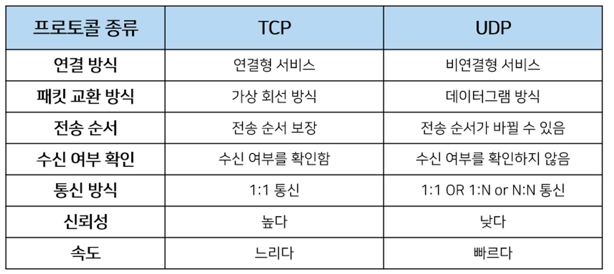
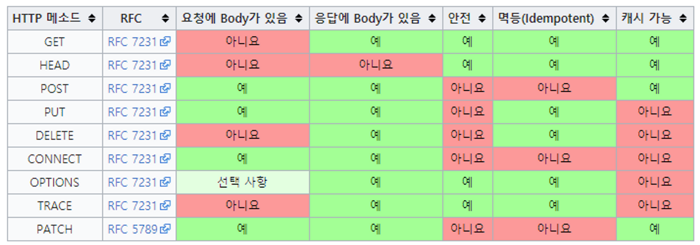
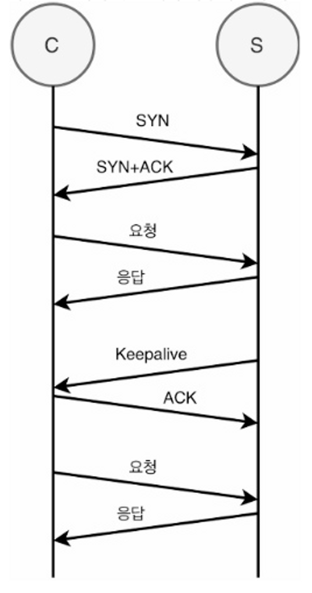

# 네트워크
## TCP & UDP

TCP와 UDP의 차이점에 대해 설명해주세요.

- TCP는 Receiver와 Sender사이에 연결을 만들고 해당 연결을 기반으로 데이터를 주고받는 **연결 지향형 프로토콜**이며 UDP는 연결 없이 전송하는 **비연결형 프로토콜**이다.
- TCP는 데이터를 순서대로 보내고 순서대로 수신하는 반면에 UDP는 수신의 순서가 중요하지 않다.
- TCP는 연결의 체증을 제어하기 위해 흐름제어(Flow Control)과 혼잡제어(Congestion Control)을 진행한다. 반대로 UDP는 수행하지 않는다.
- 속도 측면에서는 비연결형인 UDP가 더 빨라서 스트리밍과 같이 연속성이 중요한 서비스에 사용된다. 반면에 TCP는 속도가 느린대신 연결을 맺고 통신을 하기에 신뢰성이 중요한 서비스에 이용한다.

DNS와 DHCP는 UDP와 TCP중 어떤 프로토콜을 사용할까요?

- UDP를 사용한다. 그 이유는 Sender, Receiver사이에 연결을 맺으면 보내고 받는 데이터 크기에 비하여 연결에 드는 비용이 더 크기 때문이다. Root DNS 같은 경우 모든 것들과 TCP로 연결을 맺게 된다면 부담이 너무 크기에 연결 없는 UDP방식을 사용한다.

UDP, TCP의 세그먼트(Segment)는 전송 과정 중 데이터의 변경이 없었다는 것을 어떻게 알까요?

각각의 세그먼트는 헤더의 Checksum을 통해 데이터의 변경이 발생했는지 체크를 해준다.

- Sender는 세그먼트의 16-bit로 표현한 Content와 Header필드 값을 더한 다음 1의 보수를 만들어 checksum 필드에 추가한다.
- Receiver는 반대로 Content와 Header의 필드값을 16-bit로 변환 후 더한 값을 1의 보수로 변경한 후 checksum의 필드와 같은지 확인한다. 만약 같다면 데이터 전송 과정에서 문제가 발생하지 않은 것이고, 다르다면 해당 세그먼드는 에러가 담긴 세그먼트로 판단한다.

TCP 3 way handshake에 대해서 설명해주세요.

3 way handshake는 TCP통신에서 가상회선을 만드는 단계이다. 회선을 만드는 과정에서는 SYN 패킷과 ACK 패킷을 통해 회선을 만든다. 과정은 아래와 같다.

1. 클라이언트는 서버에 접속을 요청하는 SYN 패킷을 보낸다.
2. 서버는 SYN요청을 받고 클라이언트에게 요청을 수락한다는 ACK 와 SYN flag 가 설정된 패킷을 발송하고 클라이언트가 다시 ACK으로 응답하기를 기다린다.
3. 클라이언트는 서버에게 연결을 맺었다는 ACK을 보내고 이후로부터는 연결이 이루어지게 된다.

TCP 4 way handshake에 대해서 설명해주세요.

4 way handshake는 TCP통신에서 가상 회선을 해제하는 단계이다. 과정은 아래와 같다.

1. 클라이언트가 연결을 종료하겠다는 FIN플래그를 전송한다.
2. 서버는 확인메시지(ACK)를 보내고 남은 데이터를 이어서 전송한다.
3. 서버가 통신이 끝났으면 연결이 종료되었다고 클라이언트에게 FIN플래그를 전송한다.
4. 클라이언트는 확인했다는 메시지를 보낸다.

왜 연결을 끊을 때는 4way handshke를 할까요?

- Client가 데이터 전송을 마쳐서 연결을 끊으려 하더라도 Server는 아직 보낼 데이터가 남아 있을 수 있기 때문에 일단 FIN에 대한 ACK만 보내고, 데이터를 모두 전송한 후에 자신도 FIN 메세지를 보낸다.

Time-wait이란 무엇일까요?

4way handshake에서 Server에서 FIN을 전송하기 전에 전송한 패킷이 Routing 지연이나 패킷 유실로 인한 재전송 등으로 인해 FIN패킷보다 늦게 도착하는 상황이 발생하면 해당 패킷은 Drop되고 데이터는 유실될 것이다. 이러한 현상에 대비하여 Client는 Server로부터 FIN을 수신하더라도 일정시간(디폴트 240초) 동안 세션을 남겨놓고 잉여 패킷을 기다리는 과정을 거치게 되는데 이 과정을 TIME_WAIT 라고 한다.

TCP와 UDP 패킷구조에는 어떤 차이가 있을까요?

UDP는 비연결형 통신이라 출발지와 목적지의 Port정보와 UDP 세그먼트의 길이, checksum, data(payload)만을 갖고 있다.

하지만 TCP는 연결형 통신에 데이터간 전송 순서를 보장해야하기에 sequence number, ack number, receive window등 여러 추가 데이터들이 들어간다.

## 흐름제어와 혼잡제어

흐름제어와 혼잡 제어에 대해 설명해주세요

흐름제어(Flow Control)는 데이터의 수신자가 송신자가 보내주는 데이터의 양을 **수신자의 버퍼사이즈에 오퍼블로우가 발생하지 않도록 속도를 조절**해주는 방법이다.

전송 속도를 조절하는 방법은 상대방에게 응답을 할 때 TCP header중 하나인 **rwnd**에 **남은 버퍼 사이즈 정보를 추가**해서 보내주고 송신자는 해당 데이터를 보고 in-flight data의 양(전송 속도)을 조절한다.

> receive window를 참고하여 조절한다.
>

혼잡제어(Congestion Control)는 **네트워크 내의 패킷 수가 넘치게 증가하는 혼잡 현상을 방지**하는 방법이다. 즉, 네트워크의 혼잡을 피하기 위해 송신측에서 보내는 데이터의 전송 속도를 강제로 줄이는 작업을 말한다.

송신자는 congestion window를 통해 시간에 따른 네트워크 혼잡도를 판단해 Sending Rate를 변경한다.

> congestion window를 통해 조절한다.
>

Sender TCP window = min(congestion window, receive window)

혼잡제어를 윈도우 사이즈가 어떻게 변경되는지를 연관지어 설명해주세요.

혼잡제어는 기본적으로 Window size를 **AIMD**(Additive Increase, Multiplicative Decrease)방식으로 전송이 성공적으로 진행되면 1씩 증가, 실패하면 절반으로 감소하는 방식으로 진행됩니다. 하지만 초기에는 window size를 1씩 증가시키면 최적점으로 가기까지 너무 오랜 시간이 걸려 Slow Start라고 전송이 성공적으로 진행될 시 2배씩 증가하도록 합니다. 2배씩 증가를 하며 손실이 발생하면 그 때부터 AIMD방식으로 손실이 발생했을 때는 2분의 1, 성공하였을 때는 1씩 증가시킵니다.

혼잡제어에서 Timeout이 발생했을 때와 패킷 손실이 발생했을 때, 윈도우 사이즈의 변화는 각각 어떨까요?

Timeout은 네트워크 상에 심각한 혼잡이라고 판단하여 Window size를 0으로 줄인 후, 다시 Slow Start를 통해 exponential하게 증가시킵니다. 반면에 패킷 손실의 경우는 AIMD의 방식대로 Window size를 절반으로 줄입니다.

> Timeout이 발생하여 window size를 0으로 줄인 후 Slow Start를 할 경우, 손실이 발생하기까지 window size를 2배 증가시키는 것이 아니라 Timeout이 발생한 지점의 절반 지점까지만 Exponential하게 2배씩 증가한다. 이를 **Congestion Avoidance**라고 한다.
>

흐름제어기법중 슬라이딩 윈도우 방식에대해 설명해주세요.(추가 필요)

~

## OSI 7계층

OSI 7계층에 대해 설명해주세요.

OSI 7 계층은 네트워크 프로토콜이 통신하는 구조를 7개의 계층으로 분리하여 각 계층간 상호 작동하는 방식이다.

계층으로는 물리계층, 데이터링크 계층, 네트워크 계층, 전송 계층, 세션 계층, 표현 계층, 응용 계층으로 나뉘게 된다.

- 과거에는 통신용 규약이 표준화되지 않아 각 벤더에서 별도로 개발했기에 호환되지 않는 시스템이나 애플리케이션이 많았고 통신이 불가능했다. 이를 하나의 규약으로 통합하려는 노력이 현재 OSI 7계층으로 남아있다.

> OSI 7계층은 네트워크 동작을 이해하기에 좋지만 현재 대부분의 프로토콜은 TCP/IP 프로토콜 스택 기반으로 되어있다.

- 복잡한 데이터 전송 과정을 OSI 7계층으로 나누어보면 이해하기 쉽다.
- 계층별로 표준화된 프로토콜 템플릿을 통해 네트워크 프로토콜을 전부 개발하는 대신 계층별로 프로토콜을 개발해 네트워크 구성 요소들을 모듈화 할 수 있다.
- OSI 7계층은 계층의 역할과 목표에 따라 크게 2계층으로 나눌 수 있다.
    - 1~4계층: 데이터 플로 계층(Data Flow Layer) / 하위 계층(Lower Layer)
        - 상대방에게 데이터를 잘 전달하는 역할을 갖고 있다.
    - 5~7계층: 애플리케이션 계층(Application Layer) / 상위 계층(Upper Layer)

### 1계층 - 물리 계층

- 물리적 연결과 관련된 정보를 정의한다.
- 주로 전기 신호를 그대로 잘 전달하는 것이 목적이라 전기 신호가 1계층 장비에 들어오면 전기 신호를 재생성해서 내보낸다.
- 1계층 장비는 주소의 개념이 없어 전기 신호가 들어온 포트를 제외하고는 모든 포트에 같은 전기 신호를 전송한다.
- 주요 장비: 허브(Hub), 리피터(Repeater), 케이블(Cable), 커넥터(Connector), 트랜시버(Transeiver), 탭(TAP)
- 주요 프로토콜: RS-232, RS-449, C.35, S 등의 케이블
- PDU: **Bits**

> PDU → Prodocol Data Unit

### 2계층 - 데이터 링크 계층

- 전기 신호를 모아 우리가 알아볼 수 있는 데이터 형태로 처리한다.
- 주소 정보(**MAC**)를 정의하고 정확한 주소로 통신이 되도록 하는데 초점이 맞춰져 있다.

  > MAC 주소를 의미하는 NIC(Network Interface Card)는 2계층 구성요소이다.

- 1계층과 다르게 주소의 개념이 있어 출발지와 도착지 주소를 확인하고 자신에게 보낸 것이 맞는지에 대해 검사한 후 데이터 처리를 수행한다.
- 전기 신호를 모아 데이터 형태로 처리하여 데이터에 대한 에러를 탐지하거나 고치는 역할을 수행할 수 있다.
    - 이더넷 기반 네트워크의 2계층에서는 에러 탐지 역할만 수행한다.
- 주요 장비: **스위치, 브릿지, 네트워크 카드**
- 주요 프로토콜: IEEE 802.2, FDDI
- PDU: **Frames**

### 3계층 - 네트워크 계층

- 논리적 주소인 IP가 정의된다.
- 3계층 장비인 라우터는 네트워크 주소 정보(IP)를 이용해 IP 주소를 이해할 수 있고 IP주소를 사용해 최적의 경로를 찾아 해당 경로로 패킷을 전송하는 역할을 한다.
- 주요 장비: **라우터, L3 스위치**
- 주요 프로토콜: **ARP, IPv4, IPv6, NAT, IPSec, VRRP, 라우팅 프로토콜**
- PDU: **Packets**

### 4계층 - 트랜스포트 계층

- 1,2,3계층은 신호와 데이터를 올바른 위치로 보내고 실제 신호를 잘 만들어 보는데 집중하였다면 4계층은 실제로 해당 데이터들이 정상적으로 잘 보내지도록 확인하는 역할을 한다.
- 패킷이 유실되거나 순서가 바뀌었을 때 바로잡아주는 역할을 담당한다.
- 주요 장비: **로드 밸런서, 방화벽**
- 주요 프로토콜: **TCP, UDP**, SCTP, DCCP, AH, AEP
- PDU: **Segments**

### 5계층 - 세션 계층

- 양 끝단의 응용 프로세스가 연결을 성립하도록 도와주고 연결이 안정적으로 유지되도록 관리하며 작업 완료 후에는 연결을 끊는 역할을 한다.
- TCP/IP 세션을 만들고 없애는 책임을 진다.
- 에러로 중단된 통신에 대한 에러 복구와 재전송도 수행한다.
- 주요 프로토콜: L2TP, PPTP, NFS, RPC, RTCP, SIP, SSH
- PDU: Datas

### 6계층 - 표현 계층

- 표현 방식이 다른 애플리케이션이나 시스템 간 통신을 돕기 위해 하나의 통일된 구문 형식으로 변환시키는 기능을 수행한다.
- 사용자 시스템의 응용 계층에서 데이터의 형식상 차이를 다루는 부담을 줄여준다.
- 번역기나 변환기 역할을 수행한다.
- MIME 인코딩, 암호화, 압축, 코드 변환과 같은 동작이 이루어진다.
- 주요 프로토콜: **TLS, SSH**, AFP
- PDU: Datas

### 7계층 - 애플리케이션 계층

- 애플리케이션 프로세스를 정의하고 애플리케이션 서비스를 수행한다.
- 네트워크 소프트웨어의 UI부분이나 사용자 입출력 부분을 정의한다.
- 주요 프로토콜: **HTTP, SMTP**, SMP, STUN, TFTP, TELNET, FTP
- PDU: Datas

OSI 7계층은 왜 나눴을까요?

- 통신이 일어나는 과정을 단계별로 파악할 수 있다.
- 계층이 독립적으로 분리되어 있어 특정 부분에 문제가 발생하면 다른 단계의 장비 및 소프트웨어를 건드리지 않아도 문제가 발생한 단계만 고치면 된다.

TCP/IP 4계층에 대해 설명해보세요.

- 현대 네트워크는 대부분 TCP/IP와 이더넷으로 이루어져있다.
- 실용성에 중점을 두고 개발되었다.
- OSI 7계층과 다르게 4계층으로 구분되어 있다.

인캡슐레이션과 디캡슐레이션에 대해 설명해주세요.

**인캡슐레이션(Encapsulation)**

- 상위 계층에서 하위 계층으로 데이터를 보내면 물리 계층에서 전기 신호 형태로 네트워크를 통해 신호를 보내는 과정을 의미한다.
    - 상위 계층에서 내려오며 OSI 7계층을 기준으로 4, 3, 2 계층은 각각 네트워크 전송에 있어 자신이 필요한 정보를 헤더에 붙여서 보낸다.
    - 헤더에 붙이는 정보는 우리가 알아볼 수 있는 문자가 아닌 미리 정의된 비트 단위로 쓴다.

**디캡슐레이션(Decapsulation)**

- 하위 계층에서 상위 계층으로 데이터를 보내는 과정을 의미한다.
    - 상위 계층으로 디캡슐레이션하면서 각각 계층에서 추가된 헤더를 벗겨내며 정보를 확인한다.

📌 헤더에 아래의 정보는 반드시 포함되어 있어야 한다.

- **현재 계층에서 정의하는 정보**
    - 4계층의 목적은 큰 데이터를 잘 분할하고 받는 쪽에서 잘 조립하는 것이다. 시퀀스, 애크 번호와 같이 데이터의 순서와 누락된 패킷이 없는지 확인하는데 필요한 정보를 헤더에 적어 넣는다.
    - 3계층 헤더에는 3계층에서 정의하는 논리적인 주소인 **출발지, 도착지 IP 주소**를 헤더에 적어둔다.
    - 2계층은 MAC 주소를 정의하는데 3계층처럼 2계층도 **출발지, 도착지 MAC 주소** 정보를 헤더에 넣습니다.
- **상위 프로토콜 지시자**

  > 인캡슐레이션 과정에서는 상위 프로토콜이 많아도 문제가 없지만 디캡슐레이션하는 목적지 쪽에서는 헤더에 아무 정보가 없으면 어떤 상위 프로토콜로 올려보내 줘야 할지 결정할 수 없다. 그래서 헤더에 상위 프로토콜 지지자는 필수적으로 기재해야 한다.
  >

  > 각 계층마다 상위 프로토콜 지지자를 갖고 있지만 이름이 달라 4계층은 포트 번호(Port Number), 3계층은 프로토콜 번호(Protocol Number), 2계층은 이더 타입(Ether type)이라고 부른다.
  >
  > - 포트번호는 4계층 헤더에 기재되었지만 애플리케이션 계층에서 프로토콜 종류를 나타내주는 정보이다.

TCP/IP란 무엇일까요?

TCP/IP는 **인터넷 프로토콜 스위트**로 온라인상의 안전하고 효율적인 데이터 전송의 필수 요건을 정의한다.

> 인터넷 프로토콜 스위트(Internet Protocol Suite)는 인터넷에서 컴퓨터들이 서로 정보를 주고받는데 쓰이는 통신규약(프로토콜)의 모음이다.
>

> 인터넷 프로토콜 중 TCP와 IP가 가장 많이 쓰이기 때문에 TCP/IP 프로토콜 슈트라고 불린다. (거의 현대 네트워크의 대부분이 TCP/IP와 이더넷으로 이루어져있다.)
>

TCP/IP는 패킷 통신 방식의 인터넷 프로토콜인 IP (인터넷 프로토콜)와 전송 조절 프로토콜인 TCP (전송 제어 프로토콜)로 이루어져 있다. IP는 패킷 전달 여부를 보증하지 않고, 패킷을 보낸 순서와 받는 순서가 다를 수 있다. TCP는 IP 위에서 동작하는 프로토콜로, 데이터의 전달을 보증하고 보낸 순서대로 받게 해준다. HTTP, FTP, SMTP 등 TCP를 기반으로 한 많은 수의 애플리케이션 프로토콜들이 IP 위에서 동작하기 때문에, 묶어서 TCP/IP로 부르기도 한다.

즉, TCP/IP를 사용한다는 것은 송신자가 수신자에게 IP 주소를 사용하여 데이터를 전달하고 해당 전송의 신뢰성은 TCP를 통해 유지하게 된다.

### OSI와 비교

두 모델은 관련은 있으나 서로 완전히 들어맞지는 않는다.

가장 큰 차이는 계층의 수다. OSI 7계층과 다르게 4계층으로 구분되어 있다.

### Reference
- [https://aws-hyoh.tistory.com/entry/TCPIP-쉽게-이해하기](https://aws-hyoh.tistory.com/entry/TCPIP-쉽게-이해하기)

## Http/Https란?

HTTP란 무엇일까요?

- 서버/클라이언트 모델을 따라 데이터를 주고받기 위한 프로토콜이다.
- 인터넷 상에서 하이퍼텍스트를 교환하기 위해 **통신규약으로 80포트를 사용**하고 있다.
- OSI 7계층 중에서는 **7계층인 애플리케이션 레벨**에 속하며 TCP/IP위에서 작동한다.
- 상태를 갖고 있지 않은 **Stateless 프로토콜**이며 Method, Path, Version, Header, Body 등으로 구조가 구성되어 있다.

HTTP 1.0 vs HTTP 1.1 vs HTTP 2.0

### HTTP 1.0

- 브라우저에 친화적인 프로토콜이다.
- Method: GET, HEAD, POST
- Connection 특성: 응답 직후 종료

> Connection을 응답 직후에 닫기 때문에 각각의 요청마다 새로운 연결을 열고 닫으며 불필요한 3-way handshaking을 하게 된다.

### HTTP 1.1

- 오늘날 가장 많이 사용되는 HTTP 버전이다.
- 영구 및 `파이프 라인` 연결, 압축/압축 해제, 가상 호스팅, 캐시 등이 추가되어 응답속도가 빨라지고 대역폭이 절약되는 등 성능 최적화 및 기능 향상되었다.
- Method: GET, HEAD, POST, PUT, DELETE, TRACE, OPTIONS
- Connection 특성: Persistent Connection(지속 연결)
    - 한번 Connection을 맺고 해당 Connection이 열려있다면, Connection을 통해 Request/Response 작업을 진행한다.
    - `HTTP 1.1 Keep-Alive Pipelining`: Pipelining을 사용할 때, client는 여러 request를 response의 응답을 기다리지 않고 보낼 수 있다.
    - `HTTP 1.1 Keep-Alive Multiple Connections`: 클라이언트는 많은 양의 objects를 검색하는 성능을 높이기 위해 TCP 다중 연결을 할 수 있다.

### HTTP 2.0

- HTTP 1.1 프로토콜을 계승하며 성능 향상에 초점을 맞췄다.
    - HTTP 1.1은 Plain Text(평문)을 사용하고 개행으로 구별되었으나 2.0은 바이너리 포맷으로 인코딩된 Message, Frame으로 구성된다.
- Connection: **Multiplexed Streams**
    - 한 Connection으로 동시에 여러 개 메시지를 주고 받을 수 있으며, Response는 순서에 상관없이 stream으로 주고받는다.

### Reference
- [HTTP 프로토콜 1.0 vs 1.1 vs 2.0 비교](https://hirlawldo.tistory.com/106)

HTTPS를 해야하는 이유에 대해 설명해주세요

패킷 탈취, 클라이언트 위장할 수 있는 등의 보안문제로부터 사용자와 서비스를 보호해줍니다.

HTTP와 HTTPS의 차이점에 대해서 설명해주세요

- HTTP는 따로 암호화 과정을 거치지 않기 때문에 중간에 패킷을 가로챌 수 있고, 수정할 수 있다. 즉, HTTP는 보안에 취약점이 있어 이를 보안하기 위해 HTTPS가 나왔다. HTTPS는 중간에 암호화 계층을 거쳐서 패킷을 암호화한다.
- HTTP는 통신규약으로 80포트를 사용하며 HTTPS는 443포트를 사용한다.
- HTTPS는 대칭키와 비대칭키 암호화를 모두 사용하여 빠른 연산속도와 안정성을 모두 얻고 있다. HTTP와 비교하였을 때는 키의 암호화/복호화 과정이 필요하여 속도가 느리긴하지만 거의 차이를 느끼기 어렵다.

### HTTPS 동작 과정

1. 브라우저(클라이언트)가 서버로 최초 연결을 시도한다.
2. 서버는 인증서(공개키)를 브라우저에게 넘겨준다.
3. 브라우저는 인증서의 유효성을 검사하고 세션키를 발급한다.
4. 브라우저는 세션키를 보관하고 추가로 서버의 공개키로 세션키를 암호화하여 서버로 전송한다.
5. 서버는 개인키로 암호화된 세션키를 복호화하여 세션키를 얻는다.
6. 브라우저와 서버는 동일한 세션키를 공유함으로 데이터를 전달할 때 세션키로 암호화/복호화를 진행한다.

### Reference
- [2022-ConquerCS/HTTP vs HTTPS.md at main · woowacourse-study/2022-ConquerCS](https://github.com/woowacourse-study/2022-ConquerCS/blob/main/2%EC%A3%BC%EC%B0%A8/%EB%A0%89%EC%8A%A4/HTTP%20vs%20HTTPS.md)

stateful와 stateless의 차이점에 대해 설명하세요

### Stateful

**Statsful**은 서버가 클라이언트의 상태를 보존하여 둘 사이의 상태를 유지하는 것을 의미한다. 대표적으로는 홈페이지 로그인을 하였을 때 서버가 상태를 유지하여 페이지를 이동하여도 로그인이 유지되는 예가 있다. 이때 정보들은 일반적으로 브라우저의 쿠키나 서버의 세션 메모리에 저장한다.

- Stateful은 사용중이던 서버의 사용이 어려워져 다른 서버를 사용해야 할 때 발생한다. 다른 서버를 사용할 경우, 해당 서버에서는 이전에 사용하던 서버에서 갖고 있던 상태값들을 갖고있지 않아서 문제가 발생하게 된다.
- 또한 서버에서 갖고 있을 클라이언트의 정보량(용량)은 한정적일텐데 많은 유저가 몰릴 경우 처리량의 한계를 느낄 수 있다.

> 현업에서는 이러한 클라이언트의 상태 데이터를 따로 캐시 서버(Redis)에 저장하여 이용한다.
>

> 프로토콜로는 TCP가 있다.
>

### Stateless

**Stateless**는 서버가 클라이언트의 상태를 보존하지 않는 관계를 의미한다. 서버는 단순히 요청이 오면 응답을 보내주는 역할만을 수행하며, 상태 관리는 모두 클라이언트에게 위임한다. 즉, 통신에 필요한 모든상태 정보는 클라이언트가 갖고있다가 서버와 통신할 때 해당 정보들을 같이 보내어 통신을 하는 구조이다. 덕분에 Stateful와 다르게 사용중이던 서버의 장애가 발생하였을 때 다른 서버를 이용하여도 문제가 없다.

- 대표적인 Stateless 프로토콜로는 UDP와 HTTP가 있다.
- 스케일 아웃(수평확장)이 유리하다.
- 단점
  - Stateless의 문제점으로는 대표적으로 요청을 할 때마다 자신의 정보를 담아 보내야해서 Stateful보다 많은 데이터가 소모된다는 점이있다.
  - 요청마다 TCP/IP 을 새로 맺어야 함 - 3 way handshake 시간이 추가됨.
  - 단적인 예로는 페이지 로딩을 위해 html, js, css 등의 파일을 로드할 때 N번의 3way handshaking이 필요했다.
  - 지금은 http 지속 연결(Persistent Connections)로 문제 해결

### Reference
- [[WEB] 🌐 Stateful / Stateless 차이 💯 정리](https://inpa.tistory.com/entry/WEB-%F0%9F%93%9A-Stateful-Stateless-%EC%A0%95%EB%A6%AC)

SSL(Secure Socket Layer), TLS(Transport Layer Security)가 무엇인가요?

HTTPS를 위해 사용되는 **암호화기반의 인터넷 보안 프로토콜**이다. 이는 전달되는 모든 데이터를 암호화하고 사이버 공격도 차단한다.

둘의 차이 SSL은 1996년 이후 업데이트 되지 않고 사라지고 있다. 그렇기에 취약성도 있어 사용 중단을 권장하고 있다. 이를 대체할 것이 바로 TLS이다. TLS는 SSL의 업데이트 버전이다.

SSL/TLS Handshaking에 대해 설명해보세요

1. ***ClientHello(암호화 알고리즘 나열 및 전달)***: 클라이언트가 서버에 연결을 시도하며 전송하는 패킷이다. 자신이 사용가능한 Cyper Suite 목록, SessionID, SSL 프로토콜 버전, Random Byte등을 전달한다.

   > Cipher Suite는 SSL 프로토콜 버전, 인증서 검정, 데이터 암호화 프로토콜, Hash 방식 등의 정보를 담고 있는 존재이다.

2. ***ServerHello(암호화 알고리즘 선택)***:  서버는 클라이언트가 보낸 ClientHello 패킷을 받아 CyperSuite 중 하나를 선택한 후 자신의 SSL 프로토콜 버전 등과 함께 다음 클라이언트에게 보낸다.

   > ClientHello에서 보낸 Cyper Suite는 여러개이지만 ServerHello에서는 서버가 한개만을 선택하여 보내기에 1개의 CyperSuite가 들어있다.

3. ***Server Certificate(인증서 전달)***: Server는 자신의 Server가 발행한 공개키가 들어있는 SSL인증서를 클라이언트에게 전달한다. 클라이언트는 서버가 보낸 CA의 개인키로 암호화된 SSL인증서를 CA에 등록되어있는 공개키를 사용해 복호화한다. 복호화에 성공하면 인증서는 CA가 서명한 것이 맞으니 유효성 검증이 되는 것이다.
    1. ***Server Key Exchange / ServerHello Done***:  서버의 공개키가 SSL 인증서 내부에 없는 경우 서버가 직접 전달하겠다는 뜻으로 공개키가 SSL 인증서 내부에 있을 경우 Server KeyExchange 과정은 생략된다.

       인증서 내부에 서버의 공개키가 있다면 클라이언트가 CA의 공개키를 통해 인증서를 복호화한 후 서버의 공개키를 확보할 수 있다. 그리고 서버가 작업을 마쳤다고 **ServerHelloDone**을 전달한다.

4. ***Client Key Exchange(데이터를 암호화 할 대칭키 전달)***: 클라이언트는 데이터 암호화에 사용할 대칭키를 생성한 후 SSL 인증서 내부에서 추출한 서버의 공개키를 이용하여 암호화한 후 서버에 전달한다. 전달된 대칭키가 SSL Handshaking의 목적이자, 추후 데이터를 암호화할 대칭키이다.
5. ***Client/Server Hello Done(정보 전달 완료)***
6. ***ChangeCipherSpec/ Finished*** : ChangeCiperSpec 패킷은 클라이언트와 서버 모두가 서로에게 보내는 패킷으로 교환할 정보를 모두 교환한 뒤 통신할 준비가 다 되었음을 알리는 패킷이다. 그 후 finish 패킷을 보내어 SSL handshake를 종료한다.

### Reference
- [2022-ConquerCS/TLS, SSL HandShake.md at main · woowacourse-study/2022-ConquerCS](https://github.com/woowacourse-study/2022-ConquerCS/blob/main/2%EC%A3%BC%EC%B0%A8/%EB%A0%89%EC%8A%A4/TLS%2C%20SSL%20HandShake.md)

HTTP 메서드와 이것이 하는 역할에 대해서 설명해보세요.

HTTP 메소드는 `클라이언트가 웹 서버에게 사용자 요청의 목적이나 종류를 알리는 수단`이다.

- `GET` : 리소스 조회
- `POST` : 요청 데이터 처리, 주로 데이터 등록에 사용
- `PUT` : 리소스를 대체, 해당 리소스가 없으면 생성
- `PATCH` : 리소스를 일부만 변경
- `DELETE` : 리소스 삭제
- `HEAD`: GET과 동일하지만 메시지 부분을 제외하고, 상태 줄과 헤더만 반환
- `OPTIONS`: 대상 리소스에 대한 통신 가능 옵션을 설명(주로 CORS에서 사용)
- `CONNECT`: 대상 자원으로 식별되는 서버에 대한 터널을 설정
- `TRACE`: 대상 리소스에 대한 경로를 따라 메시지 루프백 테스트를 수행

HTTP 상태코드란 무엇이며 어떤 것들이 존재하는지 설명해보시오.

http 상태 코드는 클라이언트가 보낸 요청의 처리 상태를 응답에서 알려주는 기능이다.

- **1xx (Informational)**: 요청이 수신되어 처리중
- **2xx (Successful)**: 요청 정상 처리
- **3xx (Redirection)**: 요청을 완료하려면 추가 행동이 필요
- **4xx (Client Error)**: 클라이언트 오류, 잘못된 문법등으로 서버가 요청을 수행할 수 없음
- **5xx (Server Error)**: 서버 오류, 서버가 정상 요청을 처리하지 못함

GET과 POST의 차이점에 대해서 설명해보세요.

- GET: 서버로부터 리소스를 가져오기 위해 사용된다.
- POST: 서버로부터 리소스를 생성/변경하기 위해 사용된다.

**차이**

- GET의 경우 요청에 대해 캐시가 가능하고 POST는 캐시가 불가능하다.
- GET 요청은 멱등하나 POST는 서버에 리소스를 생성/업데이트 하여 멱등하다고 볼 수 없다.

PUT과 PATCH의 차이에 대해 설명해주세요.

- `PUT` : 리소스의 **모든 것**을 업데이트 한다.
- `PATCH` : 리소스의 **일부**를 업데이트 한다.

`PUT`은 항상 전체 리소스를 포함하여 요청을 보내어 **멱등성**(같은 요청을 여러번 수행하여도 동일한 결과를 만드는)성질을 갖고 있다.

하지만 반대로 `PATCH`는 변경을 하고싶은 일부 속성만을 변경하기에 상황에 따라 멱등성을 보장할 수도, 보장되지 않을 수도 있다.

대표적인 예시를 들면 `PATCH`요청을 보낼 때, 나이를 30으로 업데이트 하는 요청을 body에 `age:30`과 같이 명시적으로 보낼 경우 멱등성을 보장한다. 하지만 나이를 한 살 올리라는 의미로 `value:1` 의 값을 body에 담아 보낼 경우 요청을 보낼 때마다 결과가 달라 멱등하지 않게 된다.

### Reference
- [[ RESTful API] PUT과 PATCH의 차이 - 멱동성을 보장하는 PUT, 멱등성을 보장하지 않는 PATCH](https://oen-blog.tistory.com/211)

HTTP keep-alive / TCP keep-alive

**HTTP keep-alive**

`HTTP keep-alive`는 HTTP의 Persistent Connection을 맺는 기법 중 하나로 `HTTP 1.0+`부터 지원하고 있다. 하지만 해당 옵션은 설계상 여러 문제점(e.g. proxy 문제)이 생기며 `HTTP/1.1`부터는 사용되고 있지 않지만 여전히 많은 웹 애플리케이션에서 사용하고 있다.

> `HTTP/1.1`은 기본적으로 Persistent Connection을 지원하지만 `HTTP/1.0`은 하나의 요청이 끝나면 Connection을 닫는 것이 기본 설정이라 HTTP/1.0에서 지속 커넥션을 사용하려면 특정한 헤더들을 추가해줘야 한다. 그것이 바로 Connection 헤더와 Keep-alive 헤더이다.
>

**TCP의 Keep alive**

3-way handshake를 통해 얻은 세션을 요청에 대한 응답을 하더라도 없애지 않고 계속 유지해주는 기능이다.

그림과 같이 TCP Keepalive는 일정 시간이 지나면 연결된 세션이 살아있는지 확인하기 위해 아주 작은 양의 패킷을 하나 보낸다. 패킷은 연결을 유지하기 원하는 쪽에서 보낸다. 패킷을 주고 받은 다음에 타이머는 원점으로 돌아가고 카운트를 진행한다.
최초로 세션이 연결된 다음 `tcp_keepalive_time` 동안 기다린다. 그리고 확인 패킷을 보내게 된다. 확인 패킷에 대한 응답이 오지 않으면 `tcp_keepalive_intv` 간격으로 `tcp_keepalive_probes` 만큼 패킷을 더 보낸다. `tcp_keepalive_probes`의 마지막 패킷에 대해서 응답이 오지 않으면 연결을 끊는다.
TCP Keepalive는 연결된 세션의 재활용 측면에서만 아니라 좀비 커넥션의 삭제에도 도움을 준다.
TCP 연결을 끊으려면 FIN 패킷이 필요하다. 하지만 다양한 이유로 FIN 패킷을 받을 수 없는 상황이 된다면 FIN 을 전달할 수 없어 계속 연결된 것처럼 남아있게 된다. TCP Keepalive 옵션을 사용한다면 일정시간동안 확인 패킷을 보내는 로직을 통해 일정시간 동안 응답이 없다면 연결을 종료하기 때문에 좀비 커넥션을 방지할 수 있다.

> TCP Keep-alive는 두 종단 간의 연결을 유지하기 위함이지만, HTTP keep-alive는 최대 얼마동안 연결을 유지할지 정하는 목적을 갖고 있다.
>

### Reference
- [Keepalive 정리](https://devidea.tistory.com/60)

REST, RESTful이란 무엇일까요?

Representational State Transfer(REST)는 API 작동 방식에 대한 조건을 부과하는 소프트웨어 아키텍처이다. REST 아키텍처 스타일을 따르는 API를 REST API라고 한다. 또한 REST 아키텍처를 구현하는 웹 서비스를 RESTful 웹 서비스라고 한다.

> RESTful API라는 용어는 일반적으로 RESTful 웹 API를 나타낸다.
>

REST의 특징은 Uri로 자원을 표시하고, 행위를 Http Method로 표현한다는 특징이 있다.

### REST 아키텍처 스타일의 원칙

- Uniform Interface (균일한 인터페이스)
  - 균일한 인터페이스는 모든 RESTful 웹 서비스 디자인의 기본으로 서버가 표준 형식으로 정보를 전송함을 나타냅니다.
- Stateless (무상태)
  - 클라이언트는 임의의 순서로 리소스를 요청할 수 있으며 모든 요청은 무상태이거나 다른 요청과 분리된다.
- Cacheable (캐시 가능성)
  - RESTful 웹 서비스는 서버 응답 시간을 개선하기 위해 클라이언트 또는 중개자에 일부 응답을 저장하는 프로세스인 캐싱을 지원한다.
- 온디맨드 코드
  - REST 아키텍처 스타일에서 서버는 소프트웨어 프로그래밍 코드를 클라이언트에 전송하여 클라이언트 기능을 일시적으로 확장하거나 사용자 지정할 수 있다.
- 계층화 시스템

### RESTful API의 이점

- **확장성**

  REST API를 구현하는 시스템은 REST가 클라이언트-서버 상호 작용을 최적화하기 때문에 효율적으로 크기 조정할 수 있습니다. 무상태는 서버가 과거 클라이언트 요청 정보를 유지할 필요가 없기 때문에 서버 로드를 제거합니다. 잘 관리된 캐싱은 일부 클라이언트-서버 상호 작용을 부분적으로 또는 완전히 제거합니다. 이러한 모든 기능은 성능을 저하시키는 통신 병목 현상을 일으키지 않으면서 확장성을 지원합니다.

- **유연성**

  RESTful 웹 서비스는 완전한 클라이언트-서버 분리를 지원합니다. 각 부분이 독립적으로 발전할 수 있도록 다양한 서버 구성 요소를 단순화하고 분리합니다. 서버 애플리케이션의 플랫폼 또는 기술 변경은 클라이언트 애플리케이션에 영향을 주지 않습니다. 애플리케이션 함수를 계층화하는 기능은 유연성을 더욱 향상시킵니다. 예를 들어, 개발자는 애플리케이션 로직을 다시 작성하지 않고도 데이터베이스 계층을 변경할 수 있습니다.

- **독립성**

  REST API는 사용되는 기술과 독립적입니다. API 설계에 영향을 주지 않고 다양한 프로그래밍 언어로 클라이언트 및 서버 애플리케이션을 모두 작성할 수 있습니다. 또한 통신에 영향을 주지 않고 양쪽의 기본 기술을 변경할 수 있습니다.

URL과 URI는 뭐가 다를까?

URL은 `위치 지정자`, URI는 `식별자`이다.

- URL은 Domain name

## 웹 통신 흐름

https://www.google.com/ 을 접속할 때 일어나는 일에 대해 설명해주세요

1. 웹 브라우저에 URL을 입력하고 Enter 키를 누릅니다.
2. 웹 브라우저가 도메인의 IP 주소를 조회합니다. (먼저 캐시를 찾고, 그다음 DNS를 검색합니다.)
  - Local DNS, Root DNS, TLD(Top Level Domain), Authoritative DNS 서버 순으로 탐색
3. 웹 브라우저가 찾은 IP 주소를 기반으로 서버와의 TCP 연결을 시작합니다.

   TCP/IP(Transmission Control Protocol/Internet Protocol)라고 하는 전송 제어 프로토콜을 사용하여 라우터 장비, 인터넷 서비스 제공회사 교환기를 통해 이동되어, 통신 회사간 경로인 라우팅 테이블을 따라서 연결할 IP 주소가 있는 웹 서버를 찾는다.

   > 요즘에는 많은 웹 사이트들이 직접 서버에 연결하기 보다는 콘텐츠 전송 네트워크(CDN)를 사용하여 정적 및 동적 콘텐츠를 웹 브라우저 가까이에 위치 시킨다.
   >

   > CDN은 콘텐츠를 사용자에게 더 가까이 제공하여 사이트의 원본 연결 성능을 개선하는 캐싱 서버의 글로벌 분산 네트워크입니다.
   >

   웹 브라우저가 인터넷에서 서버를 찾으면 웹 서버와 TCP 연결을 설정하고, HTTP를 통해 평문 통신을 시작합니다. 그러나, HTTPS를 사용하는 경우 주고 받는 데이터의 암호화를 위한 TLS (Transport Layer Security) 핸드셰이크라는 추가 과정을 수행한다.

4. 웹 브라우저가 HTTP 요청을 서버로 전송합니다. (필요한 경우, HTTPS 보안 통신이 진행됩니다.)

   웹 브라우저가 서버에 연결되면 통신 규약에 따라 요청을 보낸다.

5. 웹 서버가 요청을 처리하고 응답을 다시 웹 브라우저로 전송합니다.
  - 해당 부분에서는 Spring MVC 동작 과정을 엮어서 설명해도 좋다.
6. 웹 브라우저가 전송 받은 콘텐츠를 렌더링합니다.

MAC 주소에 대해 설명해주세요.

MAC 주소는 컴퓨터간 데이터를 전송하기 위해 있는 컴퓨터의 물리적 주소이다. 통신은 일반적으로 논리적 주소인 IP를 기반으로 데이터를 요청/응답을 받는데 IP간 통신을 할 때는 내부적으로 각 라우터의 hop에서 MAC 주소와 MAC 주소 통신의 연속적인 과정을 거치게 된다.

> NIC(Network Interface Card)를 가진 각각의 기기들(컴퓨터, 라우터, 스위치 등)은 제조사가 부여하는 고유 번호인 MAC 주소를 갖고 있다.
>

> **MAC 주소는 데이터 링크 계층**, **IP는 네트워크 계층**에서 사용된다.
>

> MAC 주소는 48비트, IPv4 주소는 32비트이다.
>

> MAC 주소는 물리적 주소, IP는 논리적 주소이다.
>

PC간 통신을 할 때는 IP주소만을 알고 통신을 하며 거쳐가는 기기들의 MAC주소는 알지 못한다. 우리가 MAC주소를 전달하지 않아도 네트워크단에서 IP주소로 MAC주소를 알아오는 프로토콜이 존재하는데 이를 `ARP`라고 한다.

### Reference
- [맥 어드레스란 무엇인가? IP주소와 맥주소(MAC address) 차이, 맥 주소 확인하는 법 - 네트워크 기초](https://jhnyang.tistory.com/404)

MAC 주소가 존재하는데 왜 MAC주소로 통신을 안하고 IP주소로 통신할까요?

MAC 주소는 바로 옆 기기와의 통신에만 사용된다. 거리가 멀리 있는 기기간의 통신을 하게 될 경우 중간에 여러 기기들을 거쳐가야하기에 MAC주소로는 판단할 수 있다.

이를 해결하기 위해 IP주소가 존재한다. 만약 IP 주소 없이 MAC 주소만을 통해 라우팅한다면 각 고유한 주소를 라우팅 테이블에 일일이 입력하면 라우터에 부하가 걸릴 것이다. IP주소는 연속성을 갖기 때문에 IP주소를 다수로 한줄에 지정해줄 수 있으니 편리하다는 이점이 있다.

반대로 IP주소만을 사용할 경우에는 IP주소는 논리적인 주소라 언제든지 변경될 수 있는 특성때문에 문제가 발생할 수 있다. 그리하여 변경되지 않는 물리적 MAC 주소를 같이 사용한다.

ARP에 대해 설명해주세요

ARP(Address Resolution Protocol)는 IP 주소를 MAC주소와 매칭 시키기 위한 프로토콜이다. 로컬 네트워크인 **LAN**에서 단말 간 통신을 하기 위해서는 IP주소와 MAC주소가 함께 이용되는데 IP주소를 MAC 주소와 매칭하여 목적지 IP 단말의 MAC 주소까지 제대로 찾아가기 위해 사용한다.

매핑시키는 과정에서는 IP주소와 MAC주소를 일대일 매칭시킨 정보를 정리해둔 ARP Table을 이용한다.

#### ARP 테이블을 만드는 과정

PC0이 PC2로 데이터를 전송하려한다면 아래와 같은 순서로 동작한다.

1. PC0은 Routing Table을 보고 PC2가 같은 LAN에 속한다는 것을 알아 PC2의 MAC 주소를 알아내기 위해 **ARP Request를 Broadcast**한다.
    - ARP Request는 IP주소에 매칭되는 MAC 주소는 어디인가요?라는 요청이라 보면 된다.
2. Broadcast여서 ARP Request는 같은 LAN에 위치한 모든 노드들이 받게 되고, 타겟 노드인 PC2는 ARP Response를 보내게 된다.
    - PC2가 아닌 노드들은 무시를 한다,
3. PC0은 PC2가 보낸 ARP Response를 받고 ARP Table에 PC2의 IP와 MAC 주소를 적는다.
4. PC2에 데이터를 보내야하는 요청이 들어오면 ARP Table에 기재된 MAC 주소를 이용해 데이터를 보낸다.

### Reference
- [ARP 쉽게 이해하기](https://aws-hyoh.tistory.com/entry/ARP-%EC%89%BD%EA%B2%8C-%EC%9D%B4%ED%95%B4%ED%95%98%EA%B8%B0)

DNS에 대해 설명해주세요

웹사이트는 외우기 어려운 IP주소 대신 naver.com과 같은 도메인 네임을 사용한다. 도메인 이름을 사용했을 때 입력한 도메인을 실제 네트워크상에서 사용하는 IP 주소로 바꾸고 해당 IP 주소로 접속하는 과정이 필요하다.이러한 과정, 전체 시스템을 **DNS(Domain Name System)**오 라고 한다.

DNS는 Root DNS Server, TLD(Top-Level Domain), Authoritative DNS Server로 계층구조를 이루고 있다.

- **Root DNS Server**: ICAANN이 직접 관리하는 서버로, TLD DNS 서버들의 IP 주소를 보관하고 안내하는 역할을 한다.
- **TLD(Top-Level Domain)**: 도메인 등록기관(Registry)이 관리하는 서버로 Authoritive DNS 서버의 주소를 갖고 안내하는 역할을 한다. 각각의 TLD 서버들은 `.com`, `.kr`, `.net`등에 매칭되는 주소들을 갖고 있다.
    - 예를 들어보면 naver.com으로 요청이 들어왔다면 Root DNS에서 `.com`의 Authoritive DNS서버 주소를 가진 TLD 서버로 넘어온 후, TLD에서는 naver.com에 해당하는 Authoritive DNS 서버 주소를 반환한다.
- **Authoritive DNS Server**: 실제 도메인과 IP 주소의 정보를 갖고 있는 서버이다. 일반적으로 가비아와 같은 호스팅 업체의 **네임서버**가 해당한다.
- **Recursive DNS Server**: 인터넷 사용자가 가장 먼저 접근하는 DNS서버로, `<도메인, IP>`의 쌍을 저장하는 캐시 서버이다. SK/KT/LG와 같은 ISP(통신사) DNS 서버 등이 있다.

### **DNS 동작 과정 전체 예시**

### Reference
- [DNS란 뭐고, 네임서버란 뭔지 개념정리 | 살살살림](https://gentlysallim.com/dns란-뭐고-네임서버란-뭔지-개념정리/)
- [DNS란? (도메인 네임 시스템 개념부터 작동 방식까지) - 하나몬](https://hanamon.kr/dns%EB%9E%80-%EB%8F%84%EB%A9%94%EC%9D%B8-%EB%84%A4%EC%9E%84-%EC%8B%9C%EC%8A%A4%ED%85%9C-%EA%B0%9C%EB%85%90%EB%B6%80%ED%84%B0-%EC%9E%91%EB%8F%99-%EB%B0%A9%EC%8B%9D%EA%B9%8C%EC%A7%80/)

DHCP에 대해 설명해주세요

- DHCP는 ‘Dynamic Host Configuration Protocol(동적 호스트 구성 프로토콜)’의 약자로, 호스트의 IP 주소 및 각종 TCP/IP 프로토콜의 기본 설정을 네트워크에 연결된 장치(클라이언트)에 자동으로 제공해주는 프로토콜을이다. 즉, **네트워크 관리자가 수동으로 할당해야할 IP를 자동으로 할당해주는 역할을 한다.**
- DHCP는 IP주소를 DHCP 서버가 중앙집중식으로 관리하는 클라이언트/서버 모델을 사용한다.
- DHCP 지원 클라이언트는 네트워크 부팅 과정에서 DHCP서버에 IP 주소를 요청하면 주소를 얻을 수 있다.

> 대부분의 가정용 네트워크에서는 라우터가 DHCP서버의 역할을 한다.
>

장점

- **신뢰성 높은 DHCP IP 주소 구성**: DHCP는 동일한 IP 주소를 이용하는 두 명의 사용자 사이의 충돌을 방지하도록 도와준다. 이러한 충돌이 발생하는 경우 두 명의 사용자 모두 인터넷에 연결하지 못하게 된다. DHCP는 자동으로 이러한 충돌을 방지할 수 있다는 장점이 있다.
- **높은 이동성**: DHCP는 높은 이동성을 보장하며 사용자는 네트워크 범위 내에서 어디서든지 모바일 장치를 이용할 수 있다.
- **효율적인 네트워크 관리**: DHCP를 사용하면 별도의 IP 할당 서버가 필요하지 않아 네트워크 관리 효율성이 개선된다.
- **IP 체계의 유연성**: DHCP를 이용하면 최종 사용자에게 지장을 주지 않으면서 IP 주소 체계를 손쉽게 변경할 수 있다.

단점

- DHCP는 아무런 인증 과정을 거치지 않기 때문에 사이버 공격에 취약하다.
- DHCP 서버에 의존되는 네트워크가 만들어지게 된다.
    - DHCP서버가 죽으면 IP할당이 제대로 이루어지지 않는다.

### Reference
- [DHCP의 정의와 DHCP를 이용해야 하는 이유](https://nordvpn.com/ko/blog/what-is-dhcp/)
- [DHCP란?](https://jwprogramming.tistory.com/35)

