# Operating System

## 운영체제 기초

운영체제란 무엇일까요?

**운영 체제(OS, Operating System)** 란 컴퓨터 시스템의 자원을 효율적으로 관리하며 사용자가 컴퓨터를 편리하고 효과적으로 사용할 수 있는 환경을 제공하는 여러 프로그램들의 모임이다. 그리고 응용 프로그램과 하드웨어 간의 인터페이스로서 다른 응용 프로그램이 유용한 작업을 할 수 있도록 환경을 제공해준다.

넓은 의미에서는 커널 뿐만 아니라 시스템을 위한 유틸리티를 포함하는 개념을 갖고 있으며 좁은 의미에서는 메모리에 올라가있는 커널을 의미한다.

> 커널이란?
>
> - 전체 운영체제 코드 중 메모리에 올라가있는 부분을 커널이라고 한다.

운영체제는 어떤 기능을 하는지 설명해주세요

- CPU 스케줄링
- 메모리 관리
- 파일 관리
- 입출력 관리
- 프로세스 관리
- 네트워킹
- 보호
    - 시스템의 오류를 검사하고 복구합니다.
    - 자원 보호 기능을 제공합니다.

운영체제가 관리하는 5가지 지원에 대해 설명해주세요

**프로세스 관리**

- 프로세스의 스케줄링과 동기화 관리를 담당한다.
- 프로세스의 생성과 제거, 시작과 정지, 메시지 전달 등의 기능을 담당한다.

**저장장치 관리**

저장장치에는 1차 저장장치인 메인 메모리와 2차 저장장치인 하드디스크, NAND등이 있다. 운영체제는 이러한 저장장치를 관리하며 프로세스에게 메모리 할당 및 회수, 파일 생성과 삭제, 변경, 유지 등의 관리를 한다.

- 1차 저장장치 (Main Memory)
    - 프로세스에 할당하는 메모리
    - 영역의 할당과 해제각 메모리 영역 간의 침범 방지
    - 메인 메모리의 효율적 활용을 위한 가상 메모리 기능
- 2차 저장장치(HDD, NAND Flash Memory 등)
    - 파일 형식의 데이터 저장
    - 이런 파일 데이터 관리를 위한 파일 시스템을 OS에서 관리
    - `FAT, NTFS, EXT2, JFS, XFS` 등 많은 파일 시스템들이 개발되어 사용 중

**네트워킹**

TCP/IP기반의 인터넷에 연결하거나 응용 프로그램이 네트워크를 사용하면 OS에서 네트워크 프로토콜을 지원해야한다. 이처럼 OS는 응용 프로그램과 하드웨어 사이의 인터페이스 역하을 하며 하드웨어를 소프트웨어적으로 제어 및 관리를 하는 것을 알 수 있다.

**주변장치 관리**

- 입출력 장치의 스케줄링 및 전반적인 관리를 담당한다.
- 디바이스 드라이버를 OS가 관리하여 여러 하드웨어를 사용할 수 있게 해준다.

**사용자 관리**

사용자별 계정을 관리할 수 있는 사용자 관리 기능을 제공한다.

시분할 시스템, 다중 프로그래밍 시스템, 대화형 시스템은 각각 무엇을 의미할까요?

- CPU 작업시간을 여러 프로그램이 나누어 쓰는 시스템을 **시분할 시스템(time sharing system)**이라고 부른다.
- 메모리 공간을 분할해 여러 프로그램들을 동시에 메모리에 올려서 처리하는 시스템을 **다중 프로그래밍 시스템(multi-programming system)**이라고 한다.
- 사용자 관점에서 각 프로그램에 대한 키보드 입력의 결과를 곧바로 화면에 보여주는 것과 같은 시스템을 **대화형 시스템(interactive system)**이라고 한다.

→ 세 시스템 모두 여러 프로그램이 하나의 컴퓨터에서 동시에 실행되는 다중작업용 운영체제에 속한다.

인터럽트란 무엇일까요?

CPU가 프로그램을 실행하고 있는중 예기치 않은 상황이나 지금보다 먼저 수행해야하는 일이  발생한 경우 현재 실행 중인 작업을 즉시 중단하고, 발생된 상황에 대한 우선 처리가 필요함을 CPU에게 알리는 것을 의미한다.

- 하드웨어적으로 시그널을 확인하는 방식이다.
- 인터럽트 발생시에만 처리를 하여 시스템 부하가 적다.

이러한 인터럽트는 크게 하드웨어 인터럽트와 소프트웨어 인터럽트로 나뉘게 된다.

### 하드웨어 인터럽트

각각의 Hardware I/O device에서 발생한 인터럽트를 하드웨어 인터럽트라고 한다.

- 종류
  - 입출력 인터럽트 (I/O interrupt) - 입출력 작업의 종료나 입출력 오류에 의해 CPU의 기능이 요청됨
  - 정전,전원 이상 인터럽트(Power fail interrupt) - 전원 공급의 이상
  - 기계 착오 인터럽트(Machine check interrupt) - CPU의 기능적인 오류
  - 외부 신호 인터럽트(External interrupt) - I/O 장치가 아닌 오퍼레이터나 타이머에 의해 의도적으로 프로그램이 중단된 경우

### 소프트웨어 인터럽트 (= trap)

- CPU 내부에서 자신이 실행한 명령이나 CPU의 명령 실행에 관련된 모듈이 발생하는 경우 발생한다.
- 프로그램의 오류에 의해 생기거나 System call을 호출할 때 발생한다.
- 종류
  - **System call**: 애플리케이션이 kernel의 함수를 실행하기 위해 system call을 발생시킨다.
  - Exception
    - divide by zero, overflow/underflow, etc..

### 인터럽트 실행 과정

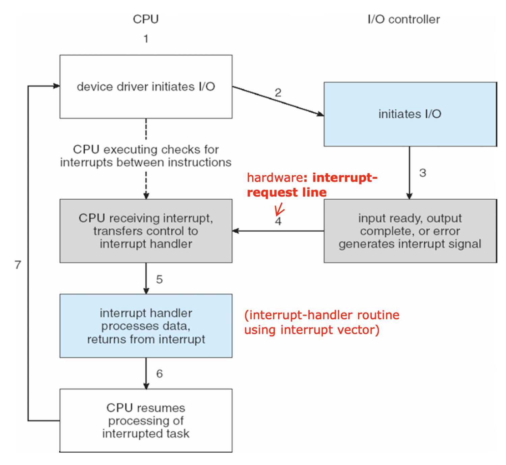

- Device controller는 요청한 작업이 끝나면 interrupt를 발생시켜 interrupt request line에 쌓아 둔다.
- CPU는 각각의 instruction이 끝날 때마다 interrupt line이 setting됐는지 확인을 하고 setting됐으면 CPU는 instruction의 수행을 멈추고 interrupt handler를 통해 interrupt를 처리한다.
- Interrupt가 발생하면 CPU는 interrupt vector로 실행을 전송한다. Interrupt vector는 interrupt service routine의 address를 알고 있어 해당 address를 알려주고 CPU는 해당 service routine을 실행시킨다. 실행이 끝나면 작업을 마친 프로세스를 block 상태에서 ready상태로 변경하고 기존의 수행 중이던 process를 이어서 수행한다. (프로세스의 우선순위에 따라 인터럽트 처리를 마친 프로세스를 바로 실행할 수도 있다.)

### 📚 Reference
- [인터럽트(Interrupt)의 개념과 종류](https://raisonde.tistory.com/entry/%EC%9D%B8%ED%84%B0%EB%9F%BD%ED%8A%B8Interrupt%EC%9D%98-%EA%B0%9C%EB%85%90%EA%B3%BC-%EC%A2%85%EB%A5%98)
- [[OS] Interrupt 인터럽트란?](https://doh-an.tistory.com/31)

폴링(Polling)이란 무엇일까요?

- 인터럽트와 같게 CPU가 다른 프로세스를 실행하는 동안 디바이스로 부터 발생하는 이벤트들을 처리하는 방법 중 하나이다.
- 폴링 방식은 특정 주기마다 CPU가 디바이스들이 serving(이벤트 처리)이 필요한지 체크하여야해서 CPU 사이클의 낭비가 발생한다.
    - 폴링은 특정 주기마다 CPU가 디바이스를 poll할 때만 serving이 가능하다. 하지만 인터럽트는 언제든지 발생할 수 있다.
- 인터럽트와 다르게 소프트웨어적으로 시그널을 확인하는 방식이다.
- 장점으로는 구현이 쉽고 우선순위의 변경이 용이하다는 점이 있다.

> 인터럽트는 폴링 방식과 다르게 하드웨어로 지원을 받아야하는 제약이 있다. 하지만 폴링 방식보다 신속하게 대응하는 것이 가능하여 실시간 대응이 필요할 때 필수적인 기능이다. 즉, 인터럽트는 발생시기를 예측하기 힘든 경우 컨트롤러가 가장 빠르게 대응할 수 있는 방식이다.

### 📚 Reference
- [Interrupt와 polling의 차이](https://seonggyu.tistory.com/26)

Mode bit이란 무엇일까요?

- 사용자 장치의 잘못된 수행으로 다른 프로그램 및 운영체제에 피해가 가지 않도록 하기 위한 Mode bit이라는 보호장치가 존재한다.
- Mode bit은 **하드웨어적**으로 두가지 모드의 operation을 지원한다.
  - 1이면 user mode (사용자 프로그램 수행)
  - 0이면 kernel mode (OS코드 수행)
- Privileged instruction은 파일을 다루거나 I/O에게 request를 하는 등 OS만 실행할 수 있는 instruction으로 kernel mode에서만 수행가능하다.
- 만약 user mode에서 실행하려고 하면 프로그램을 종료하고 software interrupt가 발생한다. User Program이 hardware에 접근하려면 system call을 통해 실행하여야 한다.

System Call이란 무엇일까요?

User program이 접근하지 못하는 OS만의 Privileged instruction을 실행하기 위해 OS에게 특정 일들을 수행해달라고 요청하는 것으로 Software interrupt이다. 이는 User program과 OS사이의 interface를 제공한다.

System call이 발생하면 mode bit을 0으로 변경하여 요청된 작업을 처리하고 다시 유저모드인 1로 변경하여 유저 프로세스가 수행되게 된다.

System Call과 Function Call의 차이점에 대해 설명해주세요

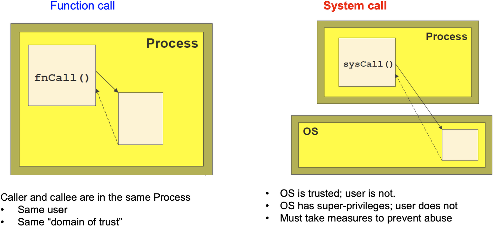

fuction call은 같은 process 내에서 process 내에 있는 function 을 불러서 수행하는 것이다. 반면에 System call은 OS의 도움을 받아 OS의 function을 불러서 수행하는 것이다.

DMA란 무엇일까요?

- 모든 메모리의 접근은 CPU에 의해 접근이 가능하여, 메모리의 접근을 위해서는 CPU에게 인터럽트를 발생시켜 부탁해야 했다. 이러한 구조는 모든 메모리 연산이 필요할 때마다 interrupt를 발생시키고, CPU는 인터럽트를 처리하기 위해 로컬버퍼와 메모리 사이에서 데이터를 옮기는 일까지 진행했다. 이러한 이유때문에 CPU의 효율성이 떨어지는 문제가 존재하였다. 비효율을 극복하기 위해 CPU이외에 메모리 접근이 가능한 장치가 있는데 이를 DMA(Direct Memory Access)라고 한다.
- DMA는 일종의 컨트롤러 장치로서, CPU가 입출력 장치들의 메모리 접근 요청에 의해 자주 인터럽트 당하는 것을 막아주는 역할을 한다.
- **DMA를 사용하면 로컬버퍼에서 메모리로 데이터를 읽어오는 작업을 CPU가 아닌 DMA가 대행하게 된다.** 덕분에 CPU가 인터럽트를 처리할 필요가 없다.
- DMA는 바이트단위가 아닌 블록 단위로 데이터를 메모리로 읽어온 후 CPU에게 인터럽트를 발생시켜 작업의 완료를 알린다.
  - CPU에 발생하는 인터럽트의 빈도를 줄여 CPU를 좀 더 효울적으로 관리할 수 있게 해준다.

## 프로세스와 스레드

프로세스와 프로세서의 차이에 대해 설명해주세요.

- 프로세스는 코드로 작성된 프로그램이 메모리에 적재되어 사용할 수 있는 상태가 된 것이다. 즉, 메모리 상에서 실행중인 프로그램을 프로세스라고 한다.
- 프로세서는 CPU를 의미한다.

프로세스와 스레드의 차이를 설명해주세요

- 프로세스는 메모리에 적재된 하나의 프로그램을 의미한다.
- 스레드는 CPU에서 동작하는 가장 작은 단위의 작업 단위이다.

> 프로세스는 운영체제로부터 자원을 할당받는 작업의 단위이고 스레드는 프로세스가 할당받은 자원을 이용하는 실행의 단위이다.

> 하나의 프로세스는 1개 이상의 여러 스레드가 들어갈 수 있으며 컨테이너는 스레드를 관리하는 컨테이너로 볼 수 있다.

프로세스의 주소 공간은 어떻게 이루어져 있을까요? 그리고 각각의 주소 공간에는 어떤 데이터가 저장될까요?

- **Text (Code)**: 코드 자체를 구성하는 메모리 영역
- **Data**:  전역변수, 정적 변수, 배열과 같은 static data (global variable)
  - 초기화된 데이터는 data 영역에 저장하며 초기화되지 않은 데이터는 bss 영역에 저장한다.
- **Stack**: 지역변수, 매개변수, 리턴 값과 같은 데이터를 저장하는 임시 메모리 영역이다. (local variable, function parameter, return address)
- **Heap**: run time 시점에 동적 할당되는 데이터들이 저장된다. (malloc, java object)

  > C에서 Pointer 변수 같은 경우 stack에는 데이터의 주소값들이 저장이 되고 heap에는 실제 값이 저장된다.

  > Java의 경우 객체 생성에서 비슷한 예시가 있다.
  >
  >
  > 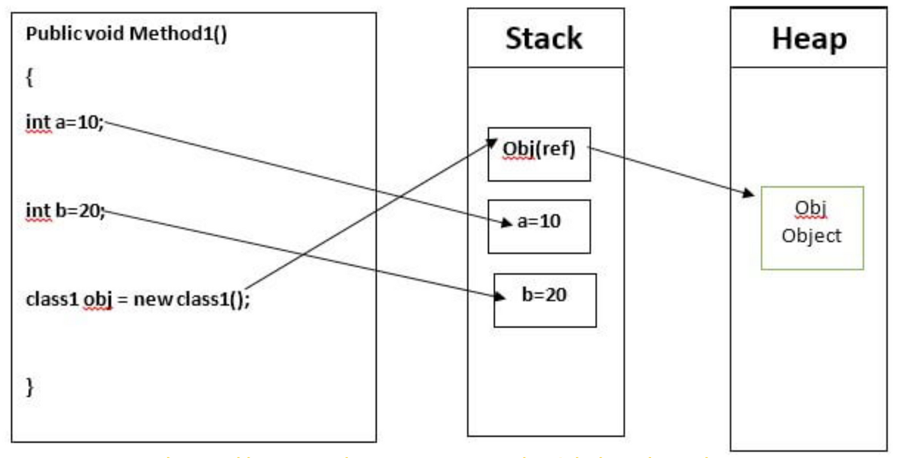
  >
  > int a,b는 local variable이어서 stack에 저장이 되고 class1 obj도 local variable이어서 stack에 저장이 되는데 object의 실제 내용은 heap에 저장이 되고 stack에서는 주소값을 갖고 있다. object는 생성이 되면 처음에는 stack에 주소값만 생성이 되고 실제로 할당이 되면 그때서야 heap이 생성되고 실제 데이터가 저장이 된다.

프로세스 주소 공간을 나눈 이유는 무엇일까요?

최대한 데이터를 공유하며 메모리 사용량을 줄이기 떄문이다.

Code와 같은 프로그램 자체의 정보는 같은 변함이 없는 같은 내용이기에 따로 관리를 하며 공유를 한다. 반면에 Stack, Data는 스택 구조의 특성과 전역 변수의 활용성을 위해서 나누게 되었다.

프로세스의 상태에는 어떤 것이 있을까요?

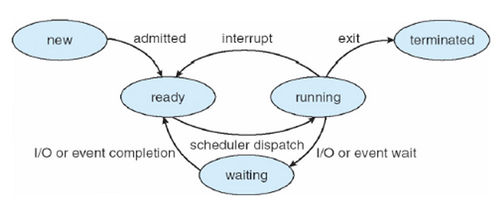

- **New**: process가 생성중인 상태
- **Ready**: CPU를 사용하려고 기다리는 상태 (할당이 되면 바로 시행하려고 proces 가 메모리에 올라가 있다.)
- **Running**: CPU를 잡고 instruction을 수행중인 상태
- **Blocked(wait, sleep)**: CPU를 주어도 당장 instruction을 수행할 수 없는 상태, process 자신이 요청한 event (I/O, 공유하는 데이터 등)가 즉시 만족되지 않아 이를 기다리는 상태이다. 요청한 event가 수행을 마치면 interrupt를 발생시키고 blocked상태의 process를 ready queue에 옮겨준다.
- **Terminated**: 수행이 끝난 상태

프로세스의 Running State에서 CPU 자원을 뺐기는 3가지 상황에 대해 설명해주세요

1. Interrupt가 발생했을 때 (timer도 포함)
2. I/O request를 하기 위해 system call을 하여 waiting상태로 넘어가는 경우
3. Process의 수행이 끝나서 terminated로 되는 경우

OS는 프로세스의 정보를 어떻게 관리하며 어떤 데이터들을 저장하고 있는지 설명해주세요 (hint.PCB)

각각의 Process들은 OS의 관리를 받게 되는데 이때 OS는 process의 현재 정보들을 알기 위해 PCB(Process Control Block)를 사용한다.

PCB는 아래의 정보들을 저장하고 있다.

- Process **state**
- Process number: process id (**pid**)
- **Program counter** (PC) - next instruction address
- **CPU register** – contents of registers (in CPU)
- etc (Owner, CPU Usage, Memory Usage, Process Priority, I/O status information)

PCB가 왜 필요할까요?

CPU core는 하나의 프로세스가 사용하지 않고 여러 프로세스가 공유해서 사용한다. 이때 프로세스의 교체(Context switching)이 발생할 때마다 실행중인 CPU에 올라간 프로세스의 정보를 변경해야하고, 프로세스들은 추후 CPU 이용 순서가 왔을 때 이전 작업 내용을 이어서 하기 위해 정보를 저장해야할 필요가 있다. 운영체제는 이러한 프로세스의 정보를 PCB를 통해 저장하고 관리하고 있다.

Context Switching이 발생할 때는 PCB의 값들을 변경하게 되며 PCB의 정보를 통해 연산을 이어서 한다.

PCB는 어떻게 관리될까요??

- kernel의 data영역은 CPU, memory, disk등의 데이터들을 각각 갖고 있다. 그리고 각각의 process의 정보들을 갖고 있는 PCB들이 존재한다. 즉, PCB는 kernel의 data 영역에서 관리된다.

  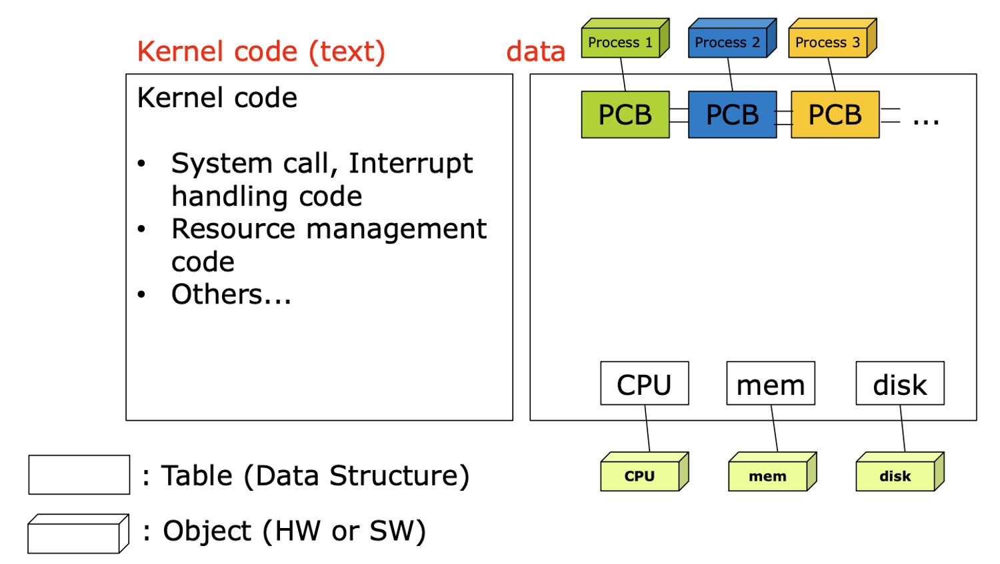

- 이때 PCB들은 Linked List 방식으로 관리가 된다. PCB List Head에 PCB들이 생성될 때마다 붙게 된다. 주소값으로 연결이 이루어져 있는 연결리스트이기 때문에 삽입 삭제가 용이하다.
- 프로세스가 생성되면 PCB가 생성되고 프로세스가 종료되면 PCB도 제거된다.

Process Context란 무엇일까요?

- 프로세스 문맥(Process Context)이란 프로세스가 현재 어떤 상태에서 수행되고 있는지 정확히 규명하기 위해 필요한 정보를 의미한다.
- 시분할 시스템에서는 CPU의 제어권을 공유하기에 프로세스를 재개하는 시점에 대한 정보를 알기 위해 Process Context를 이용한다.
- 프로세스의 주소공간(코드, 데이터, 스택 상태)등을 비롯해 레지서터의 값, 시스템 콜 등을 통해 커널에서 수행한 일의 상태, 프로세스에 관해 커널이 관리하고 있는 각종 정보 등을 포함한다.
- 하드웨어 문맥, 프로세스 주소 공간, 커널상의 문맥으로 나누어볼 수 있다.
  - 하드웨어 문맥: CPU의 수행 상태를 나태는 것으로 **PC**와 **레지스터**에 저장한 값들
  - 프로세스 주소 공간: **코드**, **데이터**, **스택**으로 구성되는 주소공간
  - 커널 상의 문맥: **PCB**, **커널 스택**과 같은 자료구조
- 실행중인 프로세스가 발생할 때, 문맥을 교환하는 것을 Context Switching이라고 한다.
  - Context Switching은 타이머 인터럽트나 입출력 요청 시스템 콜을 통해 프로세스가 blocking 상태로 이동할 때만 발생하며, 그 외의 system call이나 context switching에는 발생하지 않는다.

    > 단순히 사용자 모드에서 커널 모드로 바뀌어 특권명령을 수행하는 시스템 콜이나 인터럽트는 단순히 커널 모드에서 처리하고 사용자모드로 바뀌게 된다. context switching은 없다!!!

IPC란 무엇일까요?

경우에 따라서 독립적인 프로세스들이 협력할 때 업무의 효율성이 증진될 수 있다.

- 부분적인 처리 결과나 정보 공유, 처리 속도 향상 등

이를 위해 운영체제는 프로세스간 협력 메커니즘을 제공한다. 대표적으로는 **IPC(Inter-Proess Communiacation)**이 있다.

즉, IPC란 하나의 컴퓨터 안에서 실행 중인 서로 다른 프로세스간에 발생하는 통신을 말한다.

### IPC 종류

> 대표적인 Message Passing과 Shared Memory만 알아도 된다.
>

**익명 PIPE**

익명 파이프는 부모-자식 프로세스간 통신처럼 통신할 프로세스를 명확히 알 수 있는 경우에 사용한다.

파이프는 두 개의 데이터를 연결하는데 하나의 프로세스는 데이터를 쓰기만하고, 다른 프로세스는 데이터를 읽기만하는 단방향 통신이다. (**반이중 통신**이라고도 불린다.) 그래서 양방향 통신을 하고 싶으면 2개의 파이프를 만들어야 한다.

간단하게 사용할 수 있는 장점이 있고 단순한 데이터의 흐름을 가질 땐 해당 파이프를 사용하는 것이 효율적이나 **전이중통신(양방향 통신)**을 위해 2개의 파이프를 만들어야 할 때는 구현이 복잡해진다는 단점이 있다.

**Named PIPE(FIFO)**

Named 파이프는 전혀 모르는 상태의 프로세스들 사이의 통신에 사용한다.

부모 프로세스와 무관한 다른 프로세스도 통신이 가능하다. 하지만 익명 파이프처럼 읽기/쓰기가 동시에 불가능하여 전이중 통신을 만들기 위해서는 2개의 파이프를 만들어야 한다.

**Message Passing**

두 프로세스의 주소 공간이 달라 메시지를 직접 전달할 수는 없고 통신하기를 원하는 두 프로세스 사이에 communication link를 생성한 후 커널의 `send()`, `recieve()` 연산을 통해 메시지를 주고받는다.

> `send()`, `recieve()` 연산은 시스템 콜을 통해 사용할 수 있다.
>

메시지 전달은 전송 대상이 다른 프로세스인지 아니면 메일박스라는 일종의 저장공간인지에 따라 다시 직접 통신(direct communication)과 간접 통신(indirect communication)으로 나뉘게 된다.

**Shared Memory**

파이프, 메시지 큐가 통신을 이용한 설비라면, **공유 메모리는 데이터 자체를 공유하도록 지원하는 설비**이다.

Shared memory를 사용하면 특수한 공간이 생기는데 이 공간을 process들이 각자 자신의 공간이라고 생각하며 사용한다. 프로세스가 공유 메모리 할당을 커널에 요청하면 커널은 해당 프로세스에 메모리 공간을 할당해주고 이후에 모든 프로세스는 해당 메모리에 접근할 수 있다.

해당 방법은 중개자 없이 곧바로 메모리에 접근할 수 있어서 IPC 중에서 가장 빠르게 작동한다. 하지만 2개 이상의 Process가 동시에 접근하려는 문제(Proces synchronization)와 Multi Processor에서의 Cache Coherence Problem이 발생할 수 있다.

**Memory Map**

공유 메모리처럼 메모리를 공유하는 방법이다. 메모리 맵은 열린 파일을 메모리에 매핑시켜 공유하는 방식이다.

주로 파일로 대용량 데이터를 공유해야 할 때 사용한다.

**Socket**

네트워크 통신을 통해 데이터를 공유한다.

클라이언트와 서버가 소켓을 통해서 통싢는 구조로 원격에서 프로세스간 데이터를 공유할 때 사용한다.

> 이러한 IPC 통신에서 프로세스 간 데이터를 동기화하고 보호하기 위해 세마포어와 뮤텍스를 사용한다.

스레드란 무엇일까요?

CPU가 동작하는 가장 작은 단위를 스레드(thread)라고 한다.
사용자들이 2개의 같은 program을 이용하는 경우는 program들은 동일한 code를 실행하고 data들을 공유하고 싶을 것이다. 그래서 code와 data를 같이 공유하며 사용하자라고 만든 것이 thread이다

- 하나의 Process는 한개 이상의 스레드로 구성된다.
- 동일한 프로그램을 여러 개 띄우더라도 process가 하나만 만들어진다. (code, data이 하나만 만들어진다는 뜻.)
- IPC없이 바로 shared memory에 접근 가능하다
- Process들끼리 바꾸는 context switching보다 Thread를 변경하는 것이 overhead가 적다.
- 새로운 스레드를 만들 때는 PC, Register, Stack에 대한 공간만 만들면 됨으로 프로세스를 만드는 것보다 memory와 time 측면에서 이점이 있다.

하나의 프로세스 안에서 만들어진 스레드들간 공유하는 공간과 독립적으로 할당하는 공간은 각각 무엇이 있을까요?

- 공유하는 공간: Code, Data (OS Resource도 공유한다.)
- 각각 관리하는 공간: PC, Register, Stack
  - TCB(Thread Control Block)으로 관리

커널 스레드와 유저 스레드란 무엇일까요?

### Kernel thread

- thread_create system call을 통해 생성되며 Kernel의 support를 받아 kernel이 thread의 존재를 알게 된다.
- 각각의 thread는 TCB를 갖는다. (TCB의 정보들은 PCB안에 있다.)
- **장점** : Parallelism과 Concurrency를 지원한다.

  (Concurrency: 하나의 스레드가 block 상태에 있어도 다른 스레드가 실행 가능하다.)

- **단점** : thread들은 kernel을 통해서 operation을 해야하기에 User thread보다 무겁다.

### User thread

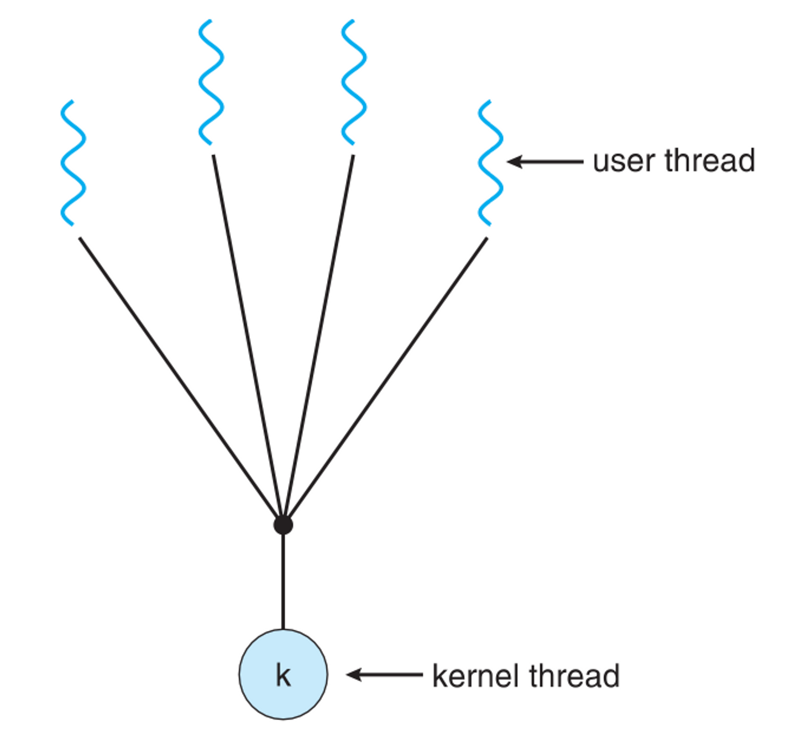

- Implement thread in user library.
- 생성을 위해 system call이 필요 없다.
- 하나의 kernel thread안에 여러 개의 user thread가 mapping되어서 만들어진다.
- **장점** : kernel이 존재를 몰라서 user space안에서 thread library에 의해 관리된다. system call이 필요 없어서 빠르다.
- **단점** : 하나의 user thread가 system call을 만들면 전체 thread가 blocked 상태가 된다 또한 Parallelism을 지원하지 않는다.

TCB란 무엇일까요?

- 프로세스를 PCB를 통해 관리하듯이 스레드는 TCB(Thread Control Block)라는 구조를 통해 관리된다.
- TCB의 정보는 PCB안에 있다.
- 각각의 Kernel Thread에만 생성된다.
- PC, register의 정보를 갖고 있다.
- ready queue는 CPU를 기다리고 있는 TCB의 리스트로 context switch를 할때마다 TCB들에 있는 각각의 PC, register 정보를 바꿔주게 된다.

멀티 스레드의 장단점에 대해 설명해주세요.

하나의 프로세스에 여러 스레드로 자원을 공유하며 작업을 나누어 수행하는 것이다.

**장점**

- 독립적으로 프로세스를 생성하는 것에 비해 PC, Register, Stack에 대한 공간만 만들면 됨으로 프로세스를 만드는 것보다 memory와 time 측면에서 이점이 있다.
- 시스템의 처리율이 향상된다.
- 스레드간 데이터를 주고받는 것이 간단해지고 시스템 자원 소모가 줄었다.
- 스레드 사이의 작업량이 적어 Context Switching이 빠르다. (캐시 메모리를 비울 필요가 없다)
  - Non-blocking system call을 하여 효율적이다.
    - Single thread는 I/O작업을 하면 process전체가 waiting으로 가게 되는 blocking system인데 multi-thread process같은 경우는 하나의 thread가 I/O작업을 하여 해당 thread가 waiting으로 가더라도 다른 thread가 CPU를 할당받아 사용할 수 있는 Non-blocking system이다.
- 간단한 통신 방법으로 프로그램의 응답시간과 통신 비용이 단축됐다. (IPC없이 Shared 메모리에 접근 가능)

**단점**

- 자원을 공유하기에 bottle neck, deadlock과 같은 동기화 문제가 발생할 수 있다.
- 주의깊은 설계가 필요하고 디버깅이 어렵다.
- 하나의 스레드에 문제가 생기면 전체 프로세스가 영향을 받는다.
- 단일 프로세스 시스템의 경우 효과를 기대하기가 어렵다.

멀티 스레드와 멀티 프로세스의 차이에 대해 설명해주세요

> 멀티 프로세스는 하나의 프로그램을 여러 개의 프로세스로 구성하여, 각 프로세스가 하나의 작업을 처리하는 것을 의미한다.
>

> 멀티 스레드는 하나의 프로세스에 여러 스레드가 자원을 공유하며 작업을 나누어 수행하는 것이다.
>

차이

- 멀티 스레드는 멀티 프로세스보다 작은 메모리 공간을 차지하고 Context Switching이 빠른 장점이 있지만, 동기화 문제와 하나의 스레드 장애로 전체 스레드가 종료될 위험을 갖고 있다.
- 멀티 프로세스는 하나의 프로세스가 죽더라도 다른 프로세스에 영향을 주지 않아 안정성이 높지만, 멀티 스레드보다 많은 메모리 공간과 CPU 시간을 차지하는 단점이 있다.
- 두 방법은 동시에 여러 작업을 수행하는 점에서 동일하지만, 각각의 장단이 있음으로 적용하는 시스템에 따라 적합한 동작 방식을 선택하고 적용해야 한다.

### 📚 Reference
- [[OS]멀티 프로세스와 멀티 스레드의 차이는 무엇일까?](https://livenow14.tistory.com/67)

## CPU 스케줄링

장기, 중기, 단기 스케줄러에 대해 설명해주세요.

**장기 스케줄러(long term scheduler)**

- 장기 스케줄러는 작업 스케줄러(job scheduler)라고도 불리며, 어떤 프로세스를 준비 큐에 진입시킬지 결정하는 역할을 한다.
  - ready queue에 있는 작업들은 CPU에서 실행되기 위해 프로세스 메모리를 보유하여야 하여 장기 스케줄러는 메모리를 할당하는 문제에 관여한다. → 메모리 할당 승인을 결정
  - 메모리에 올라가있는 프로세스의 수(degree of multiprogramming)를 조절한다.

  > 현대의 시분할 시스템의 운영체제에서는 프로세스가 시작 상태가 되면 장기 스케줄러 없이 곧바로 프로세스에 메모리를 할당해 준비 큐에 넣어준다. → 장기 스케줄러 대신 중기 스케줄러를 사용
>

**단기 스케줄러(short term scheduler)**

- 단기 스케줄러는 CPU 스케줄러라고도 하며, ready queue의 프로세스 중에서 어떤 프로세스를 다음번에 실행 상태로 만들 것인지 결정한다.
- 시분할 시스템에서는 타이머 인터럽트가 발생하면 단기 스케줄러가 호출된다.

**중기 스케줄러(medium term scheduler)**

- 현대의 시분할 시스템용 운영체제에서는 장기 스케줄러 대신 중기 스케줄러를 두는 경우가 많다.
- 너무 많은 프로세스에게 메모리를 할당해 시스템의 성능이 저하되는 경우 이를 해결하기 위해 메모리에 적재된 프로세스의 수를 동적으로 조절하기 위해 추가된 스케줄러이다. (장기 스케줄러와 같이 메모리에 올라와 있는 프로세스 수를 조절하는 역할 수행)
- 프로세스당 보유 메모리양이 지나치게 적어진 경우 이를 완화시키기 위해 일부 프로세스를 메모리에서 디스크로 스왑 아웃(swap out)시키는 역할을 수행한다.
  - 0순위: block 상태의 프로세스
  - 그럼에도 부족하다면? 타이머 인터럽트의 발생으로 준비큐로 이동하는 프로세스를 swap out!
- 중기 스케줄러에는 중지(suspended, stopped) 상태가 추가되어 운영된다.
  - 중지 상태의 프로세스들은 메모리를 조금도 보유하지 않고 디스크에 스왑 아웃된 상태로 존재한다.

선점과 비선점 스케줄링의 차이에 대해 설명해주세요

**Non-preemtive(비선점)**

- Process가 CPU를 스스로 놔줄 때까지 기다리는 스케줄링 방식이다. Process들은 종료 또는 I/O 작업을 하기 전까지는 CPU를 지속적으로 사용할 수 있다.
- CPU를 놓아줄 때까지 기다려야해서 preemtive에 비하여 context switch가 적게 일어나 Overhead가 적다. 하지만 새로운 작업을 요청해도 자신의 순서가 오기까지 오래 기다려야 하기에 response time이 오래걸리는 단점이 있다.
- 바로바로 반응해야하는 프로그램들에는 좋지 못하다.

**Preemtive(선점)**

- interrupt를 통해 강제로 CPU를 뺐는 방법이다.
- 현대 대부분의 OS는 preemtive방식이다.
- race condition이 발생한다.

CPU Scheduling을 측정하는 척도에는 무엇이 있을까요?

- **CPU utilization**: CPU를 얼마나 사용하는지, 높을수록 효율적으로 사용하는 거라 좋다.
- **Throughput**:  시간당 수행한 작업의 양
- **Turnaround time**
  - 프로세스가 종료되기까지 걸린 시간
  - waiting시간, 실행 시간을 모두 합친 것으로 process가 생성되어서 종료되기까지 총 시간
- **Waiting time**
  - ready queue에서 기다린 총 시간
  - waiting queue에서 기다리는 전체 시간을 의미
  - turnaround time과 함께 CPU scheduling 알고리즘의 성능을 측정하는 변수로 사용
- **Response time**
  - 프로세스가 생성되고 첫번째 응답이 있기까지 걸린 시간
  - interactive and real-time system 프로그램 측정에 사용된다.

CPU Scheduling의 종류에는 무엇이 있을까요?

### **First-come, First-Served (FCFS)**

- Queue와 같이 먼저 들어온 것이 먼저 수행되는 스케줄링 방법이다.
- Non-preemtive scheduling방법이다.
- **Convoy Effect** 가 발생할 수 있다.

  > Convoy Effect란?
  >
  >
  > I/O bound process 들이 늦게 들어오고 CPU bound process들이 먼저 들어오게 된다면 실행 시간이 적은 I/O bound process들은 많은 시간을 기다려야하는데 이러한 상황을 Convoy Effect라고 한다.
  >
  > 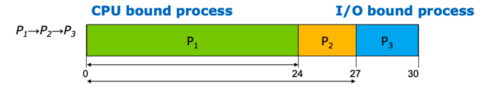
>

### Shortest-Job-First (SJF) scheduling

- CPU burst가 짧은 것부터 실행을 하여 waiting time을 최소 시키는 스케줄링 방법이다.
- 평균 waiting time이 가장 적다
- SJF에서는 CPU bust length가 어떤지는 확실히 알 수가 없어서 예측을 해야한다. 예측은 과거의 데이터를 갖고 exponential moving average를 하여 CPU burst를 예측한다.
- Nonpreemptive SJF, Preemptive SJF가 존재한다.

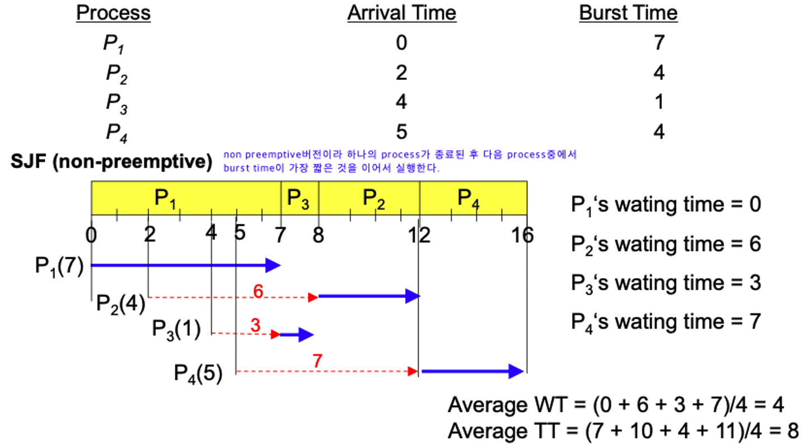

> **Shortest-Remaining-Time-First (SRTF)**
>
> - Preemptive SJF이다.
> - preemptive SJF는 새로운 process가 들어왔을때 또는 process가 종료됐을때마다 어떤 process의 burst time이 가장 작은지 판별을 하고 현재 실행되고 있는 process보다 더 짧은 burst time을 가진 process가 있다면 context switch를 한다.
    >
    >     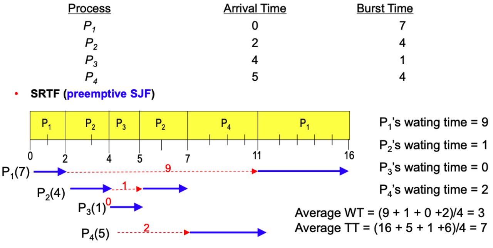

- SJF 장점
  - waiting time을 최소화한다.
  - 짧게 끝낼 수 있는 process들을 먼저 실행시켜서 process의 수를 최소화한다.
- SJF 단점
  - CPU burst time은 예측으로만 알 수 있는데 예측이 틀릴 수 있기에 실제 적용이 힘들다.
  - **Starvation Problem**이 발생할 수 있다.

    > Starvation이란?
    >
    > - burst time이 짧은 process들이 계속 들어오면 burst time의 길이가 긴 process는 실행되지 못하고 무한정 기다리게 된다. 이러한 문제를 Starvation이라고 한다.

### HRN (Hightest Response-ratio Next)

- SJF의 단점을 보완하여 우선순위를 계산하여 CPU 선점의 불평등을 보완한 방법이다.
- 프로세스가 실제 실행될 시간과 대기 시간에 따라 우선순위를 결정한다.
- 우선순위 = (대기시간 + 실행시간) / (실행시간)

### **Round Robin (RR)**

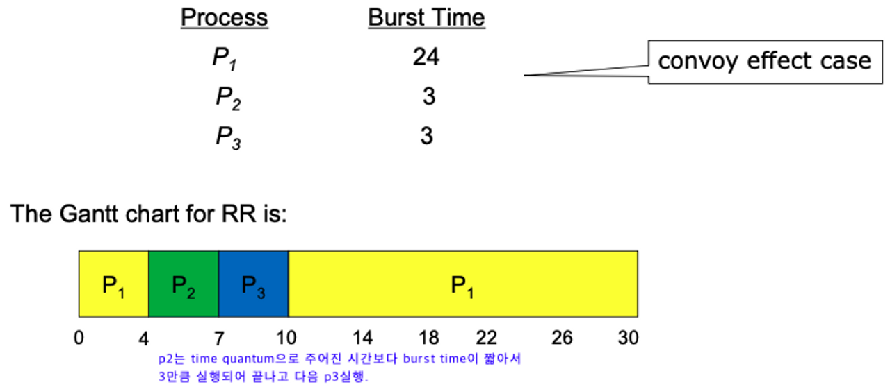

- Timer를 사용하여 time quantum이후에 실행중인 일을 중단하고 다른 process로 context switch 시키는 실행시키는 스케줄링 방법이다.
- 일반적으로 SJF보다 평균 waiting time이 높다. 하지만 공정하고 starvation이 발생하지 않는다.
- 성능은 time quantum을 매우 크게 설정하면 FCFS와 같이 실행되고 매우 작게 설정하면 context switch time이 증가하여 overhead가 매우 높아져 비효율적으로 된다.
- 장점
  - 모두 돌아가며 수행하기에 response time이 적다.
  - FCFS와 비교하였을 때 I/O bound process에 한해서 waiting time이 크게 줄어든다. SJF보다는 일반적으로 waiting time이 길다.
  - SJF의 문제인 starvation이 발생하지 않는다.
- 단점
  - 길이가 비슷한 process들을 수행시키면 turnaround time이 증가하는 문제점이 있다.
  - preemtive 방식이기에 context switching을 하는 overhead가 발생한다.

### **Priority Scheduling**

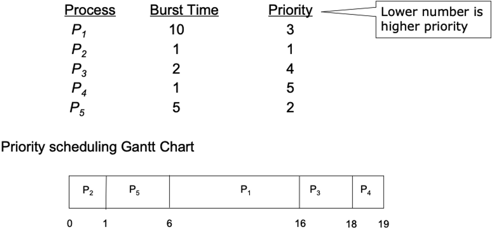

- Priority가 높은 process들부터 먼저 수행하는 스케줄링 방법이다.
- SJF도 priority scheduling중 하나이다. (우선순위를 job의 길이가 작은 거로 정한 것)
- Starvation이 발생할 수 있다. → 그에 대한 해결책 중 하나가 **Aging**이다.

  > Aging이란?
  >
  > - Aging은 각각의 process마다 시간이 지나면 지날수록 우선순의를 높여주는 방법이다.

### Multileve Queue

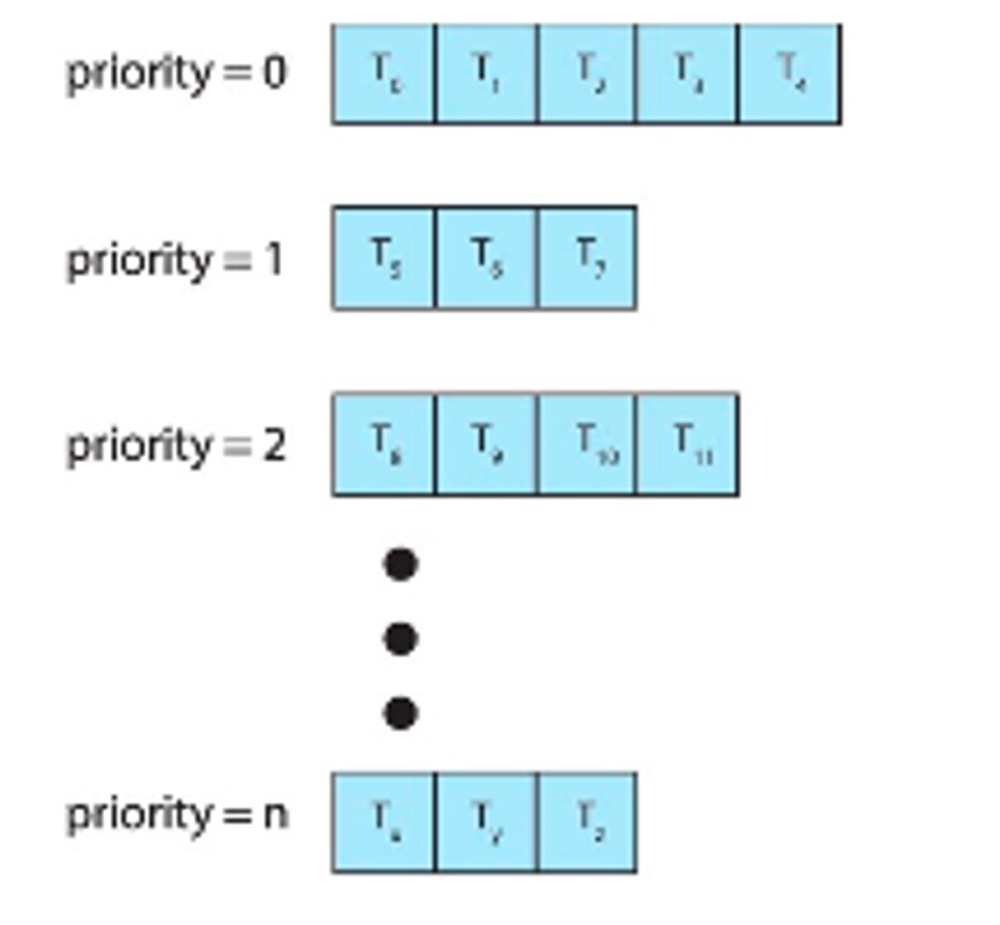

- 작업들을 여러 종류의 그룹으로 나누어 여러 개의 큐를 이용하는 기법이다.
  - 커널 작업은 우선순위가 높은 큐에서 실행된다.
- 우선순위가 낮은 큐들이 실행 못하는 걸 방지하고자 각 큐마다 다른 `Time Quantum`을 설정 해주는 방식 사용한다.
  - 우선순위가 높은 큐는 작은 `Time Quantum` 할당하고 우선순위가 낮은 큐는 큰 `Time Quantum` 할당한다.

### Multilevel-Feedback-Queue (다단계 피드백 큐)

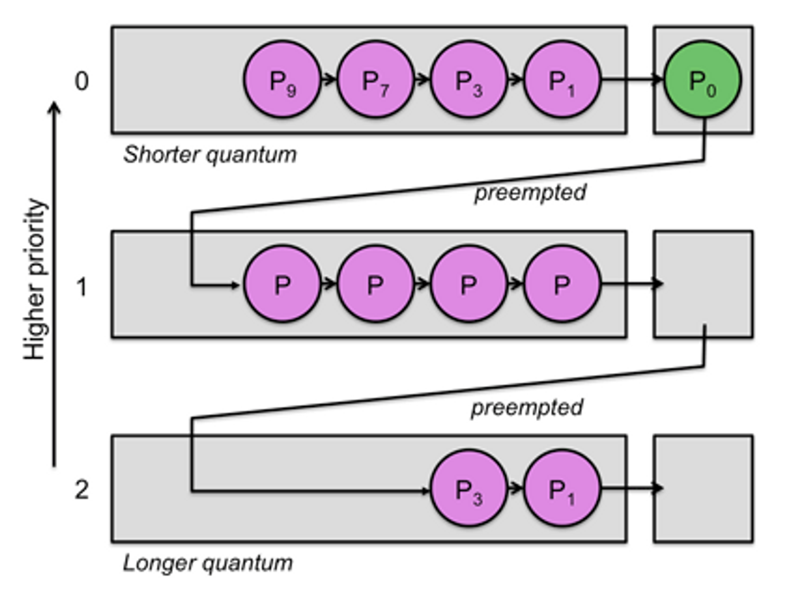

- Multileve Queue에서 time quantum을 다 채운 프로세스는 CPU burst process라고 판단하여 하위 우선순위 큐로 내리는 스케줄링 방법이다.
- **I/O burst process와 같이 짧은 작업들에 우선순위를 주는 방법**이다.
- 처리 시간이 짧은 프로세스를 먼저 처리하기에 평균 turnaround time을 줄여준다.

### Real-time scheduling

- Process중에서 Deadline이 존재하는 것들도 존재한다. Real-time scheduling은 deadline을 지켜주는 스케줄링 방법이다.
- **Rate Montonic Scheduling, Earliest Deadline First Scheduling (EDF)** 이 존재한다.

Starvation은 어떤 스케줄링에서 발생하는 문제일까요?

Starvation이란?

- Priority Scheduling에서 우선순위가 높은 process들이 계속 들어오면 우선순위가 낮은 process는 실행되지 못하고 무한정 기다리게 된다. 이러한 문제를 Starvation이라고 한다.
- Priority Scheduling, SJF Scheduling에서 발생한다.

Aging이란 무엇일까요?

Aging은 Starvation을 해결하는 방법 중 하나로 각각의 process마다 시간이 지나면 지날수록 우선순의를 높여주는 방법이다.

선점 스케줄링과 비선점 스케줄링에는 각각 어떤 것이 있을까요?

**선점 스케줄링**

- SRTF(Shortest Remaining Time First)
- 라운드로빈(Round-Robin)
- 다단계 큐(Multi-level Queue)
- 다단계 피드백 큐

**비선점 스케줄링**

- FCFS(First Come First Service)
- SJF(Shortest Job First)
- 우선순위(Priority)
- HRN(Heighest Response Next)

## Synchronized

경쟁 상태(Race Condition)이란 무엇이며 언제 발생할까요?

multicore cpu에서 두개 이상 프로세스가 parallel하게 실행되는 경우 또는 두개 이상의 프로세스가 하나의 single core에서 concurrently하게 실행되는 등 공유 자원에 동시접근하는 문제가 발생할 수 있다.

이와 같이 두개 이상의 프로세스를 두고 경쟁하는 문제를 Race Condition이라고 한다.

### Race Condition이 발생하는 경우

1. **커널 작업을 수행하는 중에 인터럽트 발생하는 경우**
  - 문제점 : 커널모드에서 데이터를 로드하여 작업을 수행하다가 인터럽트가 발생하여 같은 데이터를 조작하는 경우
  - 해결법 : 커널모드에서 작업을 수행하는 동안, 인터럽트를 disable 시켜 CPU 제어권을 가져가지 못하도록 한다.
2. **프로세스가 'System Call'을 하여 커널 모드로 진입하여 작업을 수행하는 도중 context switching이 발생할 때**
  - 문제점 : 프로세스1이 커널모드에서 데이터를 조작하는 도중, 시간이 초과되어 CPU 제어권이 프로세스2로 넘어가 같은 데이터를 조작하는 경우 ( 프로세스2가 작업에 반영되지 않음 )
  - 해결법 : 프로세스가 커널모드에서 작업을 하는 경우 시간이 초과되어도 CPU 제어권이 다른 프로세스에게 넘어가지 않도록 함
3. **멀티 프로세서 환경에서 공유 메모리 내의 커널 데이터에 접근할 때**
  - 문제점 : 멀티 프로세서 환경에서 2개의 CPU가 동시에 커널 내부의 공유 데이터에 접근하여 조작하는 경우
  - 해결법 : 커널 내부에 있는 각 공유 데이터에 접근할 때마다, 그 데이터에 대한 lock/unlock을 하는 방법

임계영역(Critical Section)에 대해 설명해주세요

- 각각의 process들은 shared data를 접근하는 부분에 critical section이라고 불리는 code segment를 갖고 있다.
- 동시간대에 하나의 process만 critical section을 실행할 수 있다.
- 각각의 process들은 critical section에 들어갈 때 `entry section`에서 permission에 대해 물어보고 사용 가능하면 들어간다. 실행을 마치면 `exit section`을 통해 사용을 마쳤다는 것을 알리고 `remainder section`을 이어서 실행시킨다.
- Critical section에는 필요 조건이 있다.
  - **Mutual Exclusion**: 하나의 프로세스가 들어오면 다른 프로세스는 못 들어온다.
  - **Progress**: Critical Section을 실행하는 프로세스가 없을 때는 원하는 프로세스는 누구나 들어갈 수 있다.
  - **Bounded** **waiting**: 각각의 process들은 몇번의 시도안에 Critical Section에 들어갈 수 있어야 한다.
- Critical Section은 Mutex Lock 또는 Semaphore로 구현된다.

Mutex Lock과 Semaphore에 대해 설명해주세요. (+ 둘은 어떤 차이가 있나요?)

많은 시스템들은 synchronization을 하기 위해 atomic hardware instruction의 도움을 받는다. Atomic instruction은 interrupt를 발생하지 않는다.

mutex lock과 semaphore는 atomic instruction을 사용하기 위한 tool이다. 둘은 atomic instruction의 지원을 받아서 Critical Section을 구현한다.

### Mutex Locks

- 임계 구역을 가진 스레드들의 실행시간이 서로 겹치지 않고 각각 단독으로 실행되게 하는 기술로 공유된 자원의 데이터 혹은 임계영역(Critical Section) 등에 하나의 Process 혹은 Thread만 접근하도록 지원한다. (동기화 대상이 하나)
- Mutual Exclusion(상호 배제)의 약자이다.
- 해당 접근을 조율하기 위해 lock과 unlock을 사용한다. 누군가가 lock을 acquire하게된다면 다른 process들은 critical section을 들어가지 못한다.
  - lock : 현재 임계 구역에 들어갈 권한을 얻어온다 ( 만약 다른 프로세스/스레드가 임계 구역 수행 중이면 종료할 때까지 대기 )
  - unlock : 현재 임계 구역을 모두 사용했음을 알린다. ( 대기 중인 다른 프로세스/스레드가 임계 구역에 진입할 수 있음 )

### Semaphore

- 공유된 자원의 데이터 혹은 임계영역(Critical Section) 등에 정해진 수의 Process 혹은 Thread만 접근하도록 지원한다. (동기화 대상이 하나 이상)
- Semaphore는 S라는 integer variable을 갖고 critical section을 관리한다.
- Wait(S)와 signal(S)는 atomic instruction이다
- Semaphore는 mutex lock보다 활용도가 높다.
- semaphore의 크기에 따라 Binary semaphore, Counting semaphore가 존재
- Deadlock과 Priority Inversion 문제가 발생할 수 있다.

**Binary semaphore**

- Semaphore값이 0,1만 갖는 것으로 Mutex lock과 동일하다.
- 누가 사용하면 semaphore는 0으로 되고 안쓰면 1이 된다.

**Counting semaphore**

- Semaphore의 값이 0,1말고도 다른 값들도 가질 수 있어서 여러 개의 thread가 resource를 동시에 이용할 수 있게 해준다. (=여러 개의 resource를 이용할 수 있다.)

### Semaphore와 Mutex의 차이

- Mutex는 동기화 대상이 오직 1개일 때 사용하며, Semaphore는 동기화 대상이 1개 이상일 때 사용한다.
- Mutex는 자원을 소유할 수 있고, 책임을 가지는 반면 Semaphore는 자원 소유가 불가합니다. Mutex는 상태가 0, 1 뿐이므로 Lock을 가질 수 있고, 소유하고 있는 스레드만이 Mutex를 해제할 수 있다. 반면 Semaphore는 Semaphore를 소유하지 않는 스레드가 Semaphore를 해제할 수 있다.
- Semaphore는 시스템 범위에 걸쳐 있고, 파일 시스템 상의 파일로 존재합니다. 반면, Mutex는 프로세스의 범위를 가지며 프로세스 종료될 때 자동으로 Clean up 된다.

### 📚 Reference
- [[운영체제] Mutex 뮤텍스와 Semaphore 세마포어의 차이](https://heeonii.tistory.com/14)

Priority Inversion은 무엇일까요?

이는 Priority Scheduling에서 발생할 수 있는 문제로 우선순위가 높은 프로세스가 필요로 하는 자원을 우선순위가 낮은 프로세스가 lock을 걸고 있을 때 발생하는 문제이다.

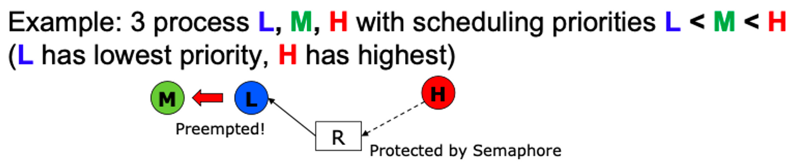

낮은 우선순위를 가진 L이 resource R을 이용중인데 R을 이용하고 싶고 높은 우선순위를 가진 H가 ready queue에 추가되어서 먼저 수행을 하려고 하는데 L이 interrupt발생을 못시키게 하는 semaphore에 접근중이라 H는 L의 수행이 끝날때까지 기다린다. (여기까지는 Priority inversion이 아니다.)
이때 R에 접근을 하고싶어하지 않는 M이 ready queue에 추가되면 R에 관련없는 M은 preemption을 발생시켜 L을 종료시키고 M을 수행한다. M이 preemption을 발생시켜 H가 M까지 기다리게 하는 일을 priority inversion이라고 한다.

데드락(Deadlock)이란 무엇이며 언제 발생할까요?

데드락은 두 개 이상의 프로세스나 스레드가 서로 자원을 얻지 못해서 다음 작업을 하지 못하여 무한히 다음 자원을 기다리는 상태를 말한다.

> 자원의 종류
>
> - Physical resource type: I/O device, memory space, CPU cycle과 같은 resource들
> - Logical resource type: semaphore, mutex lock, file과 같이 물리적으로 존재하지 않지만 여러 process가 같이 사용하는 자원

### 데드락이 발생하는 조건

데드락이 발생하려면 아래의 4가지 조건을 모두 만족해야한다.

1. Mutual Exclusion

   자원에 대해서 한개의 Process만이 점유할 수 있다. 동시에 여러개의 프로세스가 점유할 수 없다.

2. Hold and wait

   최소한 하나의 자원을 점유하고 있으면서 다른 프로세스에 할당되어 사용하고 있는 자원을 추가로 점유하기 위해 대기하는 프로세스가 존재해야 한다

3. No Preemption

   다른 프로세스에 할당된 자원은 사용이 끝날 때까지 강제로 뺐을 수 없다.

4. Circular wait

   사이클이 존재해야한다.

데드락 예방, 회피, 무시에 대해 각각 설명해주세요.

### 데드락 예방 (**Prevention**)

데드락 발생 4가지 조건 중 하나의 조건을 없애서 Deadlock 예방할 수 있다. deadlock prevention은 deadlock의 4가지 발생조건 중 최소한 하나의 조건을 거부하여 예방하지만 실현 불가능한 case들이 존재하고 심각한 resource의 낭비를 만들어 utilization이 낮아진다.

1. **No mutual exclusion**
  - 같은 시간에 자원들을 공유할 수 있도록 한다.
  - Problem: mutual exclusion을 없애면 deadlock을 예방하지만 race condition이 발생한다.

    →  공유 할 수 없는 자원(mutex lock, printer)도 존재하기도 하여서 mutual exclusion을 없애는 것은 사실상 어렵다

2. **No hold and wait**
  - 프로세스가 resource를 요청할 때마다 다른 리소스를 보유하지 않도록 보장한다.
  - **Total allocation**: 필요로 하는 자원들을 모두 이용할 수 있을 때까지 기다렸다가 한번에 allocation받아서 hold and wait을 없애는 방법이다.
  - Problem: 작업이 끝난 resource들도 오랫동안 갖고 있어서 resource utilization이 떨어진다
3. **Allow preemption**
  - Preemption을 허용하는 방법이다. (e.g. RR scheduling)
  - Problem: CPU같은 경우는 preemption을 하는 것이 괜찮지만 semaphore와 같은 자원들은 불가능하다.
4. **No circular wait**
  - **Total ordering**: 자원 타입별로 전체적인 순서를 정하고 order의 수를 높여가며 자원을 요청하여 circular wait을 없애준다. (사이클이 있어도 circular wait이 없어진다.)
  - Problem: 항상 순서에 따라 자원을 요청해야한다.

### 데드락 **회피(Avoidance)**

- 어떠한 요청이 왔을 때 데드락이 절대 일어나지 않는 safe상태로 유지할 수 있으면 요청을 받아주고 unsafe상태로 가게 된다면 그 요청을 거부하며 항상 safe상태로 유지되게 하는 것이 Deadlock avoidance이다.
- instance수가 1개인지 여러 개인지에 따라 **Resource-Allocation Graph Algorithm**과 **Banker’s Algorithm**이 존재한다.

### 데드락 무시(**Ignorance)**

- Ignore the problem and pretend that deadlocks never occur in the system (Ostrich Algorithm)
- 실제 system에서는 deadlock prevention, avoidance를 하면 overhead가 너무 커서 실제로는 사용하지 않는다.
- 실제로는 deadlock ignorance를 하여 개발자들이 deadlock에 빠지지 않도록 코딩을 하게 한다.
- 만약 deadlock에 빠질 경우 deadlock recovery(ex. 재부팅, 프로세스 종료, resource강제로 빼았기)등의 작업을 한다.
  - Deadlock Detection

    자원 할당 그래프를 통해 데드락을 탐지한다.

  - Recovery

    데드락을 일으킨 프로세스를 종료하거나 할당된 자원을 해제시켜 회복하는 방법이다.

    > **프로세스 종료 방법**
    >
    > - 교착 상태의 프로세스를 모두 중지한다
    > - 교착 상태가 제거될 때까지 하나씩 프로세스 중지한다
    >
    > **자원 선점 방법**
    >
    > - 교착 상태의 프로세스가 점유하고 있는 자원을 선점해 다른 프로세스에게 할당한다 (해당 프로세스 일시정지 시킴)
    > - 우선 순위가 낮은 프로세스나 수행 횟수 적은 프로세스 위주로 프로세스 자원 선점한다

## 메모리

메모리 계층 구조를 설명해주세요

메모리 계층구조란, 메모리를 필요에 따라(CPU가 메모리에 더 빨리 접근하기 위함) 여러 가지 종류로 나누어 둠을 의미한다.

메모리 계층 구조를 바탕으로 컴퓨터의 설계에 있어 상황에 맞게 여러 저장 장치를 각각의 역할이나 특징을 기반으로 사용할 수 있도록 하여 최적의 효율을 낼 수 있도록 한다.

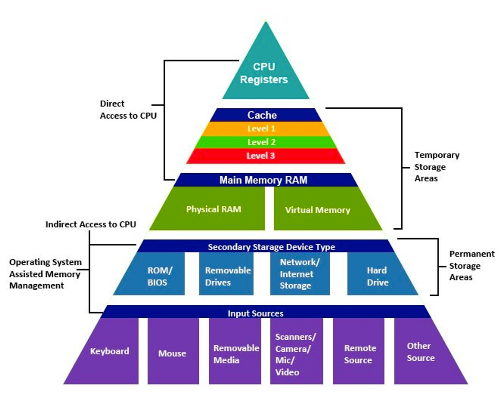

**레지스터(Register)**

- CPU가 요청을 처리하는데 필요한 데이터를 일시적으로 저장하는 기억장치이다.
- CPU 안에 존재한다.

**캐시(Cache)**

- 캐시는 지역성의 원리를 이용하여 얻고자 하는 데이터를 필요한 순간마다 데이터가 저장되어 있는 저장소에서 가져오는 일에 대한 시간을 줄일 때 사용되는 임시 저장소이다.
- 데이터나 값을 미리 복사해둔 임시 저장소로 속도가 빠른 장치와 느린 장치 사이에서 속도차에 따른 병목 현상을 완화하기 위한 범용 메모리이다.
- 메인 메모리의 접근을 빠르게 하기 위한 CPU 캐시, 하드 디스크에 내장된 디스크 캐시(==디스크 버퍼), 페이지 캐시(TLB) 등이 존재한다.

**메인 메모리(Main Memory)**

- 1차 기억장치(주 기억장치)로 실행중인 프로그램들이 올라가는 메모리 공간이다.
- 휘발성 장치인 RAM과 고정 기억 장치인 ROM이 존재한다.

**하드 디스크 드라이브(HDD)**

- 비휘발성으로 순차접근이 가능한 컴퓨터의 보조 기억 장치이다.

### 메모리 계층 구조의 목적

- 전체 기억 장치를 구성하는데 있어 가격은 최소화하면서 빠른 접근 속도와 대용량의 크기를 제공하는 **입출력의 경제성을 확보**를 목적으로 두고 있다.
- 큰 메모리를 사용해도 모든 데이터를 계속 이용하는 것이 아닌 자주 자주 쓰는 데이터는 빈번하게 사용되며, 잘 사용되지 않는 데이터는 자주 쓰이지 않는다. (지역성) 이러한 이유때문에 자주 쓰이는 데이터들을 메모리에서 캐시로 올린다.
- 메모리는 상위 계층에 갈 수록 비싸다. 그렇기에 계층적으로 구성하며 효율적인 구동을 위해 필요한 데이터들만 상위 계층으로 올린다.

### 📚 Reference
- [메모리 계층구조](https://velog.io/@steadygo247/메모리-계층구조)

가상 주소는 왜 사용할까요?

메모리의 공간이 한정적이기 때문에, 사용자에게 더 많은 메모리를 제공하기 위해 '가상 주소'라는 개념이 등장하였다. (가상 주소는 프로그램 상에서 사용자가 보는 주소 공간이라고 보면 된다) 각각의 process들은 실제 physical memory address를 이용하는 대신 앞서 말한 가상주소인 logical address를 이용한다.

주소 바인딩(Address Binding)의 3가지 방법은 무엇이 있으며 각각의 특징에 대해 설명해주세요.

> 주소 바인딩이란?
>
> - CPU가 기계어 명령을 수행하기 위해 논리적 주소를 통해 메모리 참조를 하게 되면 논리적 주소가 물리적 메모리와 매팽된다. 이렇게 논리적→물리적 주소로 연결시켜주는 것을 address binding이라고 한다.

### Compile time binding

- 컴파일하는 시점에 해당 프로그램이 물리적 메모리의 위치가 결정된다.
- 프로그램이 절대 주소로 적재시키는 절대코드(absolute code)를 생성한다.
- 프로그램이 올라가있는 물리적 메모리 위치(주소)를 변경하고 싶다면 다시 컴파일이 필요하다.

  → 이러한 이유 때문에 시분할 컴퓨팅 환경에서는 잘 사용하지 않는다.

### load time binding

- 프로그램 실행이 시작될 때 물리적 메모리 주소가 결정된다.
- 프로그램을 메모리에 적재시키는 프로그램인 로더(loader)의 책임하에 물리적 메모리 주소가 부여되며 프로그램이 종료될 때까지 물리적 메모리상의 위치가 고정된다.
- 컴파일러가 재배치 가능 코드(relocatable code)를 생성한 경우에 가능한 방식이다.
- 물리적 메모리 위치(주소)를 변경하고 싶다면 reload를 해야한다. (recompile보다는 소모가 적다.)

### execution time binding / run time binding

- 프로그램이 시작한 후에도 프로그램이 위치한 물리적 메모리상의 주소가 변경될 수 있다.
- CPU가 주소를 참조할 때마다 해당 데이터가 물리적 메모리의 어느 위치에 존재하는지, 주소 매핑 테이블(address mapping table)을 이용해 바인딩을 점검해야 한다.
- 실시간 바인딩이 가능하기 위해 **기준 레지스터(base register)** 와 **한계 레지스터(limit register)** 를 포함해 **MMU(Memory Management Unit)** 이라는 하드웨어적인 지원이 필요하다.
- 대부분의 OS가 이 방법을 사용한다.
- 물리적 메모리 위치(주소)를 변경하고 싶다면 recompile, reload를 할 필요가 없이 relocation register의 값만 바꿔주면 된다.

MMU란 무엇일까요?

- MMU(Memory Management Unit)는 **논리적 주소를 물리적 주소로 매핑해주는 하드웨어 장치**이다.
- CPU가 특정 프로세스의 논리적 주소를 참조하려고 할 때 MMU 기법은 해당 주소값에 기준 레지스터의 값을 더해 물리적 주소값을 얻어낸다.
  - 이때 프로세스의 물리적 메모리 시작 주소인 기준 레지스터를 **재배치 레지스터(relocation register)** 라고 부른다.

  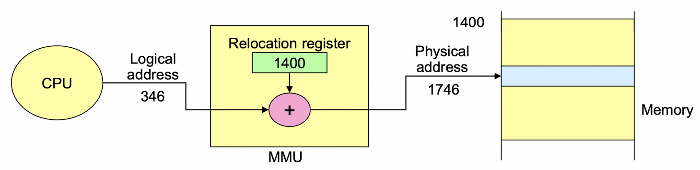

- process마다 각각 다른 값의 relocation(=base) register, limit register를  갖고 있으며 이를 통해 logical address space를 정의한다.(값은 PCB에 저장)
  - Context switching으로 CPU에서 수행 중인 프로세스가 바뀔 때마다 relocation register의 값을 해당 프로세스에 해당하는 값으로 재설정함으로써 프로세스별로 address binding을 올바르게 할 수 있게 된다.
- MMU는 권한이 없는 다른 프로세스의 물리적 주소 공간으로의 침범을 막기 위해 **한계 레지스터(limit register)** 를 이용하여 **메모리 보안**을 한다.
  - 논리적 주소값이 limit register에 저장된 프로세스의 크기보다 작은지 확인하고, 만약 작다면 relocation register를 더해 물리적 주소를 찾아내고 만약 크다면 트랩(trap)을 발생시켜 프로세스를 강제 종료시킨다.

> MMU가 하는일은??
>
> 1. 논리적 주소를 물리적 주소로 매핑!
> 2. 메모리 보호!!

캐시란 무엇일까요?

주기억장치에 저장된 내용의 일부를 임시로 저장해두는 기억장치로 CPU와 주기억장치의 속도 차이로 성능 저하를 방지해준다.

> 캐시는 플리플롭 소자로 구성되어 SRAM으로 되어있어서 DRAM보다 빠른 장점을 지니고 있다.
>

CPU에서 메인 메모리에 접근하기 이전에 먼저 캐시 기억장치를 확인하게 된다. 데이터가 존재하면 Cache Hit이 발생하여 바로 해당 명령어를 사용하고 데이터가 없다면 Cache miss가 발생하여 Main memory로 접근하게 된다.

이와 같이 Main Memory로 접근하기 이전에 Cache를 접근하기에 잘만 활용하면 메모리 접근 비용을 아낄 수 있다.

Cache hit을 극대화 시키기 위헤서는 지역성의 원리를 이용한다.

지역성(Locality)이란 무엇일까요?

기억 장치 내의 정보를 균일하게 액세스 하는 것이 아니라 한 순간에 특정부분을 집중적으로 참조하는 특성을 의미한다.

- **시간 지역성** : 최근에 참조된 주소의 내용은 곧 다음에도 참조되는 특성
- **공간 지역성** : 실제 프로그램이 참조된 주소와 인접한 주소의 내용이 다시 참조되는 특성

동적 로딩과 동적 연결에 대해 각각 설명해주세요

### 동적 로딩(dynamic loading)

- 동적 로딩은 여러 프로그램이 동시에 메모리에 올라가서 수행되는 다중 프로그래밍 환경에서 메모리 사용의 효율성을 높이기 위해 사용하는 기법 중 하나이다.
- 프로세스가 시작될 때 프로세스의 주소 공간 전체를 메모리에 다 올리는 것이 아닌 실행에 필요한 부분이 실제로 불릴 때마다 해당 부분만을 메모리에 적재하는 방식으로 동작한다.
- 기존 방식에 비하여 더 많은 프로그램을 메모리에 적재할 수 있어 효율성이 향상된다.
- 운영체제의 특별한 지원 없이 프로그램 자체에서 구현이 가능하며 운영체제가 라이브러리를 통해 지원할 수도 있다.

### 동적 연결(dynamic linking)

> Linking은 프로그래머가 작성한 소스코드를 컴파일하여 생성된 object 파일과 이미 컴파일된 library file들을 묶어 하나의 실행파일을 생성하는 과정을 말한다.
>
- 컴파일을 통해 생성된 object 파일과 라이브러리 파일 사이의 연결을 프로그램의 실행 시점까지 지연시키는 기법이다.
- 기존의 방식(정적 연결, static linking)에는 동일한 라이브러리를 각 프로세스별로 메모리에 적재하느라 물리적 메모리의 낭비가 발생하였다. 하지만 동적 연결은 라이브러리가 실행시점에 연결되어 실행코드가 포함되지 않으며 다수의 프로그램이 사용하는 라이브러리를 메모리에 한번만 적재하여 메모리 효율성을 높일 수 있다.
- 동적 연결을 가능하기 위해 실행파일의 라이브러리 호출 부분에 해당 라이브러리의 위치를 찾기 위한 스텁(stub)이라는 작은 코드를 둔다. 라이브러리 호출 시 스텁을 통해 해당 라이브러리가 메모리에 이미 존재하는지 살펴보고 그럴 경우 해당 주소의 메모리 위치에서 직접 참조하며, 그렇지 않을 경우 디스크에서 동적 라이브러리 파일을 찾아 메모리로 적재한 후 수행하게 된다.
- 동적 연결 기법은 운영체제의 지원을 필요로 한다.

스와핑(Swapping)에 대해 설명해주세요

- 스와핑이란 메모리에 올라온 프로세스의 주소 공간 전체를 디스크의 스왑 영역(Swap area)에 일시적으로 내려놓는 것을 말한다.
  - 스왑 영역을 백킹 스토어(backing store)라고도 부르며 디스크 내에 파일 시스템과는 별도로 존재하는 일정 영역이다.
    - 스왑 영역은 프로세스가 수행중인 동안에만 일시적으로 저장하는 공간인 저장 기간이 짧은 공간이다.
- 프로세스가 종료되어 주소 공간을 디스크로 내쫓는 것이 아니라 특정한 이유로 수행 중인 프로세스의 주소 공간을 일시적으로 메모리에서 디스크로 내려놓는 것이다.
- 발생하는 과정
  1. 스와퍼(swapper)라고 불리는 중기 스케줄러에 의해 스왑아웃 프로세스를 선정
  2. 스왑 아웃 대상으로 선정된 프로세스에 대해서는 메모리에 올라가 있는 주소 공간의 내용을 통째로 디스크 스왑 영역에 스왑아웃
- 스와핑은 메모리에 존재하는 프로세스의 수를 조절하며 다중 프로그래밍 정도를 조절한다.

> compile time binding과 load time binding 방식에서는 스왑 아웃된 프로세스가 다시 스왑 인 될 때에는 원래 존재하던 메모리 위치로 다시 올라가야한다. 하지만 run time binding의 경우 빈 메모리 영역 아무 곳에나 프로세스를 올릴 수 있다.

메모리의 연속 할당과 불연속 할당에 대해 설명해주세요

사용자 프로세스 영역의 관리 방법은 프로세스를 메모리에 올리는 방식에 따라 연속할당(contiguous allocation)과 불연속할당(noncontiguous allocation) 방식으로 나누어볼 수 있다.

### 연속할당(Contiguous Memory Allocation)

- 각각의 프로세스를 물리적 메모리의 연속 공간에 올리는 방식
- 물리적 메모리를 다수의 분할로 나누어 하나의 분할에 하나의 프로세스가 적재되도록 한다.
- 물리적 메모리를 분할하는 방식에 따라 고정 분할과 가변 분할 방식으로 나뉜다.
  - **고정 분할(fixed partition allocation)**
    - 물리적 메모리를 고정된 크기의 분할로 미리 나누어두고 **각 분할에 하나의 프로세스**를 실행시키는 방식이다.
    - 분할의 크기는 모두 동일하게 할 수도 있고 서로 다르게 할 수도 있다.
    - 하나의 분할에 하나의 프로그램만 적재할 수 있어 메모리에 올릴 수 있는 프로그램 수가 제한된다
    - **내부 단편화(internal fragmentation)**가 발생할 수 있다.
  - **가변 분할(variable partition allocation)**
    - 미리 나누어두지 않고 프로그램이 실행되고 종료되는 순서에 따라 분할을 관리하는 방식이다.
    - 메모리에 적재되는 프로그램의 크기에 따라 분할의 크기, 개수가 동적으로 변한다.
    - **외부 단편화(external fragmentation)**가 발생한다.
    - 프로세스를 메모리에 올릴 때 물리적 메모리 내 가용공간 중 어떤 위치에 결정하는 문제인 **동적 메모리 할당 문제(dynamic storage-allocation problem)**이 주요하게 다루는 쟁점 중 하나이다.
      - 최초 적합(first-fit) - 스캔을 하며 프로그램을 적재할 수 있는 최초의 가용 공간에 적재
      - 최적 적합(best-fit) - 모든 공간을 스캔하고 최적의 공간에 적재한다.(시간적 오버헤드가 발생하지만 공간 측면에서는 효율적이다)
      - 최악 적합(worst-fit) - 가용 공간중에 가장 크기가 큰 곳에 새로운 프로그램을 할당
    - 외부 조각을 해결하기 위해 사용중인 메모리 영역을 한 곳으로 몰아두는 **컴팩션(compaction)**을 수행한다.

      > Compaction이란?
      >
      > - process의 memory공간을 옮겨서 하나의 큰 공간을 만들어주는 방법이다.
          >
          >     → compile/load time binding에서는 recompile, reload를 하여야 해서 비효율적이다.
          >
          >     → Execution time binding을 할때만 compaction이 적합하다.
>
- 장점
  - 단순한 연산을 통해 할 수 있어서 빠르고 편하다.
  - 연산을 하는데 하드웨어로 limit register와 relocation register만 필요하다.
- 단점
  - 연속적으로 할당을 하다보니까 프로세스가 더 많은 공간을 할당 받기 위해서는 process의 위치를 옮기는 등 옮기기가 어렵다.
  - 자신만의 virtual address를 physical address로 할당받아서 사용하기에 메모리를 공유하기 어렵다. (프로세스는 base~limit 사이의 주소만 접근 가능하여 shared memory로 접근할 방법이 없다.)
  - **external fragmentation**이 발생한다.

### 불연속 할당

- 하나의 프로세스를 물리적 메모리의 여러 영역에 분산해 적재하는 방식이다.
- 현대의 대부분의 OS에서 사용하는 방법이다.
- 프로그램을 동일한 크기로 나누어 메모리에 올리는 **페이징(paging)** 기법과 크기는 일정하지 않지만 의미 단위로 나누어 메모리에 올리는 **세그먼테이션(segmentation)** 기법, 세그먼테이션을 기본으로 하되 이를 다시 동일 크기의 페이지로 나누어 메모리에 올리는 **페이지드 세그먼테이션(paged segmentation)** 기법 등이 있다.

> 각각의 내용은 아래의 질문 답변에서 이어서 설명하겠습니다.

페이징(Paging)에 대해 설명해주세요

- 프로세스의 주소 공간을 동일한 크기의 페이지 단위로 나누어 물리적 메모리의 서로 다른 위치에 페이지들을 저장하는 방식이다. (Noncontiguous allocation방법)
- 프로세스의 주소 공간 전체를 올릴 필요 없이 일부는 백킹 스토어(backing store)에 일부는 물리적 메모리에 혼재시키는 것이 가능하다.
- 물리적 메모리는 고정된 사이즈의 physical frame으로 논리적 메모리는 고정된 사이즈의 virtual page로 나뉘게 된다. (frame size와 page size는 동일)
  - 동일한 크기의 프레임을 가져 가변 분할의 동적 메모리 할당 문제가 발생하지 않는다.
- **외부 단편화(External Fragmentation)는 발생하지 않지만 내부 단편화(Internal Fragmentation)가 발생한다.**
- 논리적 주소를 물리적 주소로 변환을 하기 위해 페이지 테이블(page table)을 가진다.
  - 논리적 주소를 페이지 번호(p)와 페이지 오프셋(d)로 나누어 주소 변환(address allocation)에 사용한다. 페이지 번호는 페이지 테이블의 접근 Index로 사용하고 해당 인덱스의 항목(entry)에는 그 페이지의 물리적 메모리상의 기준 주소(base address)가 저장된다.

    → p를 통해 base address를 알 수 있으며, base address에 offset을 더해 물리적 주소를 찾을 수 있다.

  - 페이지 테이블이 MMU 역할을 한다.
- 페이지 테이블 접근
  - 현재 CPU에서 실행중인 프로세스의 페이지 테이블에 접근하기 위해 운영체제는 **페이지 테이블 기준 레지스터(PTBR, page-table base register)**와 **페이지 테이블 길이 레지스터(PTLR, page-table length register)**를 사용한다.
    - 기준 레지스터는 메모리 내에서의 페이지 테이블의 시작 위치를 가르키고 길이 레지스터는 페이지 테이블의 크기를 보관한다.
  - 페이징 기법에서 메모리 접근 연산은 주소 변환을 위한 페이지 테이블 접근, 변환된 주소를 통한 실제 데이터 접근으로 2번의 메모리 접근이 필요하다. 이러한 페이지 테이블 접근 오버헤드를 줄이고 메모리 접근 속도를 향상시키기 위해 주소 변환용 하드웨어 캐시인 **TLB(Translation Look-aside Buffer)** 를 사용한다.
    - TLB는 비싸기에 페이지의 모든 정보가 아닌 빈번하게 참조되는 페이지에 대한 주소 변환 정보만 담는다.
    - 프로세스별로 주소 변환 정보가 달라 context switching이 발생하면 이전 프로세스의 주소 변환 정보를 담고 있는 TLB내용은 지워야 한다.
  - 프로세스의 주소 공간이 커질 수록 페이지 테이블의 크기도 커지므로 주소 변환을 위한 메모리 공간 낭비가 심해져 2단계, 3,4단계에 이르는 다단계 페이지 테이블이 필요하게 된다. 다단계 페이지 테이블은 메모리의 공간 소모는 줄일 수 있지만 메모리의 접근 횟수가 많아지게 되는 문제가 발생한다. 이러한 접근 문제는 TLB를 사용하면 메모리 접근 시간에 대한 시간적 효율성도 얻을 수 있다. → 다단계 페이지는 공간적인 이득, TLB는 접근에 대한 이득
- 여러 프로세스에 의해 공유되는 페이지(shared page)를 물리적 메모리에 하나만 적재하여 메모리를 좀 더 효율적으로 사용할 수 있다.
  - 공유 페이지는 읽기 전용 성질을 가져야 할 뿐 아니라 모든 프로세스의 논리적 주소공간에서 동일한 위치에 존재해야한다는 제약점이 있다.
- **보호비트(protection bit)** 를 통해 프로세스 내에서 읽기-쓰기/읽기전용 등의 접근 권한을 설정할 수 있다.
- **유효-무효 비트(valid-invalid bit)** 를 통해 해당 페이지가 메모리에 존재하는지 존재하지 않는지에 대한 정보를 나타낸다.

### Paging이 필요한 이유(장점)

1. Privide transparency

   Programmer들은 logical address를 보고 있고 physical address를 볼 수 없어서 page들이 contiguous하게 보인다.

2. No External fragmentation
  - Noncontiguous memory allocation을 사용하여 external fragmentation이 없으나 정해진 사이즈의 page내의 빈 공간이 발생하여 internal fragmentation이 발생할 수 있다.
  - Page size를 줄이면 internal fragmentation이 줄어드나 page수가 증가하여 page table의 크기가 증가하고 그에 따라 page탐색 시간도 증가, disk transfer이 증가하는 문제가 발생한다. (일반적으로는 4kB로 사용)
  - Page size와 internal fragmentation, page table size, disk I/O efficiency는 tradeoff한 관계이다.
3. Provice protection to memory
  - 개발자들이 페이지 외부의 공간을 접근할 수 없어서 메모리의 보호가 된다.
4. provice shared memory
  - shared page를 통해 code와 같은 데이터의 공유가 가능하다.

TLB에 대해 설명해주세요

페이징 기법에서 메모리 접근 연산은 주소 변환을 위한 페이지 테이블 접근, 변환된 주소를 통한 실제 데이터 접근으로 2번의 메모리 접근이 필요하다. 이러한 페이지 테이블 접근 오버헤드를 줄이고 메모리 접근 속도를 향상시키기 위해 주소 변환용 하드웨어 캐시인 **TLB(Translation Look-aside Buffer)**를 사용한다.

- TLB는 비싸기에 페이지의 모든 정보가 아닌 빈번하게 참조되는 페이지에 대한 주소 변환 정보만 담는다.
- 프로세스별로 주소 변환 정보가 달라 context switching이 발생하면 이전 프로세스의 주소 변환 정보를 담고 있는 TLB내용은 지워야 한다.

세그먼테이션(Segmentation)에 대해 설명해주세요

- 페이징은 프로세스를 물리적을 일정한 크기로 나눠서 메모리에 할당하였다면 세그먼테이션은 프로세스의 주소 공간을 코드,데이터,스택과 같은 **논리 단위 또는 기능 단위로 나누어 저장하는 방식**이다.
- 페이징과 다르게 세그먼테이션은 프로세스를 논리적인 단위로 나눈 것이기에 크기가 균일하지 않다.
- 논리적 주소가 `<세그먼트 번호, 오프셋>`으로 나누어 사용되며 주소 변환을 위해서는 **세그먼트 테이블**을 이용한다. (페이징과 유사)
  - 페이징과 다르게 세그먼트별로 크기가 달라 세그먼트 테이블의 각 항목은 기준점(base)와 한계점(limit)을 가지고 있다.
  - 페이지 테이블의 PTLR, PTBR와 같이 세그먼테이션은 STBR, STLR 레지스터를 사용한다.
    - STBR - CPU에서 실행중인 프로세스의 세그먼트 테이블이 위치한 메모리 주소의 시작 위치를 나타낸다.
    - STLR - 세그먼트의 개수
- 페이징과 동일하게 보호비트와 유효비트를 갖고 있으며 공유 세그먼트를 사용할 수 있다.
- 세그먼트는 의미있는 단위로 나눈다는 점에서 공유와 보안 측면에서 훨씬 효과적이다.
  - 페이징은 동일한 크기로 주소 공간을 나누다보면 공유 코드와 사유 데이터 영역이 동일 페이지에 공존하는 코드가 발생하기도 한다. 이런점에서 세그먼테이션이 이점을 갖는다.
- **내부 단편화(Internal Fragmentation)는 발생하지 않지만 외부 단편화(External Fragmentation)가 발생한다.** (페이징과 반대)
- 메모리 연속 할당의 동적 **메모리 할당 문제(dynamic storage-allocation problem)가 발생**한다.

페이지드 세그먼테이션(Paged Segmentation)이란 무엇일까요?

> 꼭 알아야 하는 이론은 아닙니다.

- 페이징과 시그먼테이션의 장점만을 취하는 주소 변환 기법이다.
- 세그먼테이션과 마찬가지로 프로그램을 의미 단위의 세그먼트로 나눈다. 하지만 세그먼트가 임의의 길이를 갖는 것이 아닌 동일한 크기의 페이지들의 집합으로 구성된다.

  > 하나의 세그먼트 크기를 페이지 크기의 배수가 되도록 함으로써 세그먼테이션 기법에서 발생하는 외부조각의 문제점을 해결하며 동시에 세그먼트 단위로 프로세스 간의 공유나 프로세스 내의 접근 권한 보호가 이루어지도록 함으로써 페이징 기법의 약점을 해소한다.
>
- 주소 변환을 위해 외부의 세그먼트 테이블과 내부의 페이지 테이블을 이용한다.(2개 이용)

페이징과 세그먼테이션의 차이점에 대해 설명해주세요

- 보호와 공유 측면에서는 페이징보다 세그먼테이션이 더 효율적이다.
  - 페이징은 영역이 섞일 가능성이 존재하지만 세그멘테이션은 정확히 영역을 나눠서 더 효율적으로 공유할 수 있다.
- 세그먼테이션은 read, write, execute 권한을 논리적으로 나누서 테이블에 해당 정보를 추가하는데 내용을 논리적으로 나누기에 비트를 설정하기 간단하고 안전하다. 반면에 페이징은 code+data+stack 영역이 존재할 때 이를 일정한 크기로 나누기 때문에 영역이 섞여 비트를 설정하기 까다로워질 수 있다.
- 세그먼테이션은 세그먼트의 크기가 일정하지 않고 다양하여 Exteral Fragmentation(외부 단편화)이 발생할 수 있다. 하지만 반대로 페이징은 페이지 안에서 Internal Fragmentation(내부 단편화)가 발생할 수 있다.
- 세그먼트는 크기가 일정하지 않아 메모리 연속 할당의 동적 메모리 할당 문제(dynamic storage-allocation problem)가 발생한다. 이러한 이유때문에 페이징 기법을 더 많이 사용하고 있다.

가상 메모리란 무엇일까요?

- 현대 컴퓨터 환경에서 가장 널리 사용되는 메모리 관리 기법이다.
- 물리적 메모리보다 더 큰 프로그램이 실행되는 것을 지원하기 위해 사용한다.
- 물리적 메모리와는 독립적으로 0번지부터 시작하는 자신만의 가상메모리 주소를 갖고 운영체제는 가상메모리의 주소를 물리적 메모리주소로 매핑하는 기술을 이용해 주소를 변환시킨 후 프로그램을 물리적 메모리에 올린다. 덕분에 물리적 메모리 크기와 상관없이 사용할 수 있는 메모리가 충분히 크다고 가정하고 개발할 수 있다.
- 프로그램이 돌아갈 때는 전체 프로그램을 메모리에 올리는 것이 아닌 현재 사용되고있는 필요한 부분만 메모리에 올리고 나머지는 하드디스크와 같은 보조 기억장치(swap area)에 저장해두었다가 필요할 때 적재한다. → **Demand Paging** or **Demand Segmentation**

외부 단편화(External Fragmentation)와 내부 단편화(Internal Fragmentation)에 대해 설명해주세요

**External fragmentation이란?**

- Hole들이 조각나 있어서 빈 공간이 있음에도 불구하고 새로운 Process가 들어갈 수 있는 공간이 없게 되는 현상을 말한다.
- Segmentation과 Contiguous Memory Allocation의 가변 분할 등에서 발생한다.

**Internal fragmentation이란?**

- Page와 같이 정해진 크기로 나누어진 공간에 데이터를 넣다보면 마지막 페이지의 경우 남은 공간이 발생할 수 있다. 이러한 공간을 Internal Fragmentation이라고 한다.
- Page와 Contiguous Memory Allocation의 고정 분할 등에서 발생한다.

Demand Paging에 대해 설명해주세요

- 프로그램 실행 시 프로세스를 구성하는 모든 페이지를 한꺼번에 메모리에 올리는 것이 아닌 당장 사용될 페이지만 올리는 방식을 말한다.
  - 메인 메모리에 올리지 않는 데이터들은 Swap space에 올라가게 된다.
- 당장 실행에 필요한 페이지만을 메모리에 적재하여 메모리 사용량이 감소하고 프로레스 전체를 메모리에 올리는데 소요되는 입출력 오버헤드를 줄일 수 있다.
  - 응답시간 단축
  - 시스템이 더 많은 프로세스를 수용할 수 있다.
  - 물리적 메모리 크기의 제약을 벗어난다.
- Demand paging은 Error code, unusual routines, large data structure 등을 main memory에 올리는 것은 낭비라 필요한 일부만 올린다.
- 특정 프로세스를 구성하는 페이지 중에서 어떤 프로세스가 메모리에 올라와있는지 파악하기 위해 demand paging에서는 페이지 테이블에 **유효-무효 비트(valid-invalid bit)**를 저장한다.
- 필요한 페이지가 메모리에 올라와있지 않은 경우(invalid bit으로 되어있는 경우)를 **페이지 부재(page fault)**라고 한다.
- 성능은 페이지 부재의 발생 빈도에 따라 결정된다.
- 페이지를 적재시킬 때, 메모리에 빈 공간이 없으면 기존의 메모리에 올라와있는 페이지를 swap out 시켜야 한다. 해당 페이지를 결정하는 알고리즘은 **페이지 교체 알고리즘(page replacement algorithm)**이라고 한다.

페이지 교체(Page fault 처리)의 전반적인 순서에 대해 설명해주세요

- CPU가 메모리에 존재하지 않는 invalid 페이지에 접근하면 주소 변환을 담당하는 MMU가 페이지 부재 트랩(page fault trap)을 발생시킨다. 그러면 CPU 제어권이 커널 모드로 전환되고 page fault handler가 호출되어 페이지 부재를 처리한다.
  - 부재 페이지를 메모리에 적재하기 앞서 운영체제는 해당 페이지에 대한 접근이 적법한지 먼저 체크한다. 사용되지 않는 주소영역에 속한 페이지에 접근하려했거나 해당 페이지에 대한 접근 권한 위반(protect violoation)을 했을 경우에는 해당 프로세스를 종료시킨다.
  - 접근이 적법하다면 물리적 메모리에 비어있는 프레임을 할당받아 페이지를 읽어온다. 만약 비어 있는 프레임이 없다면 페이지 교체 알고리즘에 따라 기존에 메모리에 올라와 있는 페이지 중 하나(Victim frame)를 디스크로 쫓아낸다.(swap out)

  > 페이지 부재가 발생시킨 프로세스는 페이지를 swap in 시키는 중에는 CPU 자원을 뺏기고 Block 상태에 빠지게 된다. swap in이 완료되어 인터럽트가 발생하면 페이지 테이블의 해당 페이지의 valid-invalid bit을 유효 상태로 변경하고 프로세스를 ready 상태로 이동시킨다.

페이지 교체 알고리즘은 어떤 것이 있을까요?

### 최적 알고리즘(Belady’s optimal algorithm)

- 가장 먼 미래에 참조되는 페이지를 내쫓는 알고리즘이다.
- 미래에 어떤 페이지가 어떤 순서로 참조될지 미리 알고 있다는 전제하에 알고리즘이 생성되어 실제 시스템에서 온라인으로 사용할 수 있는 알고리즘은 아니다. 그래서 오프라인 알고리즘이라 부른다.
  - 알고리즘 설계를 하였을때, 새로운 알고리즘의 성능을 파악하기 위한 비교 알고리즘으로 사용한다.

### 선입선출(First In First Out: FIFO)

- 물리적 메모리에 가장 먼저 올라온 페이지를 우선적으로 내쫓는다.
- 향후 참조 가능성을 고려하지 않고 내쫓을 대상을 결정하기에 비효율적인 상황이 발생할 수 있다.
  - 메모리를 증가시켰음에도 불구하고 페이지 부재가 오히려 늘어나는 상황이 발생하곤 하는데 이러한 현상을 **Belady’s anomaly**이라고 부른다.

  > **Belady’s anomaly란?**
  >
  >
  > 일반적으로 할당된 frame이 많아질 수록 메모리에 올라간 페이지가 많아 Page fault가 줄어든다. 하지만 FIFO의 경우 old page가 자주 이용되는 page인 상황이 발생할 수 있어서 프레임이 많아져도 Page fault가 더 많이 발생하는 belady’s 현상이 발생할 수 있다.
  

### LRU (Least Recently Used)

- 시간지역성(temporal locality)를 활용하여 페이지 교체 시 가장 오래전에 참조가 이루어진 페이지를 쫓아낸다.

  > 시간지역성(temporal locality) - 최근에 참조된 페이지가 가낭 가까운 미래에 다시 참조될 가능성이 높다.
>
- Counter를 사용하여 사용된 이후의 지난 시간을 측정한다.
  - Stack을 이용하기도 한다. 가장 사용하는 것을 맨 위로 올리고 가장 아래 있는 것을 replacement시키는 방식으로 동작하게 된다.

  > Counter란?
  >
  > - 모든 page entry마다 갖고 counter를 갖고 있으며 page가 참조될 때마다 counter를 업데이트한다.
  > - Page가 추가로 필요할 때는 counter값이 가장 작은 것을 victim page로 선정한다

### LFU (Least Frequently Used)

- 물리적 메모리 내에 존재하는 페이지 중에서 과거 참조 횟수(reference count)가 가장 적었던 페이지를 쫓아내고 그 자리에 새로 참조될 페이지를 적재한다.
  - 최저 참조 횟수를 가진 페이지가 여러개인 경우에는 임의로 하나를 선정한다.
- 페이지 참조 횟수를 계산하는 방식에 따라 Incache-LFU와 Perfect-LFU로 나뉜다.
  - **Incache-LFU**
    - 페이지가 물리적 메모리에 올라온 후부터의 참조 횟수를 카운트한다.
    - 메모리에서 쫓겨났다가 다시 들어온 경우 참조 횟수가 1로 다시 시작한다.
  - **Perfect-LFU**
    - 메모리에 올라와있는지의 여부와 상관없이 과거 총 참조 횟수를 카운트한다.
    - 페이지 참조 횟수를 정확히 반영할 수 있다는 장점이 있지만, 메머리에서 쫓겨난 페이지의 참조 기록까지 모두 보관하고있어야하는 오버헤드가 상대적으로 더 크다.
- LFU는 LRU보다 오랜 시간 동안의 참조 기록을 반영할 수 있다는 장점이 있다. 하지만 시간에 따른 페이지 참조의 변화를 반영하지 못하고 LRU보다 구현이 복잡하다.

> LRU, LFU는 참조 시각 및 참조 횟수를 소프트웨어로 유지하고 비교해야하여 알고리즘 운영에 들어가는 시간적 오버헤드가 발생한다.
>

### 클럭 알고리즘 (Clock algorithm)

- 하드웨어적인 지원을 통해 LRU, LFU에서 발생하는 시간적 오버헤드를 줄인 방식이다.
- LRU를 근사(approximation)시킨 알고리즘으로 NUR(Not Used Recently)또는 NRU(Not Recently Used) 알고리즘으로 불린다.
  - 하드웨어의 지원을 받아 오랫동안 참조되지 않은 페이지 중 하나를 교체한다.
- 하드웨어의 지원으로 동작하기때문에 LRU에 비해 페이지 관리가 훨씬 빠르고 효율적이라 대부분의 시스템에서 클럭 알고리즘을 사용한다.
- 동작: 교체할 페이지를 선정하기 위해 페이지 프레임들의 **참조비트(refernece bit)**를 순차적으로 조사하며 클럭 하드웨어의 시계바늘이 돌아갈 때, 0인 페이지를 교체하게 된다.
  - 참조비트는 페이지가 참조될 때 하드웨어에 의해 1로 자동 세팅되고, 클럭 알고리즘의 시계바늘이 지나갈때 0으로 변경한다.

  > 시계바늘이 한 바퀴 도는 동안 다시 참조되지 않은 페이지를 교체하는 방식이다.
>
- 시계바늘이 한 바퀴를 도는데 소요되는 시간만큼 페이지를 메모리에 유지시켜둠으로써 페이지 부재율을 줄이도록 설계되었기에 2차 기회 알고리즘(second chance algorithm)이라고도 부른다.

페이지의 전역 교체와 지역 교체에 대해 설명해주세요

교체할 페이지를 선정할 때, 교체 대상이 될 프레임의 범위를 어떻게 할지에 따라 전역 교체(global replacement)와 지역 교체(local replacement)로 구분할 수 있다.

- 전역 교체
  - 모든 페이지 프레임이 교체 대상이 될 수 있는 방법
  - 프로세스마다 메모리를 할당하는 것이 아닌 전체 메모리를 각각의 프로세스가 공유해서 사용하고 교체 알고리즘에 의하여 할당되는 메모리의 양이 가변적으로 변한다.
- 지역 교체
  - 현재 수행 중인 프로세스에게 할당된 프레임 내에서만 교체 대상을 선정할 수 있는 방법
  - 프로세스마다 페이지 프레임을 미리 할당하는 것을 전제로 한다.

스레싱(Thrashing)이란 무엇일까요?

프로세스가 원활하게 수행되기 위해서는 일정 수준 이상의 페이지 프레임을 할당받아야 한다. 하지만 프로세스가 최소한의 프레임을 할당받지 못할 경우 집중적으로 참조되는 페이지들의 집합을 메모리에 한꺼번에 적재하지 못하게 되어 페이지 부재율(page fault rate)이 크게 상승하게 된다. 그 결과 CPU 이용률(CPU Utilization)이 급격히 떨어지게 되는데 이를 스레싱(thrashing)이라고 한다.

CPU Utilization이 낮으면 운영체제는 메모리에 올라와 있는 프로세스 수가 적기때문이라 판단하고 ready queue에 프로세스가 적다 판단하고 CPU 이용률을 높이기 위해 메모리에 올라가는 프로세스의 수를 늘리게 된다.

→ 운영체제는 CPU이용률이 낮을 경우 다중 프로그래밍 정도인 MPD(Multi-Programming Degree)를 높이기 위해 메모리에 프로세스를 추가로 올린다.

→ 메모리에 올라가있는 프로세스가 많아져 각각 할당받는 페이지 프레임 양이 줄어들어 페이지 부재가 더욱 빈번하게 발생한다.

→ 페이지 부재로 인한 페이지를 읽어오기 위한 I/O작업을 하며 많은 프로세스들이 다시 block 상태로 가고, 이 때문에 운영체제는 다시 CPU이용률을 높이기 위해 프로세스를 더 올린다.

이러한 과정의 반복으로 프로세스들은 서로의 페이지를 교체하며 swap in, swap out을 지속적으로 발생시키고 CPU는 대부분의 시간에 일을 하지 못하게 되는데 이를 **스레싱**이라고 한다.

> 메모리 내에 존재하는 프로세스의 수를 증가시키면 CPU 이용률은 비례해서 증가하는데 어느 한계치를 넘어서면 스레싱 때문에 CPU 이용률이 급격히 떨어진다. → 이를 위해 MPD를 조절해 스레싱을 방지해야 한다. 해당 방법에는 워킹셋 알고리즘과 페이지 부재 빈도 알고리즘이 있다.

워킹셋 알고리즘과 페이지 부재 빈도 알고리즘에 대해 설명해주세요.

### 워킹셋 알고리즘(working-set algorithm)

- 프로세스가 일정 시간동안 집중적으로 참조하는 페이지들의 집합인 지역성 집합(locality set)이 메모리에 동시에 올라갈 수 있도록 보장하는 메모리 관리 알고리즘이다.
- 해당 알고리즘에서는 프로세스가 일정 시간 동안 원활히 수행되기 위해 한꺼번에 메모리에 올라와 있어야 하는 페이지들의 집합을 워킹셋(working set)이라고 정의한다.
- **워킹셋을 구성하는 페이지들이 한꺼번에 메모리에 올라올 수 있는 경우에만 프로세스에게 메모리를 할당한다.그렇지 못할 경우 프로세스에 할당된 페이지 프레임을 모두 반납시킨 후, 그 프로세스의 주소 공간 전체를 디스크로 스왑 아웃 시킨다.** → 이와 같은 방식으로 MPD 조절
- 워킹셋 윈도우(working-set window)를 통해 워킹셋을 정하여 프로세스가 메모리를 많이 필요할 때에는 많이 할당하고 적게 필요할 때에는 적게 할당하는 일종의 동적인 프레임 할당 기능까지 수행한다.

### 페이지 부재 빈도 알고리즘(page-fault frequency scheme: PFF)

- 프로세스의 페이지 부재율을 주기적으로 조사하고 해당 값에 근거하여 각 프로세스에 할당할 메모리 양을 동적으로 조절한다.
- 어떤 프로세스의 페이지 부재율이 시스템에서 미리 정해둔 상한값(upper bound)를 넘으면 해당 프로세스에 할당된 프레임의 수가 부족하다고 판단하여 프레임을 추가로 더 할당한다. 하지만 추가로 할당할 빈 프레임이 없다면 일부 프로세스를 스왑 아웃시켜 메모리에 올라가 있는 프로세스의 수를 조절한다.
- 프로세스의 페이지 부재율이 하한값(under bound)이하로 떨어지면 프로세스에게 필요 이상으로 많은 프레임이 할당된 것으로 간주해 할당된 프레임의 수를 줄인다. → 이와 같이 프레임이 남는 경우 스왑 아웃던 프로세스에게 프레임을 할당하며 MPD를 조절한다.

